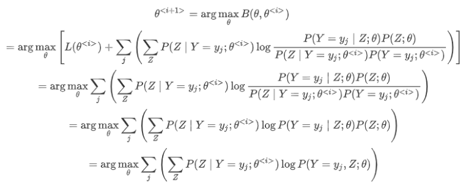
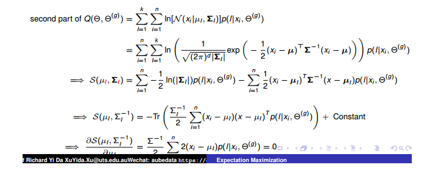
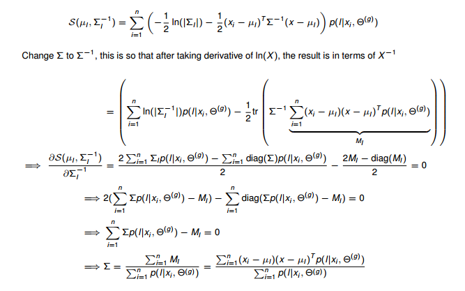

EM 算法
=====

1. 如果概率模型的变量都是观测变量，则给定数据之后，可以直接用极大似然估计法或者贝叶斯估计法来估计模型参数。

    但是当模型含有隐变量时，就不能简单的使用这些估计方法。此时需要使用`EM` 算法。

    *   `EM` 算法是一种迭代算法。
    *   `EM` 算法专门用于含有隐变量的概率模型参数的极大似然估计，或者极大后验概率估计。

2. `EM`算法的每次迭代由两步组成：

    *   `E`步求期望。
    *   `M`步求极大。

    所以`EM`算法也称为期望极大算法。

一、示例
----

### 1.1 身高抽样问题

1. 假设学校所有学生中，男生身高服从正态分布$ \mathcal N(\mu_1,\sigma_1^2)$， 女生身高服从正态分布 $\mathcal N(\mu_2,\sigma_2^2) $。

    现在随机抽取200名学生，得到这些学生的身高$ \{x_1,x_2,\cdots,x_n\}$，求参数 $\{\mu_1,\sigma_1^2,\mu_2,\sigma_2^2\} $的估计。

2. 定义隐变量为 $z$ ，其取值为$ \{0,1\}$ ，分别表示`男生、女生` 。

    * 如果==隐变量是已知的==，即已知每个学生是男生还是女生 $\{z_1,z_2,\cdots,z_n\}$，则问题很好解决：

        * 统计所有男生的身高的均值和方差，得到$ \{\mu_1,\sigma_1^2\} $：

            $$
            \mu_1 = \text{avg} \{x_i\mid z_i=0\}\quad \sigma_1^2 = \text{var} \{x_i\mid z_i=0\}
            $$
            其中 $\{x_i\mid z_i=0\} $表示满足$ z_i=0 $的$ x_i$ 构成的集合。$\text{avg},\text{var} $分别表示平均值和方差。

        * 统计所有女生的身高的均值和方差，得到$ \{\mu_2,\sigma_2^2\}$ ：

            $$
            \mu_2 = \text{avg} \{x_i\mid z_i=1\}\quad \sigma_2^2 = \text{var} \{x_i\mid z_i=1\}
            $$
            其中$ \{x_i\mid z_i=1\}$ 表示满足$ z_i=1$ 的 $x_i $构成的集合。$\text{avg},\text{var} $分别表示平均值和方差。

    * 如果已知参数$ \{\mu_1,\sigma_1^2,\mu_2,\sigma_2^2\}$，则任意给出一个学生的身高$ x $，可以知道该学生分别为男生/女生的概率。

        $$
        p_1=\frac{1}{\sqrt{2\pi} \times \sigma_1}\exp\left(-\frac{(x-\mu_1)^2}{2\sigma^2_1}\right)\\ p_2=\frac{1}{\sqrt{2\pi} \times \sigma_2}\exp\left(-\frac{(x-\mu_2)^2}{2\sigma^2_2}\right)
        $$
        则有：$p(z=0\mid x)=\frac{p_1}{p_1+p_2},p(z=1\mid x)=\frac{p_2}{p_1+p_2}$ 。因此也就知道该学生更可能为男生，还是更可能为女生。

因此：参数$ \{\mu_1,\sigma_1^2,\mu_2,\sigma_2^2\} \Leftrightarrow $`学生是男生/女生`，这两个问题是相互依赖，相互纠缠的。

3. 为解决该问题，通常采取下面步骤：

    * 先假定参数的初始值：
        $$
        \{\mu_1^{<0>},\sigma_1^{2<0>},\mu_2^{<0>},\sigma_2^{2<0>}\}。
        $$

    * 迭代 ：$i=0,1,\cdots$

        * 根据 $\{\mu_1^{<i>},\sigma_1^{2<i>},\mu_2^{<i>},\sigma_2^{2<i>}\} $来计算每个学生更可能是属于男生，还是属于女生。

            这一步为`E` 步（`Expectation`），用于计算隐变量的后验分布$ p(z\mid x)$ 。

        * 根据上一步的划分，统计所有男生的身高的均值和方差，得到 $\{\mu_1^{<i+1>},\sigma_1^{2<i+1>}\} $；统计所有女生的身高的均值和方差，得到 $\{\mu_2^{<i+1>},\sigma_2^{2<i+1>}\} 。$

            这一步为 `M` 步（`Maximization` ），用于通过最大似然函数求解正态分布的参数。

        * 当前后两次迭代的参数变化不大时，迭代终止。

### 1.2 三硬币模型

1. 已知三枚硬币 `A`，`B`，`C` ，这些硬币正面出现的概率分别为 \pi,p,q。进行如下试验：  

    *   先投掷硬币 `A`，若是正面则选硬币 `B`；若是反面则选硬币 `C` 。
    *   然后投掷被选出来的硬币，投掷的结果如果是正面则记作 `1`；投掷的结果如果是反面则记作`0` 。
    *   独立重复地 N 次试验，观测结果为： `1,1,0,1,0,...0,1` 。

    现在只能观测到投掷硬币的结果，无法观测投掷硬币的过程，求估计三硬币正面出现的概率。

2. 设：

    *   随机变量 Y 是观测变量，表示一次试验观察到的结果，取值为 `1` 或者`0`
    *   随机变量 Z 是隐变量，表示未观测到的投掷`A`硬币的结果，取值为 `1` 或者 `0`
    *   $\theta=(\pi,p,q)$ 是模型参数

    则：

    $$
    P(Y;\theta)=\sum_{Z}P(Y,Z;\theta)=\sum_{Z}P(Z;\theta)P(Y\mid Z;\theta)\\ =\pi p^{Y}(1-p)^{1-Y}+(1-\pi)q^{Y}(1-q)^{1-Y}
    $$
    注意：随机变量 $Y$ 的数据可以观测，随机变量 $Z$ 的数据不可观测

3. 将观测数据表示为$ \mathbb Y=\{y_1,y_2,\cdots,y_N\}$，未观测数据表示为 $\mathbb Z=\{z_1,z_2,\cdots,z_N\}$。

    由于每次试验之间都是独立的，则有：

    $$
    P(\mathbb Y;\theta)=\prod_{j=1}^{N}P(Y=y_i;\theta)=\prod_{j=1}^{N}[\pi p^{y_j}(1-p)^{1-y_j}+(1-\pi)q^{y_j}(1-q)^{1-y_j}]
    $$

4. 考虑求模型参数$ \theta=(\pi,p,q) $的极大似然估计，即：

    $$
    \hat \theta=\arg\max_{\theta}\log P(\mathbb Y;\theta)
    $$
    这个问题没有解析解，只有通过迭代的方法求解，`EM`算法就是可以用于求解该问题的一种迭代算法。

5. `EM`算法求解：

    首先选取参数的初值，记作$ \theta^{<0>}=(\pi^{<0>},p^{<0>},q^{<0>})$，然后通过下面的步骤迭代计算参数的估计值，直到收敛为止：

    设第$ i $次迭代参数的估计值为：$ \theta^{<i>}=(\pi^{<i>},p^{<i>},q^{<i>})$， 则`EM`算法的第 $i+1 $次迭代如下：

    * `E`步：计算模型在参数 $\theta^{<i>}=(\pi^{<i>},p^{<i>},q^{<i>}) $下，观测数据 $y_j $来自于投掷硬币 `B` 的概率：
        $$
        \mu^{<i+1>}_j=\frac{\pi^{<i>}(p^{<i>})^{y_j}(1-p^{<i>})^{1-y_j}}{\pi^{<i>}(p^{<i>})^{y_j}(1-p^{<i>})^{1-y_j}+(1-\pi^{<i>})(q^{<i>})^{y_j}(1-q^{<i>})^{1-y_j}}
        $$
        它其实就是$ P(Z=1\mid Y=y_j)$，即：已知观测变量 $Y=y_j$的条件下，观测数据 $y_j $来自于投掷硬币 `B` 的概率。

    * `M` 步：计算模型参数的新估计值：
        $$
        \pi^{<i+1>}=\frac 1N\sum_{j=1}^{N}\mu_j^{<i+1>}\\ p^{<i+1>}=\frac{\sum_{j=1}^{N}\mu_j^{<i+1>}y_j}{\sum_{j=1}^{N}\mu_j^{<i+1>}}\\ q^{<i+1>}=\frac{\sum_{j=1}^{N}(1-\mu_j^{<i+1>})y_j}{\sum_{j=1}^{N}(1-\mu_j^{<i+1>})}
        $$

        *   第一个式子：通过后验概率 $P(Z \mid Y) $估计值的均值作为先验概率 $\pi $的估计。
        *   第二个式子：通过条件概率$ P(Y\mid Z=1) $的估计来求解先验概率$ p$ 的估计。
        *   第三个式子：通过条件概率 $P(Y\mid Z=0) $的估计来求解先验概率 $q $的估计。

6. `EM` 算法的解释：

    * 初始化：随机选择三枚硬币 `A`，`B`，`C` 正面出现的概率$ \pi,p,q $的初始值 $\pi^{<0>},p^{<0>},q^{<0>} $。

    * `E` 步：在已知概率$ \pi,p,q$ 的情况下，求出每个观测数据$ y_j $是来自于投掷硬币 `B` 的概率。即：$p(z_j\mid y_j=1) $。

        于是对于 N 次实验，就知道哪些观测数据是由硬币 `B` 产生，哪些是由硬币 `C` 产生。

    * `M` 步：在已知哪些观测数据是由硬币 `B` 产生，哪些是由硬币 `C` 产生的情况下：

        *   $\pi$ 就等于硬币 `B` 产生的次数的频率。
        *   $p $就等于硬币`B` 产生的数据中，正面向上的频率。
        *   $q $就等于硬币 `C` 产生的数据中，正面向上的频率。

二、EM算法原理
--------

### 2.1 观测变量和隐变量

1. 令 Y 表示观测随机变量，$\mathbb Y=\{y_1,y_2,\cdots,y_N\}$ 表示对应的数据序列；令 Z 表示隐随机变量，$ \mathbb Z=\{z_1,z_2,\cdots,z_N\} $表示对应的数据序列。

    $\mathbb Y $和 $\mathbb Z $连在一起称作完全数据，观测数据$ \mathbb Y $又称作不完全数据。

2. 假设给定观测随机变量 Y ，其概率分布为 $P(Y;\theta)$，其中$ \theta$ 是需要估计的模型参数，则不完全数据$ \mathbb Y $的似然函数是 $P(\mathbb Y;\theta)$， 对数似然函数为 $L(\theta)=\log P(\mathbb Y;\theta) $。

    假定 $Y $和$ Z$ 的联合概率分布是$ P(Y,Z;\theta)$，完全数据的对数似然函数是 $\log P(\mathbb Y,\mathbb Z;\theta)$，则根据每次观测之间相互独立，有：

    $$
    \log P(\mathbb Y;\theta)=\sum_i \log P(Y=y_i;\theta)\\ \log P(\mathbb Y,\mathbb Z;\theta)=\sum_i \log P(Y=y_i,Z=z_i;\theta)
    $$

3. 由于$ \mathbb Y $发生，根据最大似然估计，则需要求解对数似然函数：

    $$
    L(\theta)=\log P(\mathbb Y;\theta)=\sum_{i=1}\log P(Y=y_i;\theta) =\sum_{i=1}\log\sum_Z P(Y=y_i, Z;\theta)\\ =\sum_{i=1}\log\left[\sum_Z P(Y=y_i \mid Z;\theta)P(Z;\theta)\right]
    $$
    的极大值。其中$ \sum_Z P(Y=y_i,Z;\theta) $表示对所有可能的$Z$ 求和，因为边缘分布 $P(Y)=\sum_Z P(Y,Z) $。

    该问题的困难在于：该目标函数包含了未观测数据的的分布的积分和对数。

### 2.2 EM算法

#### 2.2.1 原理-为什么最大化Q函数

1. `EM` 算法通过迭代逐步近似极大化$ L(\theta) $。

    假设在第$ i $次迭代后，$\theta $的估计值为：$ \theta^{<i>}$。则希望 $\theta $新的估计值能够使得 $L(\theta) $增加，即：$ L(\theta) \gt L(\theta^{<i>}) $。

    为此考虑两者的差：$L(\theta) - L(\theta^{<i>})=\log P(\mathbb Y;\theta)-\log P(\mathbb Y;\theta^{<i>}) 。$

    > 这里$ \theta^{<i>} $已知，所以 $\log P(\mathbb Y;\theta^{<i>}) $可以直接计算得出。

2. `Jensen` 不等式：如果 f 是凸函数，x 为随机变量，则有：$\mathbb E[f(x)]\le f(\mathbb E[x])$ 。

    * 如果 f 是严格凸函数，当且仅当 x 是常量时，等号成立。

        

    * 当$ \lambda_i $满足 $\lambda_j \ge 0,\sum_j \lambda_j=1$ 时，将$ \lambda_j $视作概率分布。

        设随机变量 y 满足概率分布$ p(y=y_j)=\lambda_j $，则有：$\log\sum_j\lambda_j y_j \ge \sum_j\lambda_j\log y_j $。

3. 考虑到条件概率的性质，则有$ \sum_Z P(Z \mid Y;\theta)=1 $。因此有：

    $$
    L(\theta) - L(\theta^{<i>})=\sum_{j}\log\sum_Z P(Y=y_j, Z;\theta) - \sum_{j}\log P(Y=y_j; \theta^{<i>})\\ =\sum_{j}\left[\log\sum_ZP(Z\mid Y=y_j;\theta^{<i>})\frac{P(Y=y_j, Z;\theta)}{P(Z\mid Y=y_j;\theta^{<i>})} - \log P(Y=y_j;\theta^{<i>}) \right]\\ \ge\sum_{j}\left[\sum_Z P(Z\mid Y=y_j;\theta^{<i>})\log\frac{P(Y=y_j, Z;\theta)}{P(Z\mid Y=y_j;\theta^{<i>})} - \log P(Y=y_j;\theta^{<i>}) \right]\\ =\sum_{j}\left[\sum_Z P(Z\mid Y=y_j;\theta^{<i>})\log\frac{P(Y=y_j\mid Z;\theta)P(Z;\theta)}{P(Z\mid Y=y_j;\theta^{<i>})} - \log P(Y=y_i;\theta^{<i>})\times 1 \right]\\ =\sum_{j}\left[\sum_Z P(Z\mid Y=y_j;\theta^{<i>})\log\frac{P(Y=y_j\mid Z;\theta)P(Z;\theta)}{P(Z\mid Y=y_j;\theta^{<i>})} \\ - \log P(Y=y_j;\theta^{<i>})\times \sum_Z P(Z\mid Y=y_j;\theta^{<i>}) \right]\\ =\sum_{j}\left[\sum_Z P(Z\mid Y=y_j;\theta^{<i>})\log\frac{P(Y=y_j\mid Z;\theta)P(Z;\theta)}{P(Z\mid Y=y_j;\theta^{<i>}) P(Y=y_j;\theta^{<i>})} \right]
    $$
    等号成立时，需要满足条件：

    $$
    P(Z\mid Y=y_j;\theta^{<i>})=\frac 1 {n_Z}\\ \frac{P(Y=y_j, Z;\theta)}{P(Z\mid Y=y_j;\theta^{<i>})}=\text{const}
    $$
    其中 $n_Z$ 为随机变量$ Z $的取值个数。

4. 令 ：
    $$
    B\left(\theta, \theta^{<i>}\right)=L\left(\theta^{<i>}\right)+\sum_{j}\left[\sum_{Z} P\left(Z | Y=y_{j} ; \theta^{<i>}\right) \log \frac{P\left(Y=y_{j} | Z ; \theta\right) P(Z ; \theta)}{P\left(Z | Y=y_{j} ; \theta^{<i}\right) P\left(Y=y_{j} ; \theta^{<i>}\right)}\right]
    $$
    则有： $L(\theta) \ge B(\theta,\theta^{<i>})$ ，因此 $B(\theta,\theta^{<i>})$ 是$ L(\theta^{<i>}) $的一个下界。

    * 根据定义有：$ L(\theta^{<i>})=B(\theta^{<i>},\theta^{<i>}) $。因为此时有：

        $$
        \frac{P( Y=y_j\mid Z ;\theta^{<i>})P( Z ;\theta^{<i>})}{P( Z \mid Y=y_j;\theta^{<i>})P(Y=y_j;\theta^{<i>})}=\frac{P( Y=y_j, Z ;\theta^{<i>})}{P(Y=y_j,Z ;\theta^{<i>})} =1
        $$

    * 任何可以使得$ B(\theta,\theta^{<i>}) $增大的 $\theta $，也可以使$ L(\theta)$ 增大。

        为了使得 $L(\theta)$ 尽可能增大，则选择使得$ B(\theta,\theta^{<i>}) $取极大值的 $\theta $：$\theta^{<i+1>}=\arg\max_\theta B(\theta,\theta^{<i>}) $。

5. 求极大值：

    

    

    李航书里的写法
    $$
    \begin{align*} &  \theta^{\left( i+1 \right)}＝ \arg \max B \left( \theta, \theta^{\left( i \right)} \right)  \\ & = \arg \max \left( L \left( \theta^{\left ( i \right)} \right) + \sum_{Z} P \left( Z | Y , \theta^{\left( i \right)} \right) \log \dfrac {P \left( Y | Z, \theta \right) P \left(Z|\theta\right)} {P \left( Z | Y , \theta^{\left( i \right)} \right) P \left(Y|\theta^{\left( i \right)} \right)} \right) \\ & = \arg \max \left( \sum_{Z} P \left( Z | Y, \theta^{\left( i \right)} \right)  \log \left( P \left( Y | Z, \theta \right)  \right) P \left( Z | \theta \right) \right)  \\ & = \arg \max \left( \sum_{Z} P \left( Z | Y, \theta^{\left( i \right)} \right)  \log P \left(  Y, Z | \theta\right)  \right) \\ & = \arg \max Q \left( \theta, \theta^{\left( i \right)} \right) \end{align*}
    $$
    其中：$ L(\theta^{<i>}),P(Z\mid Y=y_j;\theta^{<i>}) P(Y=y_j;\theta^{<i>}) $与 $\theta $无关，因此省略。

#### 2.2.2 算法步骤

1. `EM` 算法：

    * 输入：

        *   观测变量数据 $\mathbb Y=\{y_1,y_2,\cdots,y_N\}$
        *   联合分布$ P(Y,Z ;\theta)$，以及条件分布$ P( Z \mid Y;\theta)$

        > 联合分布和条件分布的形式已知（比如说高斯分布等），但是参数未知（比如均值、方差）

    * 输出：模型参数$ \theta$

    * 算法步骤：

        * 选择参数的初值$ \theta^{<0> } $，开始迭代。

        * `E`步：记$ \theta^{<i>} $为第$ i $次迭代参数 $\theta $的估计值，在第$ i+1 $步迭代的 `E` 步，计算：

            > 固定$\theta^{<i>}   $求期望

            $$
            Q(\theta,\theta^{<i>})=\sum_{j=1}^N \mathbb E_{P(Z\mid Y=y_j;\theta^{<i>})}\log P(Y=y_j,Z ;\theta)\\ =\sum_{j=1}^N\left(\sum_Z P(Z\mid Y=y_j;\theta^{<i>})\log P(Y=y_j,Z;\theta) \right)
            $$
            其中$\mathbb E_{P(Z\mid Y=y_j;\theta^{<i>})}\log P(Y=y_j,Z ;\theta) $表示：对于观测点 $Y=y_j ， \log P(Y=y_j,Z ;\theta) $关于后验概率$ P(Z\mid Y=y_j;\theta^{<i>})$ 的期望。

            > $P(Z\mid Y=y_j;\theta^{<i>})$就是cs229中的$Q_i(z_i)$

        * `M`步：求使得$ Q(\theta,\theta^{<i>})$ 最大化的 $\theta$，确定 $i+1$ 次迭代的参数的估计值 $\theta^{<i+1>}$
            $$
            \theta^{<i+1>}=\arg\max_\theta Q(\theta,\theta^{<i>})
            $$

        * 重复上面两步，直到收敛。

2. 通常收敛的条件是：给定较小的正数 $\varepsilon_1,\varepsilon_2$，满足：$||\theta^{<i+1>}-\theta^{<i>}|| \lt \varepsilon_1$ 或者 $||Q(\theta^{<i+1>},\theta^{<i>})-Q(\theta^{<i>},\theta^{<i>})|| \lt \varepsilon_2 $。

3. $Q(\theta,\theta^{<i>})$是算法的核心，称作 $Q $函数。其中：

    *   第一个符号表示要极大化的参数（未知量）。
    *   第二个符号表示参数的当前估计值（已知量）。
4. `EM`算法的直观理解：`EM`算法的目标是最大化对数似然函数$ L(\theta)=\log P(\mathbb Y)$ 。

    * 直接求解这个目标是有问题的。因为要求解该目标，首先要得到未观测数据的分布 $P(Z \mid Y;\theta) $。如：身高抽样问题中，已知身高，需要知道该身高对应的是男生还是女生。

        但是未观测数据的分布就是待求目标参数$ \theta $的解的函数。这是一个“鸡生蛋-蛋生鸡” 的问题。

    * `EM`算法试图多次猜测这个未观测数据的分布 $P(Z \mid Y;\theta) $。

        每一轮迭代都猜测一个参数值$ \theta^{<i>}$，该参数值都对应着一个未观测数据的分布$ P(Z \mid Y;\theta^{<i>}) $。如：已知身高分布的条件下，男生/女生的分布。

    * 然后通过最大化某个变量来求解参数值。这个变量就是 $B(\theta,\theta^{<i>}) $变量，它是真实的似然函数的下界 。  

        *   如果猜测正确，则 B 就是真实的似然函数。
        *   如果猜测不正确，则 B 就是真实似然函数的一个下界。
5. 隐变量估计问题也可以通过梯度下降法等算法求解，但由于求和的项数随着隐变量的数目以指数级上升，因此代价太大。

    *   `EM`算法可以视作一个非梯度优化算法。
    *   无论是梯度下降法，还是`EM` 算法，都容易陷入局部极小值。

#### 2.2.3 收敛性定理

李航书中关于收敛性的证明可以看看

1. 定理一：设$ P(\mathbb Y;\theta) $为观测数据的似然函数，$\theta^{<i>} $为`EM`算法得到的参数估计序列，$ P(\mathbb Y;\theta^{<i>}) $为对应的似然函数序列，其中$ i=1,2,\cdots$ 。

    则：$ P(\mathbb Y;\theta^{<i>}) $是单调递增的，即：$P(\mathbb Y;\theta^{<i+1>}) \ge P(\mathbb Y;\theta^{<i>}) $。

    

2. 定理二：设$ L(\theta)=\log P(\mathbb Y;\theta) $为观测数据的对数似然函数， $\theta^{<i>} $为`EM`算法得到的参数估计序列，$L(\theta^{<i>}) $为对应的对数似然函数序列，其中$ i=1,2,\cdots $。

    * 如果 $P(\mathbb Y;\theta) $有上界，则$ L(\theta^{<i>}) $会收敛到某一个值 $L^{*} $。

    * 在函数 $Q(\theta,\theta^{<i>}) $与 $L(\theta) $满足一定条件下，由 `EM` 算法得到的参数估计序列$ \theta^{<i>} $的收敛值$ \theta^{*} $是$ L(\theta) $的稳定点。

        > 关于“满足一定条件”：大多数条件下其实都是满足的。

3. 定理二只能保证参数估计序列收敛到对数似然函数序列的稳定点$ L^{*} $，不能保证收敛到极大值点。

4. `EM`算法的收敛性包含两重意义：

    *   关于对数似然函数序列 $L(\theta^{<i>})$ 的收敛。
    *   关于参数估计序列$ \theta^{<i>} $的收敛。

    前者并不蕴含后者。

5. 实际应用中，`EM` 算法的参数的初值选择非常重要。

    *   参数的初始值可以任意选择，但是 `EM` 算法对初值是敏感的，选择不同的初始值可能得到不同的参数估计值。
    *   常用的办法是从几个不同的初值中进行迭代，然后对得到的各个估计值加以比较，从中选择最好的（对数似然函数最大的那个）。

6. `EM` 算法可以保证收敛到一个稳定点，不能保证得到全局最优点。其优点在于：简单性、普适性。

三、EM算法与高斯混合模型
-------------

> 2019-06-16：每个样本只来自一个高斯，而不是同时来自多个高斯
>
> 高斯曲线只是计算概率的,而不能通过叠加产生样本。叠加的是概率密度而不是其他
>
> 不同的高斯可能会生成相同的样本，需要求来自哪个高斯的概率更大

概率密度叠加，几乎所有的连续概率密度都能够以任意的精度近似

给出了二维空间中3个高斯分布混合的例子。(a)每个混合分量的常数概率密度轮廓线，其中三个分量分别被标记为红、蓝和绿，且混合系数的值在每个分量的下方给出。(b)混合分布的边缘概率密度p(x)的轮廓线。(c)概率分布p(x)的⼀个曲⾯图

样本的生成方式: 1以概率选择某个高斯 2以选中的高斯生成数据

一个样本(0.25,0.25)即属于红色高斯。也属于绿色高斯.因为它可以是由红色高斯生成的，也可能是由绿色高斯生成的，只不过它属于红色高斯的概率是最大的。

混合高斯之所以有系数，是为了保证积分为1。

### 3.1 高斯混合模型

混合模型是一个可以用来表示在==总体分布（distribution）中含有 K 个子分布==的概率模型，换句话说，==混合模型表示了观测数据在总体中的概率分布==，它是一个由 K 个子分布组成的混合分布。混合模型不要求观测数据提供关于子分布的信息，来计算观测数据在总体分布中的概率。

1. 高斯混合模型(`Gaussian mixture model,GMM`)：指的是具有下列形式的概率分布模型：

    $$
    P(y;\theta)=\sum_{k=1}^{K}\alpha_k\phi(y;\theta_k)
    $$
    其中$ \alpha_k $是系数，满足 ：

    *   $\alpha_k \ge 0,\sum_{k=1}^K \alpha_k=1 $。
    *   $\phi(y;\theta_k) $是高斯分布密度函数，称作第 $k$ 个分模型，$ \theta_k=(\mu_k,\sigma_k^{2})$：

    $$
    \phi(y;\theta_k)=\frac{1}{\sqrt{2\pi}\sigma_k}\exp\left(-\frac{(y-\mu_k)^{2}}{2\sigma_k^{2}}\right)
    $$

2. 如果用其他的概率分布密度函数代替上式中的高斯分布密度函数，则称为一般混合模型。

### 3.2 参数估计

1. 假设观察数据 $\mathbb Y=\{y_1,y_2,\cdots,y_N\} $由高斯混合模型 
    $$
    P(y;\theta)=\sum_{k=1}^{K}\alpha_k\phi(y;\theta_k) 生成，其中 \theta=(\alpha_1,\alpha_2,\cdots,\alpha_K;\theta_1,\theta_2,\cdots,\theta_K)。
    $$
    可以通过`EM`算法估计高斯混合模型的参数$ \theta $。

2. 可以设想观察数据$ y_j $是这样产生的：  

    *   首先以概率$ \alpha_k$ 选择第$ k $个分模型$ \phi(y;\theta_k) $。
    *   然后以第$ k$ 个分模型的概率分布$ \phi(y;\theta_k) $生成观察数据 $y_j $。

    这样，观察数据$ y_j $是已知的，观测数据 $y_j$ 来自哪个分模型是未知的。

    对观察变量$ y$ ，定义隐变量$ z $，其中 $p(z=k)=\alpha_k$ 。

3. 完全数据的对数似然函数为：

    $$
    P(y=y_j,z=k;\theta)=\alpha_k\frac{1}{\sqrt{2\pi}\sigma_k}\exp\left(-\frac{(y_j-\mu_k)^{2}}{2\sigma_k^{2}}\right)
    $$
    其对数为：

    $$
    \log P(y=y_j,z=k;\theta)=\log \alpha_k-\log\sqrt{2\pi}\sigma_k -\frac{(y_j-\mu_k)^{2}}{2\sigma_k^{2}}
    $$
    后验概率为：

    $$
    P(z=k\mid y=y_j;\theta^{<i>})=\frac{\alpha_k\frac{1}{\sqrt{2\pi}\sigma_k^{<i>}}\exp\left(-\frac{(y_j-\mu_k^{<i>})^{2}}{2\sigma_k^{^{<i>}2}}\right)}{\sum_{t=1}^K\alpha_t\frac{1}{\sqrt{2\pi}\sigma_t^{<i>}}\exp\left(-\frac{(y_j-\mu_t^{<i>})^{2}}{2\sigma_t^{^{<i>}2}}\right)}
    $$
    即：$P(z=k\mid y=y_j;\theta^{<i>})=\frac{P(y=y_j,z=k;\theta^{<t>})}{\sum_{t=1}^KP(y=y_j,z=t;\theta^{})}$。

    > $P(z=k\mid y=y_j;\theta^{<i>})$ 就是$Q_k(z_j)$和$\gamma_{kj}$为第$j$个样本在参数固定时属于第$k$个高斯的概率

    则$ Q $函数为：
    $$
    Q(\theta,\theta^{<i>})=\sum_{j=1}^N\left(\sum_z P(z\mid y=y_j;\theta^{<i>})\log P(y=y_j,z;\theta) \right)\\ =\sum_{j=1}^N\sum_{k=1}^K P(z=k\mid y=y_j;\theta^{<i>})\left(\log \alpha_k-\log\sqrt{2\pi}\sigma_k -\frac{(y_j-\mu_k)^{2}}{2\sigma_k^{2}}\right)
    $$
    求极大值：$\theta^{<i+1>}=\arg\max_{\theta}Q(\theta,\theta^{<i>}) $。

    根据偏导数为 0，以及$ \sum_{k=1}^{K}\alpha_k=1 $得到：

    * $\alpha_k$：

        $\alpha_k^{<i+1>}=\frac{n_k}{N}$

        其中： $n_k=\sum_{j=1}^NP(z=k\mid y=y_j;\theta^{<i>}) $，其物理意义为：所有的观测数据$ \mathbb Y$ 中，产生自第$ k$ 个分模型的观测数据的数量。

    * $\mu_k$：

        $\mu_k^{<i+1>}=\frac{\overline {Sum}_k}{n_k}$

        其中：$\overline {Sum}_k=\sum_{j=1}^N y_j P(z=k\mid y=y_j;\theta^{<i>}) $，其物理意义为：所有的观测数据 $\mathbb Y$ 中，产生自第 k 个分模型的观测数据的总和。

    * $\sigma^2$：

        $$
        \sigma_k^{<i+1>2}=\frac{\overline {Var}_k}{n_k}
        $$
        其中：$\overline {Var}_k=\sum_{j=1}^N (y_j-\mu_k^{<i>})^2P(z=k\mid y=y_i;\theta^{<i>}) $，其物理意义为：所有的观测数据 $\mathbb Y$ 中，产生自第 k 个分模型的观测数据，偏离第$k $个模型的均值$（\mu_k^{<i>} ）$的平方和。

4. 高斯混合模型参数估计的`EM`算法：

    * 输入：

        *   观察数据$ \mathbb Y=\{y_1,y_2,\cdots,y_N\}$
        *   高斯混合模型的分量数 K
    * 输出：高斯混合模型参数$ \theta=(\alpha_1,\alpha_2,\cdots,\alpha_K;\mu_1,\mu_2,\cdots,\mu_K;\sigma^2_1,\sigma^2_2,\cdots,\sigma^2_K)$

    * 算法步骤：

        * 随机初始化参数$ \theta^{<0>}$ 。

        * 根据$ \theta^{<i>}$ 迭代求解$ \theta^{<i+1>} $，停止条件为：对数似然函数值或者参数估计值收敛。

            $$
            \alpha_k^{<i+1>}=\frac{n_k}{N},\;\mu_k^{<i+1>}=\frac{\overline {Sum}_k}{n_k},\;\sigma_k^{<i+1>2}=\frac{\overline {Var}_k}{n_k}
            $$
            其中：

            * $n_k=\sum_{j=1}^NP(z=k\mid y=y_j;\theta^{<i>}) $。

                其物理意义为：所有的观测数据 $\mathbb Y$ 中，产生自第 k 个分模型的观测数据的数量。

            * $\overline {Sum}_k=\sum_{j=1}^N y_j P(z=k\mid y=y_j;\theta^{<i>})$。

                其物理意义为：所有的观测数据$ \mathbb Y $中，产生自第 k 个分模型的观测数据的总和。

            * $\overline {Var}_k=\sum_{j=1}^N (y_j-\mu_k^{<i>})^2P(z=k\mid y=y_i;\theta^{<i>}) $。

                其物理意义为：所有的观测数据$ \mathbb Y$ 中，产生自第 k 个分模型的观测数据，偏离第 k 个模型的均值$（\mu_k^{<i>} ）$的平方和。

四、EM 算法与 kmeans 模型
------------------

1. `kmeans`算法：给定样本集$ \mathbb D=\{\mathbf{\vec x}_1,\mathbf{\vec x}_2,\cdots,\mathbf{\vec x}_N\}$， 针对聚类所得簇划分 $\mathcal C=\{\mathbb C_1,\mathbb C_2,\cdots,\mathbb C_K\}$， 最小化平方误差：
    $$
    \min_{\mathcal C} \sum_{k=1}^{K}\sum_{\mathbf{\vec x}_i \in \mathbb C_k}||\mathbf{\vec x}_i-\vec \mu_k||_2^{2}
    $$
    其中 $\vec \mu_k=\frac {1}{|\mathbb C_k|}\sum_{\mathbf{\vec x}_i \in \mathbb C_k}\mathbf{\vec x}_i $是簇 $\mathbb C_k$ 的均值向量。

2. 定义观测随机变量为$ \mathbf {\vec x}$ ，观测数据为$ \mathbb D $。定义隐变量为$ z$ ，它表示$ \mathbf {\vec x}$ 所属的簇的编号。设参数$ \theta= (\mathbf {\vec\mu}_1,\mathbf {\vec\mu}_2,\cdots,\mathbf {\vec\mu}_K)，$ 则考虑如下的生成模型：

    $$
    P(\mathbf {\vec x},z\mid\theta) \propto \begin{cases}\exp(-||\mathbf {\vec x}-\mathbf {\vec \mu}_z||_2^2)\quad &||\mathbf {\vec x}-\mathbf {\vec \mu}_z||_2^2=\min_{1\le k\le K}||\mathbf {\vec x}-\mathbf {\vec \mu}_k||_2^2\\ 0\quad &||\mathbf {\vec x}-\mathbf {\vec \mu}_z||_2^2\gt \min_{1\le k\le K}||\mathbf {\vec x}-\mathbf {\vec \mu}_k||_2^2 \end{cases}
    $$
    其中 $\min_{1\le k\le K}||\mathbf {\vec x}-\mathbf {\vec \mu}_k||_2^2 $表示距离 $\mathbf{\vec x} $最近的中心点所在的簇编号。即：

    *   若$ \mathbf{\vec x} $最近的簇就是 $\mathbf{\vec \mu}_z$ 代表的簇，则生成概率为$ \exp(-||\mathbf {\vec x}-\mathbf {\vec \mu}_z||_2^2)$ 。
    *   若 $\mathbf{\vec x} $最近的簇不是 $\mathbf{\vec \mu}_z $代表的簇，则生成概率等于 0 。

3. 计算后验概率：

    $$
    P(z\mid \mathbf{\vec x},\theta^{<i>})\propto \begin{cases} 1\quad &||\mathbf {\vec x}_i-\mathbf {\vec \mu}_z||_2^2=\min_{1\le k\le K}||\mathbf {\vec x}-\mathbf {\vec \mu}_k^{<i>}||_2^2\\ 0\quad &||\mathbf {\vec x}_i-\mathbf {\vec \mu}_z||_2^2\gt \min_{1\le k\le K}||\mathbf {\vec x}-\mathbf {\vec \mu}_k^{<i>}||_2^2 \end{cases}
    $$
    即：

    *   若$ \mathbf{\vec x} $最近的簇就是 $\mathbf{\vec \mu}_z $代表的簇，则后验概率为 1 。
    *   若 $\mathbf{\vec x} $最近的簇不是$ \mathbf{\vec \mu}_z $代表的簇，则后验概率为 0 。

4. 计算 Q 函数：

    $$
    Q(\theta,\theta^{<i>})=\sum_{j=1}^N\left(\sum_z P(z\mid \mathbf{\vec x}=\mathbf{\vec x}_j;\theta^{<i>})\log P(\mathbf{\vec x}=\mathbf{\vec x}_j,z;\theta) \right)
    $$
    设距离 $\mathbf{\vec x}_j $最近的聚类中心为$ \mathbf{\vec \mu}_{t_j}^{<i>} $，即它属于簇$ t_j $，则有：

    $$
    Q(\theta,\theta^{<i>})=\text{const}-\sum_{j=1}^N ||\mathbf{\vec x}_j-\vec\mu_{t_j}||_2^2
    $$
    则有：

    $$
    \theta^{<i+1>}=\arg\max_\theta Q(\theta,\theta^{<i>})=\arg\min_\theta \sum_{j=1}^N ||\mathbf{\vec x}_j-\vec\mu_{t_j}||_2^2
    $$
    定义集合$ \mathbb I_k=\{j\mid t_j=k\},\quad k=1,2\cdots,K $，它表示属于簇 k 的样本的下标集合。则有：

    $$
    \sum_{j=1}^N ||\mathbf{\vec x}_j-\vec\mu_{t_j}||_2^2=\sum_{k=1}^K\sum_{j\in \mathbb I_k} ||\mathbf{\vec x}_j-\vec\mu_k||_2^2
    $$
    则有：

    $$
    \theta^{<i+1>}=\arg\min_\theta\sum_{k=1}^K\sum_{j\in \mathbb I_k} ||\mathbf{\vec x}_j-\vec\mu_k||_2^2
    $$
    这刚好就是 `k-means` 算法的目标：最小化平方误差。

5. 由于求和的每一项都是非负的，则当每一个内层求和$ \sum_{j\in \mathbb I_k}||\mathbf{\vec x}_j-\mathbf{\vec\mu}_{k}||_2^2$ 都最小时，总和最小。即：

    $$
    \vec\mu^{<i+1>}_k=\arg\min_{\vec\mu_k}\sum_{j\in \mathbb I_k}||\mathbf{\vec x}_j-\mathbf{\vec\mu}_{k}||_2^2
    $$
    得到：$\vec \mu_k^{<i+1>}=\frac {1}{|\mathbb I_k|}\sum_{j \in \mathbb I_k}\mathbf{\vec x}_j$，其中 $|\mathbb I_k| $表示集合$ |\mathbb I_k| $的大小。

    这就是求平均值来更新簇中心。

五、EM 算法的推广
----------

### 5.1 F 函数

1. `F`函数：假设隐变量 Z 的概率分布为$ \tilde P( Z)$，定义分布$ \tilde P( Z ) $与参数$ \theta$ 的函数$ F(\tilde P,\theta) $为：
    $$
    F(\tilde P,\theta)=\mathbb E_{\tilde P}[\log P( Y, Z ;\theta)]+H(\tilde P)
    $$
    其中$ H(\tilde P)=-\mathbb E_{\tilde P}\log \tilde P $是分布 $\tilde P( Z ) $的熵。

    通常假定 $P( Y,Z ;\theta)$ 是$ \theta $的连续函数，因此$ F(\tilde P,\theta) $为$ \tilde P( Z )$ 和 $\theta $的连续函数。

2. 函数 $F(\tilde P,\theta) $有下列重要性质：

    *   对固定的 $\theta $，存在唯一的分布$ \tilde P_{\theta}( Z ) $使得极大化 $F(\tilde P,\theta)$。此时 $\tilde P_{\theta}( Z )=P( Z \mid Y;\theta)，$并且 $\tilde P_{\theta} $随着$ \theta $连续变化。
    *   若$ \tilde P_{\theta}( Z )=P( Z \mid Y;\theta)$， 则 $F(\tilde P,\theta)=\log P( Y;\theta) $。

3. 定理一：设 $L(\theta)=\log P(\mathbb Y;\theta) $为观测数据的对数似然函数，$ \theta^{<i>}$ 为 `EM` 算法得到的参数估计序列，函数$ F(\tilde P,\theta)=\sum_Y\mathbb E_{\tilde P}[\log P(Y,Z ;\theta)]+H(\tilde P)$，则：

    *   如果$ F(\tilde P,\theta) 在 \tilde P^{*}(Z ) 和 \theta^{*} $有局部极大值，那么$ L(\theta) 也在 \theta^{*} $有局部极大值。
    *   如果$ F(\tilde P,\theta) $在$ \tilde P^{*}( Z ) $和$ \theta^{*}$ 有全局极大值，那么$ L(\theta) $也在 $\theta^{*} $有全局极大值。

4. 定理二：`EM`算法的一次迭代可由 `F` 函数的极大-极大算法实现：设 $\theta^{<i>}$ 为第 i 次迭代参数 $\theta $的估计，$ \tilde P^{<i>} $为第 i 次迭代函数 $\tilde P(Z ) $的估计。在第$ i+1 $次迭代的两步为：

    *   对固定的 $\theta^{<i>} $，求 $\tilde P^{<i+1>} $使得$ F(\tilde P,\theta^{<i>}) $极大化。
    *   对固定的$ \tilde P^{<i+1>} $，求$ \theta^{<i+1>} $使得 $F(\tilde P^{<i+1>},\theta) $极大化。

### 5.2 GEM算法1

1.  `GEM`算法1（`EM`算法的推广形式）：

    *   输入：

        *   观测数据$ \mathbb Y=\{y_1,y_2,\cdots\}$
        *   F 函数
    *   输出：模型参数

    *   算法步骤：

        *   初始化参数 $\theta^{<0>} $，开始迭代。

        *   第 i+1 次迭代：

            *   记$ \theta^{<i>} $为参数 $\theta$ 的估计值，$ \tilde P^{<i>} $为函数$ \tilde P $的估计值。求$ \tilde P^{<i+1>} $使得$ F(\tilde P,\theta^{<i>}) $极大化。
            *   求$ \theta^{<i+1>}$ 使得 $F(\tilde P^{<i+1>},\theta)$ 极大化。
            *   重复上面两步直到收敛。
2.  该算法的问题是，有时候求$ F(\tilde P^{<i+1>},\theta) $极大化很困难。

### 5.3 GEM算法2

1. `GEM`算法2（`EM`算法的推广形式）：

    * 输入：

        *   观测数据 $\mathbb Y=\{y_1,y_2,\cdots\}$
        *   Q 函数
    * 输出：模型参数

    * 算法步骤：

        * 初始化参数 $\theta^{<0>} $，开始迭代。

        * 第 $i+1 $次迭代：

            * 记 $\theta^{<i>} $为参数 $\theta $的估计值， 计算

                $$
                Q(\theta,\theta^{<i>})=\sum_{j=1}^N\left(\sum_Z P(Z\mid Y=y_j;\theta^{<i>})\log P(Y=y_j,Z;\theta) \right)
                $$

            * 求 $\theta^{<i+1>} $使得$ Q(\theta^{<i+1>},\theta^{<i>}) \gt Q(\theta^{<i>},\theta^{<i>})$

            * 重复上面两步，直到收敛。

2. 此算法不需要求$ Q(\theta,\theta^{<i>})$ 的极大值，只需要求解使它增加的$ \theta^{<i+1>} $即可。

### 5.4 GEM算法3

1. `GEM`算法3（`EM`算法的推广形式）：

    * 输入：

        *   观测数据$ \mathbb Y=\{y_1,y_2,\cdots\}$
        *   Q 函数
    * 输出：模型参数

    * 算法步骤：

        * 初始化参数$ \theta^{<0>}=(\theta_1^{<0>},\theta_2^{<0>},\cdots,\theta_d^{<0>}) $，开始迭代

        * 第$ i+1 $次迭代：

            * 记 $\theta^{<i>}=(\theta_1^{<i>},\theta_2^{<i>},\cdots,\theta_d^{<i>}) $为参数 $\theta=(\theta_1,\theta_2,\cdots,\theta_d) $的估计值， 计算

                $$
                Q(\theta,\theta^{<i>})=\sum_{j=1}^N\left(\sum_Z P(Z\mid Y=y_j;\theta^{<i>})\log P(Y=y_j,Z;\theta) \right)
                $$

            * 进行 d 次条件极大化：

                *   首先在$ \theta_2^{<i>},\cdots,\theta_d^{<i>} $保持不变的条件下求使得 $Q(\theta,\theta^{<i>}) $达到极大的 $\theta_1^{<i+1>}$
                *   然后在 $\theta_1=\theta_1^{<i+1>},\theta_j=\theta_j^{<i>},j=3,\cdots,d $的条件下求使得 $Q(\theta,\theta^{<i>}) $达到极大的 $\theta_2^{<i+1>}$
                *   如此继续，经过 d 次条件极大化，得到$ \theta^{<i+1>}=(\theta_1^{<i+1>},\theta_2^{<i+1>},\cdots,\theta_d^{<i+1>})$ ，使得 $Q(\theta^{<i+1>},\theta^{<i>}) \gt Q(\theta^{<i>},\theta^{<i>})$

            * 重复上面两步，直到收敛。

2. 该算法将 `EM` 算法的 `M` 步分解为 d 次条件极大化，每次只需要改变参数向量的一个分量，其余分量不改变。

## 高斯混合模型详细推导

* * *

高斯混合模型同样多用于聚类，与K-means不同的是其采用概率模型来表达聚类原型。 
首先回顾一下高斯分布(Gaussian Distribution)：对于随机变量$x$，其概率密度函数可表示为： 
$$
\mathcal{N}(x|\mu, \sigma^2) = \frac{1}{\sqrt{2\pi\sigma^2}}e^{-\frac{(x-\mu)^2}{2\sigma^2}} 
$$
若$\mathbf{x}$为n维随机向量，则多元高斯分布(Multivariate Gaussian Distribution)为： 
$$
\mathcal{N}(\mathbf{x}| \boldsymbol{\mu},\mathbf{\Sigma}) = \frac{1}{(2\pi)^{\frac{n}{2}}|\Sigma|^\frac12}\,e^{-\frac12(\mathbf{x}-\boldsymbol{\mu})^T\mathbf{\Sigma}^{-1}(\mathbf{x}-\boldsymbol{\mu})}
$$
其中$\boldsymbol{\mu}$为n维均值向量，$\mathbf{\Sigma}$为$n\times n$的协方差矩阵，$|\mathbf{\Sigma}|$为$\mathbf{\Sigma}$的行列式。

  

很多时候我们发现单个高斯分布无法很好地描述数据的性质，如下图数据分成了两个簇，如果使用两个高斯分布明显能更好地描述其结构。

因此沿着这个思路就诞生了高斯混合模型(Mixture of Gaussians)，本质上是k个高斯分布的线性组合，这样灵活性大增，能描述更多样的分布：  
$$
p(\mathbf{x}) = \sum\limits_{k=1}^{K}\pi_k\mathcal{N}(\mathbf{x}|\boldsymbol{\mu}_k,\mathbf{\Sigma}_k) \qquad \tag{1.1} 
其中0 \leqslant\pi_k\leqslant 1为混合系数(mixing coefficients)，满足\sum\limits_{k=1}^{K} \pi_k= 1 。
$$

其中$0 \leqslant\pi_k\leqslant 1$为混合系数(mixing coefficients)，满足$\sum\limits_{k=1}^{K} \pi_k= 1$ 。

由于本文的主角是EM算法，所以下面以EM算法的角度来看待高斯混合模型。

回忆EM算法是一种对含有隐变量的概率模型参数的极大似然估计。通常隐变量$\mathbf{Z}$未知，而实际知晓的只有观测数据$\mathbf{X}$。而对于高斯混合模型来说，观测数据是这样产生的：先依照\pi_k选择第k个高斯分模型，然后依照其概率密度函数进行采样生成相应的样本。

#### 隐变量

可以看到在经过上述过程后我们拿到手的只有采样得来的样本，却不知道每个样本来自于哪个分模型，但这样就表示我们获得了高斯混合模型的隐变量。

这里定义$K$维随机向量$ \mathbf{z} = \begin{bmatrix} z_1 \\ z_2 \\ \vdots \\ z_k \\ \end{bmatrix}，\mathbf{z}$中只有一个$z_k$为1，其余元素为0，即$z_k = \left. \begin{cases}1\,, & \text{数据来自第k个分模型} \\ 0\,, & \text{否则} \end{cases} \right.$，  

==这样$z_k$即为**高斯混合模型的隐变量**，表示样本来自于第$k$个分模型==。  

由于$p(\mathbf{x}) = \sum\limits_zp(\mathbf{x},\mathbf{z}) = \sum\limits_{z}p(\mathbf{z})\,p(\mathbf{x}|\mathbf{z})$，对比(1.1)式中高斯混合模型的定义，可将$\pi_k$视为选择第k个分模型的先验概率，即$\pi_k = p(z_k = 1)$；而对应的$\mathcal{N}(\mathbf{x}|\mathbf{\mu}_k, \mathbf{\Sigma}_k) = p(\mathbf{x}|z_k = 1)$。另外在得到观测数据$\{\mathbf{x}_1, \mathbf{x}_2 \cdots \mathbf{x}_n\}$后，每个$\mathbf{x}_n$都对应一个隐变量$z_{nk}，$则运用贝叶斯定理，$\mathbf{x}_n$属于第$k$个分模型的后验概率 (记作$\gamma(z_{nk})$)为：  
$$
\begin{align*} \gamma(z_{nk}) = p(z_{nk} = 1|\mathbf{x}_n) & = \frac{p(z_{nk} = 1)\,p(\mathbf{x}_n|z_{nk} = 1)}{\sum\limits_{j=1}^Kp(z_{nj}=1)\,p(\mathbf{x}_n|z_{nj} = 1)} \\ & = \frac{\pi_k\,\mathcal{N}(\mathbf{x}_n|\mathbf{\mu}_k,\mathbf{\Sigma}_k)}{\sum\limits_{j=1}^K \pi_j\,\mathcal{N}(\mathbf{x}_n|\mathbf{\mu}_j,\mathbf{\Sigma}_j)} \tag{1.2} \end{align*} 
$$

> ==也就是$Q_n(z_k)$和$\gamma_{nk}$为第$n$个样本在参数固定时属于第$k$个高斯的概率==

下图显示了$\gamma(z_{nk})$的作用，图a是依照完全数据的联合分布$p(\mathbf{x},\mathbf{z})$作图，每个点依照其所属的第k个分模型标记颜色，这类似于“硬分配”； 图b则不考虑隐变量$\mathbf{z}$，仅依照不完全数据$\mathbf{x}$直接作图； 图c则考虑了每个样本来自于各个分模型的后验概率$\gamma(z_{nk})$，这样一些在簇中间的点的颜色是红蓝绿三种颜色的混合，表明这些点来自于每个簇的概率比较接近，这即为“软分配”。

为了估计参数，如果直接采用极大似然法，则  
$$
\begin{align*} L(\mathbf{\theta}) = ln\,p(\mathbf{X}|\mathbf{\theta}) = ln\,p(\mathbf{X}|\mathbf{\pi},\boldsymbol{\mu},\mathbf{\Sigma}) & = ln\left[\prod\limits_{n=1}^N\left(\sum\limits_{k=1}^K\,\pi_k \mathcal{N}(\mathbf{x}_n|\boldsymbol{\mu}_k,\mathbf{\Sigma}_k)\right) \right]\\ & = \sum\limits_{n=1}^N ln\left(\sum\limits_{k=1}^K \pi_k \frac{1}{(2\pi)^{\frac{n}{2}}|\Sigma|^\frac12}\,e^{-\frac12(\mathbf{x}-\boldsymbol{\mu})^T\mathbf{\Sigma}^{-1}(\mathbf{x}-\boldsymbol{\mu})} \right) \end{align*} 
$$
上式直接求导比较复杂，因为存在“和的对数”$ ln (\sum_{k=1}^K\pi_k\,\mathcal{N} \cdot)$ ，而如果使用EM算法则会方便很多。  

#### Q函数

先依照上一篇EM算法的流程，写出含$Q$函数：  
$$
 \mathcal{Q}(\mathbf{\theta}, \mathbf{\theta}^{(t)}) = \sum\limits_{n=1}^N\sum\limits_{\mathbf{z}}p(\mathbf{z}|\mathbf{x}_n,\mathbf{\pi}^{(t)},\boldsymbol{\mu}^{(t)},\mathbf{\Sigma}^{(t)})\,ln(\mathbf{x}_n,\mathbf{z}|\pi,\boldsymbol{\mu},\mathbf{\Sigma}) \tag{1.3} 
$$
由(1.2)式可知，(1.3)中第一项 $p(z_{nk} = 1|\mathbf{x}_n,\pi^{(t)},\boldsymbol{\mu}^{(t)},\mathbf{\Sigma}^{(t)}) = \gamma(z_{nk})$，表示当前参数下每个样本$\mathbf{x}_n$属于第k个分模型的后验概率。而第二项为完全数据的对数似然函数： 
$$
\begin{align*} ln(\mathbf{x}_n,\mathbf{z}|\pi,\mathbf{\mu},\mathbf{\Sigma}) & = ln\prod\limits_{k=1}^K \left[\pi_k\mathcal{N}(\mathbf{x}_n|\boldsymbol{\mu}_k,\mathbf{\Sigma_k}) \right]^{z_{nk}} \\ & = \sum\limits_{k=1}^Kz_{nk} \left[ln \pi_k + ln\,\mathcal{N}(\mathbf{x_n}|\boldsymbol{\mu}_k,\mathbf{\Sigma}_k)\right] \end{align*}\\
z_{nk}=0或者1
$$
==上面的推导看不懂...看起来和李航书中的思路是一个，但也有所不同?,下面的是Q函数的最后形式==

由此(1.3)式变为：  
$$
\begin{align*} & \sum\limits_{n=1}^N\sum\limits_{k=1}^K \gamma (z_{nk}) \left[ln \pi_k + ln\,\mathcal{N}(\mathbf{x_n}|\boldsymbol{\mu}_k,\mathbf{\Sigma}_k)\right] \\ = \;& \sum\limits_{n=1}^N\sum\limits_{k=1}^K \gamma (z_{nk}) \left[ln\,\pi_k + ln\left(\frac{1}{(2\pi)^\frac{n}{2}|\mathbf{\Sigma|^\frac{1}{2}}}\,e^{-\frac12 (\mathbf{x}_n - \boldsymbol{\mu}_k)^T\mathbf{\Sigma}_k^{-1}(\mathbf{x}_n-\boldsymbol{\mu}_k)} \right) \right] \tag{1.4} \end{align*} 
$$
可以看到上式括号中变成了“对数的和”，这使得求导方便了很多，且求解时式中$ln(\cdot)$和$e^{(\cdot)}$可以相互抵消。

(1.4)式分别对$\boldsymbol{\mu}_k，\boldsymbol{\Sigma}_k$求导得： 
$$
\boldsymbol{\mu}_k = \frac{\sum\limits_{n=1}^N\gamma(z_{nk}) \cdot \mathbf{x}_n}{\sum\limits_{n=1}^N\gamma(z_{nk})}\qquad,\qquad \boldsymbol{\Sigma}_k = \frac{\sum\limits_{n=1}^N \gamma(z_{nk})\cdot (\mathbf{x}_n - \boldsymbol{\mu}_k)\cdot(\mathbf{x}_n-\boldsymbol{\mu}_k)^T}{\sum\limits_{n=1}^N \gamma(z_{nk})} 
$$

可以看到分模型$k$的$\boldsymbol{\mu}_k$和$\boldsymbol{\Sigma}_k$是所有样本的加权平均，其中每个样本的权重为该样本属于分模型k的后验概率$\gamma(z_{nk}) $。对比上文中K-means的$ \boldsymbol{\mu}_k = \frac{\sum_nr_{nk} \cdot \mathbf{x}_n}{\sum_nr_{nk}}$，二者形式类似，区别为K-means中的$r_{nk} \in \{0,1\}，$而高斯混合模型中$\gamma(z_{nk})$为概率估计。

#### 求导

这里的$l$指的的是第$l$个高斯,$i$为第$i$个样本

$\gamma_{il}=p(l|x_i) = \gamma_{nk}$

#### 拉格朗日函数求解

对于混合系数$\pi_k$，因为有限制条件$\sum_{k=1}^K \pi_k = 1$，因此需要使用拉格朗日乘子法转化为无约束优化问题：  
$$
\sum\limits_{n=1}^N\sum\limits_{k=1}^K \gamma (z_{nk}) \left[ln\,\pi_k + ln\left(\frac{1}{(2\pi)^\frac{n}{2}|\mathbf{\Sigma|^\frac{1}{2}}}\,e^{-\frac12 (\mathbf{x}_n - \boldsymbol{\mu}_k)^T\mathbf{\Sigma}_k^{-1}(\mathbf{x}_n-\boldsymbol{\mu}_k)} \right) \right] + \lambda(\sum\limits_{k=1}^K \pi_k - 1) 
$$
对$\pi_k$求导得，  
$$
\begin{align*} & \sum\limits_{n=1}^N\frac{\gamma(z_{nk})}{\pi_k} + \lambda = 0 \qquad \Longrightarrow \qquad \pi_k = \frac{\sum\limits_{n=1}^N \gamma(z_{nk})}{-\lambda} \tag{1.5} \\ & \\ & \text{由于$\sum_{k=1}^K\pi_k = 1\;，\qquad$ 则} \;\;\sum_{k=1}^K \;\frac{\sum_{n=1}^N \gamma (z_{nk})}{-\lambda} = 1 \;, \;\lambda = -N \quad 代入(1.5) \;,\\ & \\ & \text{得}\; \pi_k = \frac{\sum_{n=1}^N\gamma(z_{nk})}{N} \end{align*} 
$$
即每个分模型k的混合系数是属于k的样本的平均后验概率，由此运用EM算法能大大简化高斯混合模型的参数估计过程，在中间步只需计算$\gamma(z_{nk})$就行了。

  

### 高斯混合模型的算法流程

输入： 样本集 $\mathbf{X} = \{\mathbf{x}_1, \mathbf{x}_2 \cdots \mathbf{x}_n\}$

输出： 高斯混合模型参数 $\pi, \boldsymbol{\mu}, \boldsymbol{\Sigma}$

1. 初始化各个分模型参数$ \pi_k, \boldsymbol{\mu}_k, \boldsymbol{\Sigma}_k$

2. E步： 依照当前模型参数，==计算观测数据$\mathbf{x}_n$属于分模型$k$的后验概率/响应度==： 
    $$
    \begin{align*} \gamma(z_{nk}) = p(z_{nk} = 1|\mathbf{x}_n) = \frac{\pi_k\,\mathcal{N}(\mathbf{x}_n|\mathbf{\mu}_k,\mathbf{\Sigma}_k)}{\sum\limits_{j=1}^K \pi_j\,\mathcal{N}(\mathbf{x}_n|\mathbf{\mu}_j,\mathbf{\Sigma}_j)} \end{align*}\\
    \sum_{k=1}^K \gamma(z_{nk})=1\\
    也就是Q_n(z_k)和\gamma_{nk}为第n个样本在参数固定时属于第k个高斯的概率
    $$

3. M步： 根据$ \gamma(z_{nk})$计算新一轮参数： 
    $$
     \boldsymbol{\mu}_k^{new} = \frac{\sum\limits_{n=1}^N\gamma(z_{nk}) \cdot \mathbf{x}_n}{\sum\limits_{n=1}^N\gamma(z_{nk})} \\
     \boldsymbol{\Sigma}_k^{new} = \frac{\sum\limits_{n=1}^N \gamma(z_{nk})\cdot (\mathbf{x}_n - \boldsymbol{\mu}_k^{new})\cdot(\mathbf{x}_n-\boldsymbol{\mu}_k^{new})^T}{\sum\limits_{n=1}^N \gamma(z_{nk})} \\  
    \pi_k^{new} = \frac{\sum_{n=1}^N\gamma(z_{nk})}{N}
    $$

4. 重复2\. 和3. 步直至收敛。

最后总结一下高斯混合模型的优缺点：

优点：

1.  相比于K-means更具一般性，能形成各种不同大小和形状的簇。K-means可视为高斯混合聚类中每个样本仅指派给一个混合成分的特例，且各混合成分协方差相等，均为对角矩阵$\sigma^2\mathbf{I}。$
2.  仅使用少量的参数就能较好地描述数据的特性。

缺点：

1.  高斯混合模型的计算量较大收敛慢。因此常先对样本集跑k-means，依据得到的各个簇来定高斯混合模型的初始值。其中质心即为均值向量，协方差矩阵为每个簇中样本的协方差矩阵，混合系数为每个簇中样本占总体样本的比例。
2.  分模型数量难以预先选择，但可以通过划分验证集来比较。
3.  对异常点敏感。
4.  数据量少时效果不好。

  

  

### EM算法在半监督学习上的应用

在现实的分类问题中常遇到数据集中只有少量样本是带有标签的，而大部分样本的标签缺失。如果直接将无标签的样本丢弃，则会容易造成大量的有用信息被浪费。而如果使用EM算法，将缺失标签视为隐变量，很多时候能达到利用所有数据进行训练的目的。流程如下：

1.  仅用带标签样本训练学习器，得到初始参数$\theta。$
2.  E步： 利用训练好的学习器预测无标签样本，将其分类到概率最大的类别，这样所有样本就都有标签了。
3.  M步： 用所有样本重新训练学习器，得到参数$\theta^t。$
4.  重复2\. 和 3. 步直至收敛，得到最终模型。

## 手写笔记

> <https://blog.csdn.net/weixin_35479108/article/details/87894136>

### EM引入

### EM算法 导出

### 收敛性证明

### 高斯混合

#### Q函数

下面的Q函数的第二项没有加$P(z_i|x_i)$

> 上面求$n_k$应该是错了，不需要$\gamma_{jk}$为1

