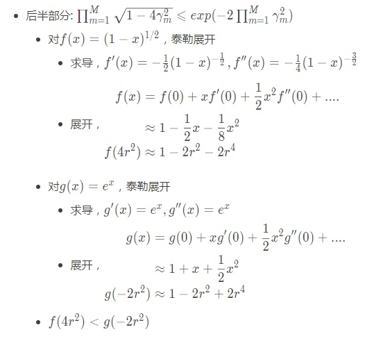
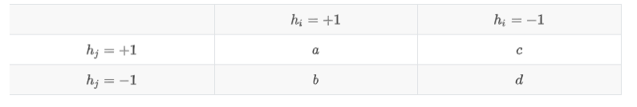

集成学习

1. 集成学习`ensemble learning`是通过构建并结合多个学习器来完成学习任务。其一般结构为：  

    * 先产生一组“个体学习器”（`individual learner`) 。个体学习器通常由一种或者多种现有的学习算法从训练数据中产生。

        * 如果个体学习器都是从某一种学习算法从训练数据中产生，则称这样的集成学习是同质的`homogenerous`。

            此时的个体学习器也称作基学习器`base learner`，相应的学习算法称作基学习算法。

        * 如果个体学习器是从某几种学习算法从训练数据中产生，则称这样的集成学习是异质的`heterogenous` 。

    * 再使用某种策略将它们结合起来。集成学习通过将多个学习器进行组合，通常可以获得比单一学习器显著优越的泛化性能。

2. 通常选取个体学习器的准则是：

    *   个体学习器要有一定的准确性，预测能力不能太差。
    *   个体学习器之间要有多样性，即学习器之间要有差异。
3. 通常基于实际考虑，往往使用预测能力较强的个体学习器（即强学习器，与之对应的为弱学习器）。

    强学习器的一个显著的好处就是可以使用较少数量的个体学习器来集成就可以获得很好的效果。

4. 根据个体学习器的生成方式，目前的集成学习方法大概可以分作两类：

    *   个体学习器之间存在强依赖关系、必须串行生成的序列化方法，每一轮迭代产生一个==个体学习器==。其中以`Boosting`为代表。
    *   个体学习器之间不存在强依赖关系、可同时生成的并行化方法。其中以`Bagging`和随机森林`Random Forest`为代表。

一、集成学习误差
--------

1. 考虑一个二类分类问题。设单个样本为$ \mathbf {\vec x}$，真实类别为$ y \in \mathcal Y=\{-1,+1\}$。

    假定基类分类器的错误率为$ \epsilon$，即对每个基分类器 $h_i$ 有：$p(h_i(\mathbf {\vec x}) \ne y)=\epsilon$ 。

    * 假设集成学习通过简单投票法结合 M 个基分类器 $h_1,h_2,\cdots,h_M $。即：若有超过半数的基分类器正确，则集成分类就正确。根据描述，给出集成学习器为：$H(\mathbf {\vec x})=\text{sign}\left(\sum_{i=1}^{M}h_i(\mathbf {\vec x})\right)$ 。

    * 集成学习器预测错误的条件为： k 个基分类器预测正确，其中 $k \le \left\lfloor M/2\right\rfloor$（即：少于一半的基分类器预测正确）， $M-k $个基分类器预测错误。

        假设基分类器的错误率相互独立，则集成学习器预测错误的概率为：$p(H(\mathbf {\vec x}) \ne y)=\sum_{k=0}^{\left\lfloor M/2\right\rfloor}C_M^{k}(1-\epsilon)^{k}\epsilon^{M-k}$ 。

    * 根据`Hoeffding`不等式有：$p(H(\mathbf {\vec x}) \ne y)=\sum_{k=0}^{\left\lfloor M/2\right\rfloor}C_M^{k}(1-\epsilon)^{k}\epsilon^{M-k}\le \exp\left(-\frac 12 M(1-2\epsilon)^{2}\right) $。

        可以看出：随着$ M \rightarrow \infty $， 集成学习器预测错误的概率 $p(H(\mathbf {\vec x}) \ne y) \rightarrow 0 $。

2. 上述推论有非常关键的一个地方：假设基分类器的错误率相互独立。

    * 实际上个体学习器是为了解决同一个问题训练出来的，而且可能是同一类算法从同一个训练集中产生。

        这样个体学习器的错误率显然不能相互独立。

    * 实际上个体学习器的准确性和多样性本身就存在冲突。

        *   通常个体学习器的准确性很高之后，要增加多样性就需要牺牲准确性。
        *   实际上如何产生并结合”好而不同“的个体学习器就是集成学习研究的核心。

二、 Boosting
-----------

1. 提升方法(`boosting`) 是一种常用的统计学习方法。在分类问题中，它通过改变训练样本的权重学习多个分类器，并将这些分类器们进行线性组合来提高分类的能力。

2. 提升方法的基本思想是：对于一个复杂任务来说，将多个专家的判断进行适当的综合所得出的判断，要比其中任何一个专家单独的判断要好。类似于”三个臭皮匠顶一个诸葛亮“。

3. 提升方法的理论基础是：强可学习与弱可学习是等价的。

    在概率近似正确（`probably approximately correct,PAC`）学习的框架下：

    *   强可学习：一个概念（或一个类别），若存在一个多项式的学习算法能够学习它并且正确率很高，那么称这个概念是强可学习的。
    *   弱可学习：一个概念（或一个类别），若存在一个多项式的学习算法能够学习它，学习的正确率仅比随机猜测略好，那么称这个概念是弱可学习的。

    可以证明：强可学习与弱可学习是等价的。

    即：若在学习中发现了 ”弱学习算法“ ，则可以通过某些办法将它提升为 ”强学习算法“。

4. 对于分类问题而言，求一个比较粗糙的分类规则（弱分类器）要比求精确的分类规则（强分类器）要容易得多。

5. `Boosting` 就是一族可以将弱学习器提升为强学习器的算法。

    这族算法的工作原理类似：

    *   先从初始训练集训练出一个基学习器。
    *   再根据基学习器的表现对训练样本分布进行调整，使得先前基学习器做错的训练样本在后续受到更多关注。
    *   然后基于调整后的样本分布来训练下一个基学习器。
    *   如此重复，直到基学习器数量达到事先指定的值`M` 。
    *   最终将这`M`个基学习器进行加权组合。

### 2.1 AdaBoost 算法

1. `Boosting`族算法最著名的代表是`AdaBoost`算法。

2. `AdaBoot`算法两个核心步骤：

    * 每一轮中如何改变训练数据的权值？

        `AdaBoost`算法提高那些被前一轮弱分类器错误分类样本的权值，而降低那些被正确分类样本的权值。

        于是那些没有得到正确分类的数据由于权值的加大而受到后一轮的弱分类器的更大关注。

    * 最后如何将一系列弱分类器组合成一个强分类器？

        `AdaBoost` 采用加权多数表决的方法：

        *   加大分类误差率较小的弱分类器的权值，使得它在表决中起较大作用。
        *   减小分类误差率较大的弱分类器的权值，使得它在表决中起较小的作用。
3. `AdaBoost`算法有两个特点：

    * 不改变所给的训练数据，而不断改变训练数据权值的分布，使得训练数据在基本分类器的学习中起不同作用。

        *   因此`AdaBoost`要求基本学习器能够对特定的数据分布进行学习，这一般是在学习的时候为每个训练样本赋予一个权重。
        *   对于无法接受带权样本的基本学习算法，则可以通过“重采样法”来处理：即在每一轮学习中，根据样本分布对训练集重新采样，再用重采样的样本集对基本学习器进行训练。
        *   一般而言这两者没有显著的优劣差别。

    * 利用基本分类器的线性组合$ f(\mathbf {\vec x})=\sum_{m=1}^{M}\alpha_mh_m(\mathbf {\vec x})$ 构成最终分类器：

        $$
        H(\mathbf {\vec x})=\text{sign}(f(\mathbf {\vec x}))=\text{sign}\left(\sum_{m=1}^{M}\alpha_mh_m(\mathbf {\vec x})\right )
        $$
        其中：

        *   $f(\mathbf {\vec x})$ 的符号决定实例 $\mathbf {\vec x}$ 的分类。
        *   $f(\mathbf {\vec x}) $的绝对值表示分类的确信度。
4. `AdaBoost` 算法具有自适应性，即它能够自动适应弱分类器各自的训练误差率，这也是它的名字（适应的提升）的由来。

#### 2.1.1 算法

1. `AdaBoost`算法：

    * 输入：

        *   训练数据集 $\mathbb D=\{(\mathbf{\vec x}_1,\tilde y_1),(\mathbf{\vec x}_2,\tilde y_2),\cdots,(\mathbf{\vec x}_N,\tilde y_N)\},\;\mathbf{\vec x}_i \in \mathcal X \subset \mathbb R^{n},\tilde y_i \in \mathcal Y=\{-1,+1\}$
        *   弱学习算法
    * 输出：集成分类器 $H(\mathbf {\vec x})$

    * 算法步骤：

        * 初始化训练数据的权值分布 $W_1=(w_{1,1},w_{1,2},\cdots,w_{1,N}),w_{1,i}=\frac 1N $。

        * 对$ m=1,2,\cdots,M$

            * 使用具有权值分布$ W_m $的训练数据集学习，根据输入的弱学习算法得到基本分类器：$h_m(\mathbf {\vec x}):\mathcal X \rightarrow \{-1,+1\} 。$

            * 计算 $h_m(\mathbf {\vec x}) $在训练数据集上的分类误差率：$e_m = \sum_{i=1}^{N}w_{m,i}I(h_m(\mathbf{\vec x}_i) \neq \tilde y_i) $。

                ==它就是所有误分类点的权重之和。其中权重越大的误差分类点，其在误差率中占比越大==。

            * 若$ e_m \ge \frac 12$，算法终止，构建失败！

            * 计算$ h_m(\mathbf {\vec x}) $的系数：$\alpha_m=\frac 12 \log \frac{1-e_m}{e_m}$ 。

                该系数表示$ h_m(\mathbf {\vec x})$ 在集成分类器中的重要性。它是$ e_m$ 的单调减函数，说明==误差越小的基本分类器，其重要性越高。==

                根据系数大于零==要求$ e_m \lt \frac 12$ 。此时$\alpha_m>0$==

            * 更新训练数据集的权值分布：$W_{m+1}=(w_{m+1,1},w_{m+1,2},\cdots,w_{m+1,N}) $。其中：

                $$
                w_{m+1,i}=\frac{w_{m,i}}{Z_m}\exp(-\alpha_m\tilde y_ih_m(\mathbf{\vec x}_i))
                $$
                $Z_m=\sum_{i=1}^{N}w_{m,i}\exp(-\alpha_m\tilde y_ih_m(\mathbf{\vec x}_i)) $为规范化因子，它使得 $W_{m+1} $成为一个概率分布 ,即保证和为1。

                - $\tilde y_ih_m(\mathbf{\vec x}_i)$的取值只能为$1,-1$,如果是正确分类的点,则为1，分类错误的点为-1.具体解释见算法解释2.1.2-1

        * 构建基本分类器的线性组合：$ f(\mathbf {\vec x})=\sum_{m=1}^{M}\alpha_mh_m(\mathbf {\vec x})，$于是得到集成分类器：$H(\mathbf {\vec x})=\text{sign}\left(\sum_{m=1}^{M}\alpha_mh_m(\mathbf {\vec x})\right) 。$

2. 为防止过拟合，`AdaBoost` 通常会加入正则化项。该正则化项称作步长或者学习率，定义为 $\nu $。

    考虑正则化项之后，模型的更新方式为：$f_m(\mathbf{\vec x}) = f_{m-1}(\mathbf{\vec x})+\nu \alpha_mh_m( \mathbf{\vec x})$ 。

#### 2.1.2 算法解释

1. `AdaBoost` 提高那些被前一轮弱分类器错误分类样本的权值，而降低那些被正确分类样本的权值。

    这是通过更新训练数据集的权值分布 $W_{m+1}=(w_{m+1,1},w_{m+1,2},\cdots,w_{m+1,N}) $来实现的。其中：

    $$
    w_{m+1,i}=\frac{w_{m,i}}{Z_m}\exp(-\alpha_m\tilde y_ih_m(\mathbf{\vec x}_i))\\ Z_m=\sum_{i=1}^{N}w_{m,i}\exp(-\alpha_m\tilde y_ih_m(\mathbf{\vec x}_i))
    $$

    *   对于正确分类样本，$h_m(\mathbf{\vec x}_i)=\tilde y_i $下一轮权重为：$w_{m+1,i}=\frac{w_{m,i}}{Z_m}\exp(-\alpha_m)$
    *   对于错误分类样本，$h_m(\mathbf{\vec x}_i)\neq \tilde y_i$ 下一轮权重为：$w_{m+1,i}=\frac{w_{m,i}}{Z_m}\exp(\alpha_m)$

    两者比较，误分类样本的权重是正确分类样本的权重的$ \exp(2\alpha_m)=\frac{e_m}{1-e_m} $倍。于是误分类样本在下一轮学习中权重更大。

2. 集成分类器$ H(\mathbf {\vec x})=\text{sign}\left(\sum_{m=1}^{M}\alpha_mh_m(\mathbf {\vec x})\right) $结合 M 个基本分类器的方式为加权表决。

    * 系数 $\alpha_m$ 表示了基本分类器$h_m(\mathbf {\vec x})$ 的重要性。其中：

        $$
        \alpha_m=\frac 12 \log \frac{1-e_m}{e_m}\\ e_m = \sum_{i=1}^{N}w_{m,i}I(h_m(\mathbf{\vec x}_i) \neq \tilde y_i)\\
        
        令\frac{\partial Z_{m}}{\partial \alpha_{m}}=\sum_{i=1}^{N}-w_{m i} y_{i} h_{m}\left(\mathbf{\vec x}_{i}\right) \exp \left(-\alpha_{m} y_{i} h_{m}\left(\mathbf{\vec x}_{i}\right)\right)=0\\
        即-exp(-\alpha_{m})(1-e_m)-(-exp(\alpha_{m})e_m)=0求得\alpha_m
        $$

    * 由于$ \alpha_m$ 是分类误差率 $e_m $的单调递减函数，因此：

        *   `AdaBoost` 加大分类误差率较小的弱分类器的权值，使得它在表决中起较大作用。
        *   `AdaBoost` 减小分类误差率较大的弱分类器的权值，使得它在表决中起较小的作用。

#### 2.1.3 误差分析

1. 定理一：`AdaBoost`算法集成分类器的训练误差上界为：

    $$
    \frac 1N \sum_{i=1}^{N}I(H(\mathbf{\vec x}_i) \neq \tilde y_i) \le \frac 1N \sum_{i=1}^{N}\exp(-\tilde y_if(\mathbf{\vec x}_i))=\prod_{m=1}^{M}Z_m\\ Z_m=\sum_{i=1}^{N}w_{m,i}\exp(-\alpha_m\tilde y_ih_m(\mathbf{\vec x}_i))
    $$

    $$
    \begin{split} & \frac{1}{N} \sum_i exp(-y_i f(x_i)) \\
    &= \frac{1}{N} \sum_i exp(-\sum_{m=1}^M \alpha_m y_i G_m(x_i))\\
    &由于w_{1i}=\frac{1}{N},且将exp中的求和写成连乘的形式\\
    &= \sum_i w_{1i} \prod_{m=1}^M exp(-\alpha_m y_i G_m(x_i)) \\
    &=\sum_i [w_{1i}exp(-\alpha_1 y_i G_1(x_i)) ]\prod_{m=2}^M exp(-\alpha_m y_i G_m(x_i)) \\
    &由于w_{m+1,i}=\frac{w_{m,i}}{Z_m}\exp(-\alpha_m\tilde y_ih_m(\mathbf{\vec x}_i))\\
    &可得w_{m+1,i}Z_m=w_{m,i}\exp(-\alpha_m\tilde y_ih_m(\mathbf{\vec x}_i))\\
    &= \sum_i w_{2i}Z_1  \prod_{m=2}^M exp(-\alpha_m y_i G_m(x_i)) \\ 
    &= Z_1 \sum_i w_{2i} \prod_{m=2}^M exp(-\alpha_m y_i G_m(x_i)) \\ 
    &= Z_1 Z_2 \sum_i w_{3i} \prod_{m=3}^M exp(-\alpha_m y_i G_m(x_i)) \\
    &= ... \\
    &= Z_1 Z_2 ... Z_{M-1} \sum_i w_{Mi} exp(-\alpha_m y_i G_m(x_i)) \\
    &= \prod_{m=1}^M Z_m \end{split}
    $$

    这一定理说明：可以在每一轮选取适当的$ h_m$ 使得 $Z_m$ 最小，从而使得训练误差下降最快。

    

    

2. 定理二：二类分类 `AdaBoost` 的训练误差界：

    $$
    \prod_{m=1}^{M}Z_m=\prod_{m=1}^{M}\left[2\sqrt{e_m(1-e_m)} \;\right]=\prod_{m=1}^{M}\sqrt{(1-4\gamma_m^{2})} \le \exp(-2\sum_{m=1}^{M}\gamma_m^{2})
    $$
    其中$ \gamma_m=\frac 12-e_m $。

$$
\begin{split} Z_m &= \sum_{i=1}^N w_{mi} exp(-\alpha_m y_i G_m(x_i) \\
&= \sum_{y_i = G_m(x_i)} w_{mi} e^{-\alpha_m} + \sum_{y_i \neq G_m(x_i)} w_{mi} e^{\alpha_m} \\
&= (1-e_m)e^{-\alpha_m} + e_m e^{\alpha_m}\\
& 带入\alpha_m=\frac 12 \log \frac{1-e_m}{e_m}可得 \\
&= 2 \sqrt{e_m (1 - e_m)} = \sqrt{1 - 4\gamma_m^2 }
\end{split} \tag{8.11}\\
可以证明，当e_m<0.5时,Z_m=2 \sqrt{e_m (1 - e_m)}<1
$$

至于不等式 $exp(-2\sum_{m=1}^M \gamma_m^2) \geqslant\prod_{m=1}^M \sqrt{1-4\gamma_m^2}$可由$(e^{-2x^2})^2$在$x=0$的泰勒展开得到$(e^{-2x^2})^2 \geqslant 1 - 4x^2$进而推出。

    aaaa

3. 推论：若存在 $\gamma \gt 0$，对所有 $m $有 $\gamma_m \ge \gamma$ ，则有：

    $$
    \frac 1N \sum_{i=1}^{N}I(H(\mathbf{\vec x}_i)\neq \tilde y_i) \le \exp(-2M\gamma^{2})
    $$
    这表明在此条件下 `AdaBoost` 的训练误差是以指数速率下降的。

4. 上述定理都只是关于训练误差的分析，实际应用中更关系测试集的误差。

    `AdaBoost` 算法也会出现过拟合，此时训练误差为 0 但是测试集的误差较大。

5. 当`AdaBoost` 的基础分类器比较复杂时，`AdaBoost` 很容易陷入过拟合。

    但是当`AdaBoost` 的基础分类器比较简单时，`AdaBoost` 反而难以陷入过拟合。这也是为什么`AdaBoost` 的基础分类器经常选择使用树桩的原因。

### 2.3 AdaBoost 多分类

1.  标准的`AdaBoost`算法只适用二类分类问题，可以将它推广到多分类问题。 有两种算法：

    *   `SAMME` 算法：该算法不需要个体分类器输出类别的概率。
    *   `SAMME.R` 算法：该算法需要个体分类器输出类别的概率。

#### 2.3.1 SAMME 算法

1. `SAMME`算法：

    * 输入：

        *   训练数据集$ \mathbb D=\{(\mathbf{\vec x}_1,\tilde y_1),(\mathbf{\vec x}_2,\tilde y_2),\cdots,(\mathbf{\vec x}_N,\tilde y_N)\},\; \mathbf{\vec x}_i \in \mathcal X \subset \mathbb R^{n},\tilde y_i \in \mathcal Y=\{c_1,c_2,\cdots,c_K\}$
        *   弱学习算法
    * 输出：集成分类器$ H(\mathbf {\vec x})$

    * 算法步骤：

        * 初始化训练数据的权值分布 $W_1=(w_{1,1},w_{1,2},\cdots,w_{1,N}),w_{1,i}=\frac 1N $。

        * 对$ m=1,2,\cdots,M$

            * 使用具有权值分布 $W_m $的训练数据集学习，根据输入的弱学习算法得到基本分类器：$h_m(\mathbf {\vec x}):\mathcal X \rightarrow \{c_1,c_2,\cdots,c_K\}$ 。

            * 计算 $h_m(\mathbf {\vec x})$ 在训练数据集上的分类误差率：$e_m= \sum_{i=1}^{N}w_{m,i}I(h_m(\mathbf{\vec x}_i) \neq \tilde y_i) 。$

            * 计算 $h_m(\mathbf {\vec x}) $的系数：$\alpha_m=\frac 12 \log \frac{1-e_m}{e_m}+\log(K-1) $。

                因为系数$ \alpha_m\gt 0 $，因此要求 $e_m \lt \frac {K-1}{K} $。

            * 更新训练数据集的权值分布：$ W_{m+1}=(w_{m+1,1},w_{m+1,2},\cdots,w_{m+1,N}) $。其中：

                $$
                w_{m+1,i}=\frac{w_{m,i}}{Z_m}\exp\left( -\alpha_m\tilde y_ih_m(\mathbf{\vec x}_i) \right)\\ Z_m=\sum_{i=1}^{N}w_{m,i}\exp(-\alpha_m\tilde y_ih_m(\mathbf{\vec x}_i))
                $$
                其中$Z_m $为规范化因子，它使得$ W_{m+1} $成为一个概率分布。

        * 构建基本分类器的线性组合，于是得到集成分类器：$H(\mathbf {\vec x})=\arg\max_{c_k}\left(\sum_{m=1}^{M}\alpha_mI(h_m(\mathbf {\vec x})=c_k)\right)$ 。

2. 当 K=2 时`SAMME`算法退化为标准的`AdaBoost`算法。

#### 2.3.2 SAMME.R算法

1. `SAMME.R`算法：

    * 输入：

        *   训练数据集$ \mathbb D=\{(\mathbf{\vec x}_1,\tilde y_1),(\mathbf{\vec x}_2,\tilde y_2),\cdots,(\mathbf{\vec x}_N,\tilde y_N)\},\; \mathbf{\vec x}_i \in \mathcal X \subset \mathbb R^{n},\tilde y_i \in \mathcal Y=\{c_1,c_2,\cdots,c_K\}$
        *   弱学习算法
    * 输出：集成分类器 $H(\mathbf {\vec x})$

    * 算法步骤：

        * 初始化训练数据的权值分布 $W_1=(w_{1,1},w_{1,2},\cdots,w_{1,N}),w_{1,i}=\frac 1N $。

        * 对$ m=1,2,\cdots,M$

            * 使用具有权值分布$ W_m$ 的训练数据集学习，根据输入的弱学习算法得到基本分类器：$h_m(\mathbf {\vec x}):\mathcal X \rightarrow \{c_1,c_2,\cdots,c_K\} $。

            * 计算$ h_m(\mathbf {\vec x}) $在训练数据集上的加权概率估计：

                $$
                p_{m,i}^{(k)}=w_{m,i}p(\tilde y_i=c_k\mid\mathbf {\vec x}_i), i=1,2,\cdots,N;k=1,2,\cdots,K
                $$
                其中：

                *   $\tilde y_i $是 $\mathbf {\vec x}_i$ 的真实标记。
                *   $w_{m,i} $是$ \mathbf {\vec x}_i $的权重。
                *   $p_{m,i}^{(k)} $刻画基本分类器 $h_m(\cdot) $预测 $\mathbf {\vec x}_i$ 的输出为类别$ c_k$ 的概率的加权值。  

            * 对$ h_m $和类别$ c_k$ ，定义：

                $$
                l_m^{(k)}(\mathbf{\vec x}_i)=(K-1)\left(\log p_{m,i}^{(k)}-\frac 1K\sum_{k'=1}^{K}\log p_{m,i}^{(k')}\right) ,k=1,2,\cdots,K
                $$
                它刻画了： $h_m(\cdot)$ 预测的输出类别为 $c_k$ 的概率加权值的对数$ \log p_{m,i}^{(k)} $，距离所有概率加权值对数的均值$ \frac 1K\sum_{k'=1}^{K}\log p_{m,i}^{(k')} $的距离。

            * 更新训练数据集的权值分布：$ W_{m+1}=(w_{m+1,1},w_{m+1,2},\cdots,w_{m+1,N}) $。其中：

                $$
                w_{m+1,i}=w_{m,i}\exp\left(-\frac{K-1}{K} \sum_{k=1}^{K}\delta_{i}^{(k)}\log p_{m,i}^{(k)}\right)\\ \delta_{i}^{(k)}=\begin {cases} 1,& \text{if} \quad \tilde y_i=c_k \\ -\frac {1}{K-1} ,& \text{else} \end{cases}
                $$

            * 归一化训练数据集的权值分布$ W_{m+1}=(w_{m+1,1},w_{m+1,2},\cdots,w_{m+1,N}) $，使得权值之和为 1 。

        * 构建基本分类器的线性组合，于是得到集成分类器：
            $$
            H(\mathbf {\vec x})=\arg\max_{c_k}\left(\sum_{m=1}^{M}l_m^{(k)}(\mathbf{\vec x})\right) 
            $$
            。

### 2.4 Adaboost 回归

1. `Adaboost` 的回归问题有很多变种，这里介绍`AdaBoost R2` 算法。

2. `AdaBoost R2` 回归算法：

    * 输入：

        *   训练数据集 $\mathbb D=\{(\mathbf{\vec x}_1,\tilde y_1),(\mathbf{\vec x}_2,\tilde y_2),\cdots,(\mathbf{\vec x}_N,\tilde y_N)\},\;\mathbf{\vec x}_i \in \mathcal X \subset \mathbb R^{n},\tilde y_i \in \mathbb R$
        *   弱学习算法
    * 输出：集成回归器 $H(\mathbf {\vec x})$

    * 算法步骤：

        * 初始化训练数据的权值分布$ W_1=(w_{1,1},w_{1,2},\cdots,w_{1,N}),w_{1,i}=\frac 1N$ 。

        * 对 $m=1,2,\cdots,M$

            * 使用具有权值分布 W_m 的训练数据集学习，根据输入的弱学习算法得到基本回归器：
                $$
                h_m(\mathbf {\vec x}):\mathcal X \rightarrow \mathbb R 。
                $$

            * 计算$ h_m(\mathbf {\vec x}) $在训练数据集上的误差：

                $$
                E_m = \max_{\mathbf{\vec x}_i \in \mathbb D}|\tilde y_i - h_m(\mathbf{\vec x}_i)|\\ e_m=\sum_{i=1}^Nw_{m,i}\left(\frac {\tilde y_i - h_m(\mathbf{\vec x}_i) }{E_k}\right)^2
                $$
                它就是所有样本的回归误差的加权和。

                其中$ E_m $为误差绝对值的最大值，通过它来对所有的回归误差归一化。

            * 计算$ h_m(\mathbf {\vec x}) $的系数：$\alpha_m = \frac{e_m}{1-e_m}$ 。

                该系数表示 $h_m(\mathbf {\vec x}) $在集成回归器中的重要性。

                它是$ e_m $的单调减函数，说明误差越小的基本回归器，其重要性越高。

            * 更新训练数据集的权值分布：$W_{m+1}=(w_{m+1,1},w_{m+1,2},\cdots,w_{m+1,N}) $。其中：

                $$
                w_{m+1,i}=\frac{w_{m,i}}{Z_m} \alpha_m^{1-\left(\frac {\tilde y_i - h_m(\mathbf{\vec x}_i) }{E_m}\right)^2}\\ Z_m = \sum_{i=1}^N w_{m,i} \alpha_m^{1-\left(\frac {\tilde y_i - h_m(\mathbf{\vec x}_i) }{E_m }\right)^2}
                $$
                $Z_m $为规范化因子，它使得$ W_{m+1}$ 成为一个概率分布 。

        * 构建基本回归器的线性组合 ，于是得到集成回归器：$H(\mathbf {\vec x})=\sum_{m=1}^M (\ln \frac {1}{\alpha_m})h_m(\mathbf{\vec x}) $。  

### 2.5 AdaBoost与加法模型-梯度提升

AdaBoost的另外一种解释

#### 2.5.1 加法模型-损失函数

1. `AdaBoost` 算法可以认为是：模型为加法模型、损失函数为指数函数、学习算法为前向分步算法的二类分类学习方法。

    其中指数损失函数为： $L(\tilde y,f(\mathbf {\vec x}))=e^{-\tilde yf(\mathbf {\vec x})} $。

2. 考虑加法模型 $y=f(\mathbf {\vec x})=\sum_{m=1}^{M}\beta_mb(\mathbf {\vec x};\gamma_m) $，其中 $b(\mathbf {\vec x};\gamma_m) $为基函数、 $\gamma_m$ 为基函数的参数、 $\beta_m$ 为基函数的系数。

    给定训练数据以及损失函数$ L(\tilde y,y)$ 的条件下，根据经验风险极小化（即：损失函数极小化）准测来学习加法模型 $f(\mathbf {\vec x})$ ：

    $$
    \min_{\beta_m,\gamma_m}\sum_{i=1}^{N}L\left(\tilde y_i,\sum_{m=1}^{M}\beta_mb(\mathbf {\vec x};\gamma_m)\right)
    $$

3. 这是个复杂的最优化问题，通常可以采用前向分步算法求解。

    前向分步算法求解这一优化问题的思想是：因为学习的是加法模型，如果能够从前向后，每一步只学习一个基函数及其系数，逐步逼近优化目标函数，则可以简化优化的复杂度。

    具体地，==每一步只需要优化如下的损失函数==：$\min_{\beta,\gamma}\sum_{i=1}^{N}L(\tilde y_i,\beta b(\mathbf {\vec x};\gamma)) $。

#### 2.5.2 前向分布算法

1.  前向分步算法：

    *   输入：

        *   训练数据集 $\mathbb D=\{(\mathbf{\vec x}_1,\tilde y_1),(\mathbf{\vec x}_2,\tilde y_2),\cdots,(\mathbf{\vec x}_N,\tilde y_N)\},\quad \mathbf{\vec x}_i \in \mathcal X \subset \mathbb R^{n},\tilde y_i \in \mathcal Y=\{-1,+1\}$
        *   损失函数$ L(\tilde y,y)$
        *   基函数集 $\{b(\mathbf {\vec x};\gamma)\}$
    *   输出：加法模型 $f(\mathbf {\vec x})$

    *   算法步骤：

        *   初始化$ f_0(\mathbf {\vec x})=0$

        *   对$ m=1,2,\cdots,M$

            *   极小化损失函数 $(\beta_m,\gamma_m)=\arg\min_{\beta,\gamma}\sum_{i=1}^{N}L(\tilde y_i,f_{m-1}(\mathbf{\vec x}_i)+\beta b(\mathbf{\vec x}_i;\gamma)) $，得到参数 $\beta_m,\gamma_m $。
            *   更新 $f_m(\mathbf {\vec x})=f_{m-1}(\mathbf {\vec x})+\beta_m b(\mathbf {\vec x};\gamma_m) 。$
        *   最终加法模型$ f(\mathbf {\vec x})=f_M(\mathbf {\vec x})=\sum_{i=1}^{M}\beta_mb(\mathbf {\vec x};\gamma_m) 。$

三、Bagging
---------

### 3.1 原理

1. `Bagging`直接基于自助采样法`bootstrap sampling`。

    自助采样法的步骤是：给定包含 N 个样本的数据集：

    *   先随机取出一个样本放入采样集中，再把该样本放回原始数据集。
    *   这样经过 N 次随机采样操作，得到包含 N 个样本的采样集。

    初始训练集中有的样本在采样集中多次出现，有的则从未出现。一个样本始终不在采样集中出现的概率是$ (1-\frac 1N)^{N} $。

    根据$ \lim_{N\rightarrow \infty} (1-\frac 1N)^{N} =\frac 1e \simeq=0.368 $，因此初始训练集中约有 63.2% 的样本出现在了采样集中。

2. 自助采样法给`Bagging`算法带来了额外的优点：由于每个基学习器只用初始训练集中约 63.2% 的样本来训练，剩下的约 36.8% 的样本可用作验证集来对泛化性能进行包外估计。

3. `Bagging`的基本流程：

    *   经过 M 轮自助采样，可以得到 M 个包含 N 个训练样本的采样集。
    *   然后基于每个采样集训练出一个基学习器。
    *   最后将这 M 个基学习器进行组合，得到集成模型。
4. 在使用 `Bagging`学习器进行预测时：

    *   分类任务采取简单投票法，取每个基学习器的预测类别的众数。
    *   回归任务使用简单平均法，取每个基学习器的预测值的平均。
5. 从`偏差-方差分解`的角度来看：

    * `Bagging`主要关注降低方差，它能平滑强学习器的方差。

        因此它在非剪枝决策树、神经网络等容易受到样本扰动的学习器上效果更为明显。

    * `Boosting` 主要关注降低偏差，它能将一些弱学习器提升为强学习器。

        因此它在`SVM` 、`knn` 等不容易受到样本扰动的学习器上效果更为明显。

### 3.2 随机森林

1. 随机森林`Random Forest:RF` 是`Bagging`的一个扩展变体。

2. 随机森林对`Bagging`做了小改动：

    * `Bagging`中基学习器的“多样性”来自于样本扰动。样本扰动来自于对初始训练集的随机采样。

    * 随机森林中的基学习器的多样性不仅来自样本扰动，还来自属性扰动。

        这就是使得最终集成的泛化性能可以通过个体学习器之间差异度的增加而进一步提升。

3. 随机森林在以决策树为基学习器构建`Bagging`集成模型的基础上，进一步在决策树的训练过程中引入了随机属性选择。

    *   传统决策树在选择划分属性时，是在当前结点的属性集合（假定有 n 个属性）中选择一个最优属性。

    *   随机森林中，对基决策树的每个结点，先从该结点的属性集合中随机选择一个包含 k 个属性的子集，然后再从这个子集中选择一个最优属性用于划分。

        *   如果 k=n，则基决策树的构建与传统决策树相同。
        *   如果 k=1，则随机选择一个属性用于划分。
        *   通常建议$ k=\log_2 n $。
4. 随机森林的优点：

    *   训练效率较高。因为随机森林使用的决策树只需要考虑所有属性的一个子集。
    *   随机森林简单、容易实现、计算开销小。
    *   随机森林在很多现实任务中展现出强大的性能，被称作 “代表集成学习技术水平的方法”。
5. 随着树的数量的增加，随机森林可以有效缓解过拟合。因为随着树的数量增加，模型的方差会显著降低。

    但是树的数量增加并不会纠正偏差，因此随机森林还是会有过拟合。

四、集成策略
------

1. 学习器组合可以能带来好处：  

    * 由于学习任务的假设空间往往很大，可能有多个假设在训练集上达到同等性能。

        此时如果使用单学习器可能因为造成误选而导致泛化性能不佳，通过学习器组合之后会减小这一风险。

    * 学习算法往往会陷入局部极小。有的局部极小点所对应的泛化性能可能很差，而通过学习器组合之后可降低陷入糟糕局部极小的风险。

    * 某些学习任务的真实假设可能不在当前学习算法所考虑的假设空间中，此时使用单学习器肯定无效。

        通过学习器组合之后，由于相应的假设空间有所扩大，有可能学得更好的近似。

2. 假定集成包含 M 个基学习器 $h_1,h_2,\cdots,h_M $。一共有三种集成策略：

    *   平均法。
    *   投票法。
    *   学习法。

### 4.1 平均法

1. 平均法通常用于回归任务中。

    * 简单平均法：$H(\mathbf {\vec x})=\frac 1M \sum_{i=1}^{M}h_i(\mathbf {\vec x}) $。

    * 加权平均法：

        $$
        H(\mathbf {\vec x})=\frac 1M \sum_{i=1}^{M}w_ih_i(\mathbf {\vec x}) \\ w_i \ge 0,\sum_{i=1}^{M}w_i=1
        $$
        其中学习器$ h_i $的权重 $w_i $是从训练数据中学的。

2. 现实任务中训练样本通常不充分或者存在噪声，这就使得学得的权重不完全可靠。尤其是对于规模比较大的集成学习，要学习的权重比较多，很容易出现过拟合。

    因此实验和应用均显示出，加权平均法不一定优于简单平均法。

3. 通常如果个体学习器性能相差较大时，适合使用加权平均法；个体学习器性能相差较近时，适合使用简单平均法。

### 4.2 投票法

1. 投票法通常用于分类任务中。

    * 绝大多数投票法：若某个标记得票数过半，则预测为该标记；否则拒绝预测。

        ==此时很有可能所有标记都未过半，则预测失败。因此这种方法比较少用==。

    * 相对多数投票法：选取得票最多的标记作为预测值：$H(\mathbf {\vec x})=\arg\max_{c_j} \sum_{i=1}^{M}I(h_i(\mathbf {\vec x})=c_j) $。

    * 加权投票法：类似于加权平均法，其中学习器 $h_i $的权重$ w_i $是从训练数据中学的：$H(\mathbf {\vec x})=\arg\max_{c_j} \sum_{i=1}^{M}w_iI(h_i(\mathbf {\vec x})=c_j) 。$

### 4.3 学习法

1. 学习法中，个体学习器的分类结果通过与另一个学习器来组合。

    此时称个体学习器为初级学习器，用于组合的学习器称作次级学习器或者元学习器`meta_learner`。

2. 学习法的典型代表就是`stacking`集成算法。`stacking` 集成算法中：

    * 首先从初始数据集训练出初级学习器。

    * 然后将初级学习器的预测结果作为一个新的数据集用于训练次级学习器。

        在这个新数据集中，初级学习器的输出被当作样本输入特征；初始样本的标记仍被视作标记。

3. 若直接使用初级学习器的输出来产生次级训练集，则容易发生过拟合。

    ==一般是通过使用交叉验证，使用训练初级学习器时未使用的样本来产生次级学习器的训练样本。==

4. 次级学习器的输入属性表示和次级学习算法对`stacking`集成算法的泛化性能有很大影响。通常推荐：

    *   次级学习器的输入特征是以初级学习器的输出类概率为特征。
    *   次级学习算法采用多响应线性回归`Multi-response Linear Regression:MLR` 。

五、多样性分析
-------

### 5.1 误差-分歧分解

1. 假定有 $M$ 个个体学习器$ h_1,h_2,\cdots,h_M$ ，通过加权平均法组合产生集成学习器$ H$ 来完成回归学习任务。即：$H(\mathbf {\vec x})=\sum_{i=1}^{M}w_ih_i(\mathbf {\vec x}) $。

    * 对于某个样本$ \mathbf {\vec x}$，定义学习器$ h_i $的分歧`ambiguity`为：$A(h_i \mid \mathbf{\vec x})=(h_i( \mathbf{\vec x})-H( \mathbf{\vec x}))^{2}$ 。

        ==分歧刻画了个体学习器在某个样本$ \mathbf {\vec x} $上的不一致性，在一定程度上反映了个体学习器的多样性。==

    * 定义集成学习器的分歧为 :$ \bar A(H \mid \mathbf{\vec x}) =\sum_{i=1}^{M}w_iA(h_i \mid \mathbf{\vec x})=\sum_{i=1}^{M}w_i(h_i( \mathbf{\vec x})-H( \mathbf{\vec x}))^{2} $。

2. 设样本 $\mathbf {\vec x} $的真实标记为 $\tilde y$，则个体学习器 $h_i$ 和集成学习器$ H$ 的平方误差分别为：

    $$
    e_i(\mathbf {\vec x})=\left(\tilde y-h_i(\mathbf {\vec x})\right)^{2}\\ e_H(\mathbf {\vec x})=\left(\tilde y-H(\mathbf {\vec x})\right)^{2}
    $$
    令个体学习器误差的加权均值为：$\bar e_h(\mathbf {\vec x})=\sum_{i=1}^{M}w_ie_i(\mathbf {\vec x}) 。根据 H(\mathbf {\vec x})=\sum_{i=1}^{M}w_ih_i(\mathbf {\vec x}) $，则有：

    $$
    \bar A(H \mid \mathbf{\vec x})=\sum_{i=1}^{M} w_ie_i(\mathbf {\vec x})-e_H(\mathbf {\vec x})=\bar e_h(\mathbf {\vec x})-e_H(\mathbf {\vec x})
    $$

3. 令$ p(\mathbf {\vec x}) $为样本的概率密度。则在全样本上有：

    $$
    \int\bar A(H \mid \mathbf{\vec x})p(\mathbf {\vec x})d\mathbf {\vec x} =\int\bar e_h(\mathbf {\vec x})\;p(\mathbf {\vec x})d\mathbf {\vec x}-\int e_H(\mathbf {\vec x})\;p(\mathbf {\vec x})d\mathbf {\vec x}
    $$
    代入各变量，则有：

    $$
    \int \sum_{i=1}^{M}w_iA(h_i \mid \mathbf{\vec x}) p(\mathbf {\vec x})d\mathbf {\vec x} =\int \sum_{i=1}^{M}w_ie_i(\mathbf {\vec x})\;p(\mathbf {\vec x})d\mathbf {\vec x}-\int e_H(\mathbf {\vec x})\;p(\mathbf {\vec x})d\mathbf {\vec x}\\ \rightarrow \sum_{i=1}^{M}w_i\int A(h_i \mid \mathbf{\vec x}) p(\mathbf {\vec x})d\mathbf {\vec x}=\sum_{i=1}^{M}w_i\int e_i(\mathbf {\vec x})\;p(\mathbf {\vec x})d\mathbf {\vec x}-\int e_H(\mathbf {\vec x})\;p(\mathbf {\vec x})d\mathbf {\vec x}
    $$

4. 定义个体学习器$ h_i $在全体样本上的泛化误差和分歧项为：

    $$
    E_i= \int e_i(\mathbf {\vec x})\;p(\mathbf {\vec x})d\mathbf {\vec x}\\ A_i=\int A(h_i \mid \mathbf{\vec x}) \;p(\mathbf {\vec x})d\mathbf {\vec x}
    $$
    定义集成的泛化误差为：$E=\int e_H(\mathbf {\vec x})\;p(\mathbf {\vec x})d\mathbf {\vec x} $。则有：$\sum_{i=1}^{M}w_i A_i= \sum_{i=1}^{M}w_i E_i-E $。

5. 定义个体学习器泛化误差的加权均值为$ \bar E=\sum_{i=1}^{M}w_i E_i。$定义个体学习器的加权分歧值为 $\bar A=\sum_{i=1}^{M}w_i A_i$。则有：$E=\bar E-\bar A $。这就是集成学习的误差-分歧分解。

    *   ==该式针对回归学习，难以直接推广到分类学习任务中去==。

    *   该式难以直接作为优化目标，因为现实任务中很难直接对 $\bar E-\bar A$ 进行优化：

        *   一方面是它们是定义在整体样本空间上的。
        *   另一方面是 $\bar A$ 不是一个可以直接操作的值，它是当集成学习器构造之后才能进行估计的。

6. 从误差-分歧分解中看出：要想降低集成学习的泛化误差$ E$，要么提高个体学习器的加权分歧值 $\bar A$，要么降低个体学习器的泛化误差的加权均值 $\bar E$。

    因此：个体学习器准确性越高、多样性越大，则集成越好。

### 5.2 多样性度量

1. 多样性度量`diversity measure`是用于刻画集成模型中的个体分类器的多样性的程度。通常是考虑个体分类器的两两相似/不相似程度。

2. 给定数据集$ \mathbb D=\{(\mathbf{\vec x}_1,\tilde y_1),(\mathbf{\vec x}_2,\tilde y_2),\cdots,(\mathbf{\vec x}_N,\tilde y_N)\},\tilde y_i\in \mathcal Y=\{-1,+1\}$。考虑分类器 $h_i,h_j $的预测结果联表`contingency table`为：

     

     

     其中：
     
     *   $a$ 表示： $h_i $预测为 +1，且$ h_j$ 预测为 +1 的样本的数量。
     *   $b$ 表示：$ h_i$ 预测为 +1，且 $h_j $预测为 -1 的样本的数量。
*   $c$ 表示：$ h_i$ 预测为 -1，且 $h_j$ 预测为 +1 的样本的数量。
     *   $d $表示：$ h_i$ 预测为 -1，且 $h_j $预测为 -1​的样本的数量。
     
     > 根据定义有： $a+b+c+d=N$

#### 5.2.1 不合度量

1. 不合度量`disagreement measure` ：$dis_{ij}=\frac{b+c}{N}$ 。

    其范围为 `[0,1]`，值越大则多样性越大 。

#### 5.2.2 相关系数

1. 相关系数`correlation coefficient`：$\rho_{ij}=\frac{ad-bc}{\sqrt{(a+b)(a+c)(c+d)(b+d)}} $。

    其范围是 `[-1,+1]`。

    *   如果$ h_i$ 与 $h_j $无关，则值为 0。
    *   如果$ h_i $与$ h_j$ 正相关，则值为正。
    *   如果$ h_i $与$ h_j $负相关，则值为 负。

#### 5.2.3 Q 统计量

1. `Q`统计量`Q-statistic`：$Q_{ij}=\frac{ad-bc}{ad+bc} $。

    $Q_{ij} $与相关系数 $\rho_{ij} $符号相同，且 $|Q_{ij}| \le |\rho_{ij}|$

#### 5.2.4 kappa 统计量

1. $\kappa$统计量$ (\kappa-statistic)：\kappa_{ij}=\frac{p_1-p_2}{1-p_2} 。$

    其中：

    * $p_1$ 是两个分类器取得一致的概率：$ p_1=\frac {a+d}{N} 。$

        根据：

        $p(h_i=h_j)=p(h_i=1,h_j=1)+p(h_i=-1,h_j=-1)=\frac aN+\frac dN=p_1$

        所以$ p_1 $刻画了两个分类器取得一致的概率。

    * $p_2$ 是两个分类器偶然达成一致的概率：$p_2=\frac{(a+b)(a+c)+(c+d)(b+d)}{N^{2}} $。

        根据：

        $$
        p(h_i=1)=\frac{a+b}{N},\quad p(h_i=-1)=\frac{c+d}{N}\\ p(h_j=1)=\frac{a+c}{N},\quad p(h_j=-1)=\frac{b+d}{N}
        $$
        如果假设$ h_1$ 与 $h_2 $相互独立，则 ：

        $$
        \hat p(h_i=h_j)=\hat p(h_i=1,h_j=1)+\hat p(h_i=-1,h_j=-1)\\ =p(h_i=1)(h_j=1)+p(h_i=-1)P(h_j=-1)=p_2
        $$
        ==所以 $p_2$ 刻画了假设两个分类器的预测结果相互独立，则两个分类器取得一致的概率==。

2. $\kappa$ 的取值：

    * 若两个分类器在数据集 $\mathbb D $上完全一致，则 $\kappa=1$。

        因为此时$ b=c=0$，则 $p_1=1$。

    * 如果两个分类器仅仅是偶然达成一致，则$ \kappa=0$。

        因为此时$ p(h_i=h_j)=\hat p(h_i=h_j)$，则$ p_1=p_2 $。

    * 通常 $\kappa $取非负值，仅在$ h_i $与 $h_j $达成一致的概率甚至低于偶然性的情况下才取负值。

### 5.3 多样性增强

1. 集成学习中，需要有效地生成多样性较大的个体学习器。

    一般的思路是在学习过程中引入随机性。常见的做法是：对数据样本、输入属性、输出表示、算法参数进行扰动。

2. 数据样本扰动：给定初始数据集，可以从中产生出不同的数据子集。再利用不同的数据子集训练出不同的个体学习器。

    * 数据样本扰动通常是基于采样法，此类做法简单高效、使用最广。

    * 对于常见的基学习器，如决策树、神经网络等，训练样本稍加变化就会导致学习器有显著的变动，数据样本扰动法对这样的“不稳定基学习器”很有效。

    * 对于一些基学习器对数据样本的扰动不敏感，如线性学习器、支持向量机、朴素贝叶斯、 k 近邻学习器等，这样的基学习器称作稳定基学习器。

        对于此类的基学习器进行集成往往需要使用输入属性扰动等其他机制。

3. 输入属性扰动：训练样本通常由一组属性描述，不同的“子空间”提供了观察数据的不同视角。显然从不同子空间训练出来的个体学习器必然有所不同。

    * 对于包含了大量冗余属性的数据，在子空间中训练个体学习器不仅能够产生多样性大的个体，还会因为属性数量的减少而大幅节省时间开销。

        同时由于冗余属性多，减少一些属性之后训练的个体学习器也不至于太差。

    * ==对于只包含少量属性的数据，或者冗余属性较少，则不宜采用输入属性扰动法。==

4. 输出表示扰动：此类做法的思路是对输出表示进行操纵以增强多样性。

    如：可以对训练样本的类标记稍作变动，如翻转法`Flipping Output`随机改变一些训练样本的标记。

5. 算法参数扰动：基学习算法一般都有超参数需要设置。可以通过随机设置不同的超参数，从而产生差别较大的个体学习器。

    使用单一学习器时通常需要使用交叉验证等方法来确定最佳的超参数值。这种做法实际上是用了不同的超参数训练出来了多个学习器，只不过最终挑选出来效果最好的那个学习器来使用。

    集成学习则是相当于把所有这些学习器都利用起来。

6. 不同的多样性增强机制可以同时使用。如随机森林同时是用了数据样本扰动和输入属性扰动。