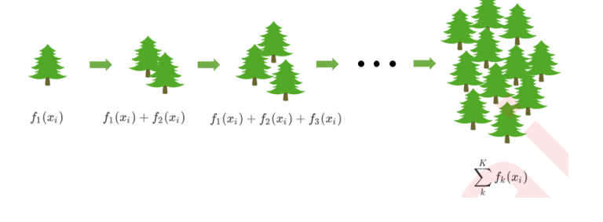
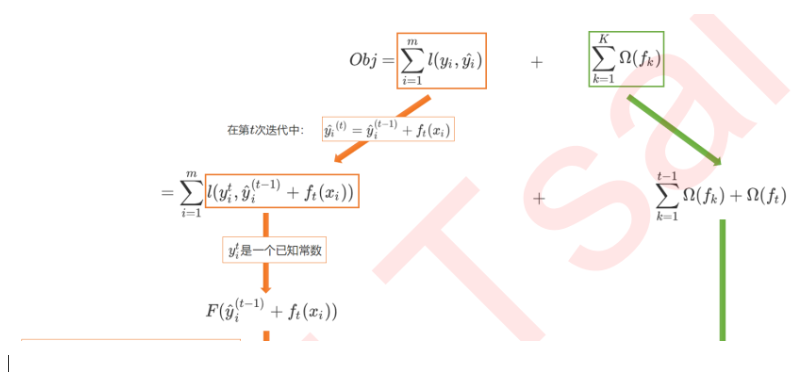
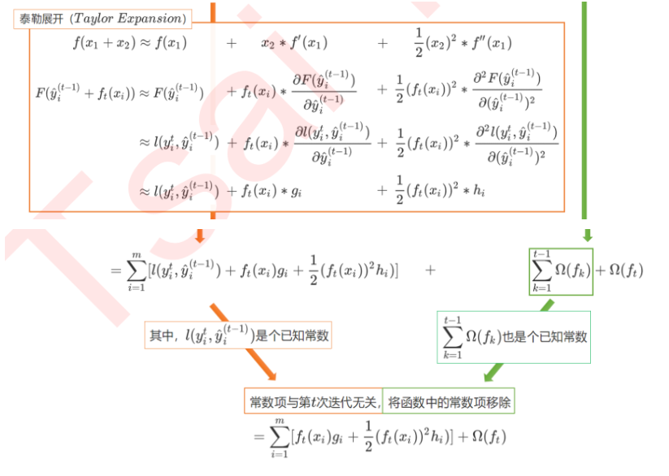
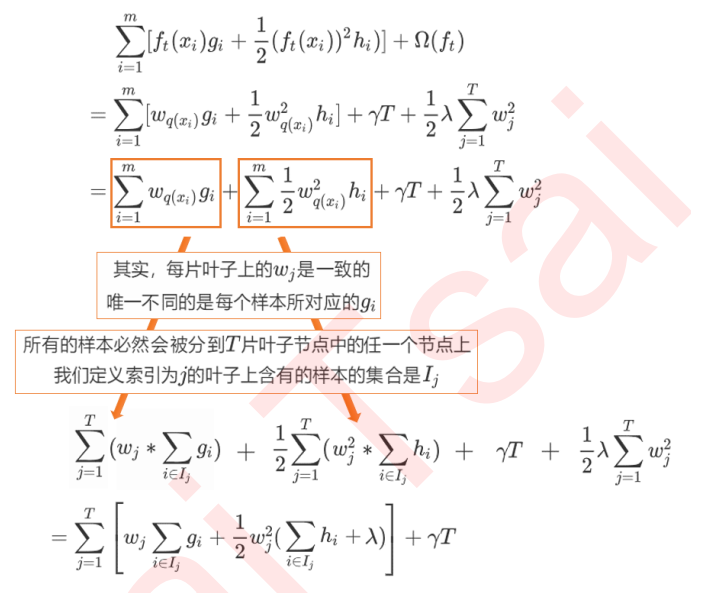
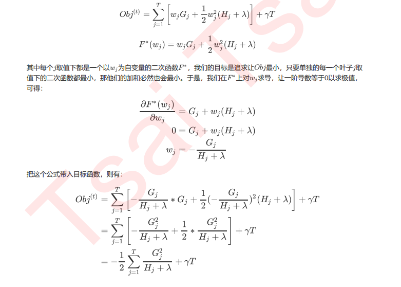
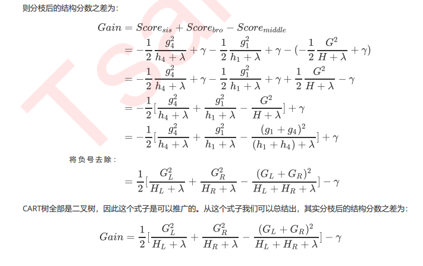

提升树
===

一、提升树
-----

提升树与梯度提升树计算残差的方法是不同的

1. 提升树`boostring tree`是以决策树为基本学习器的提升方法。它被认为是统计学习中性能最好的方法之一。

2. ==对分类问题，提升树中的决策树是二叉决策树；对回归问题，提升树中的决策树是二叉回归树==。

3. 提升树模型可以表示为决策树为基本学习器的加法模型：$ f(\mathbf {\vec x})=f_M(\mathbf {\vec x})=\sum_{m=1}^{M}h_m(\mathbf {\vec x};\Theta_m) $。

    其中 ：

    *   $h_m(\mathbf {\vec x};\Theta_m) $表示第 $m $个决策树。
    *   $\Theta_m $为第 $m $个决策树的参数。
    *   $M $为决策树的数量。
4. 提升树算法采用前向分步算法。

    * 首先确定初始提升树 $f_0(\mathbf {\vec x})=0$ 。

    * 第 $m $步模型为：$f_m(\mathbf {\vec x})=f_{m-1}(\mathbf {\vec x})+h_m(\mathbf {\vec x};\Theta_m) $。其中 $h_m(\cdot) $为待求的第 m 个决策树。

    * 通过经验风险极小化确定第 $m$ 个决策树的参数$ \Theta_m$：
        $$
        \hat\Theta_m=\arg\min_{\Theta_m}\sum_{i=1}^{N}L(\tilde y_i,f_m(\mathbf {\vec x}_i))
        $$
        。

        这里没有引入正则化，而在`xgboost` 中会引入正则化。

5. 不同问题的提升树学习算法主要区别在于使用的损失函数不同（设预测值为$ \hat y$，真实值为 $\tilde y$)：

    *   回归问题：通常使用平方误差损失函数：$L(\tilde y,\hat y)=(\tilde y-\hat y)^{2}$ 。
    *   分类问题：通常使用指数损失函数：$L(\tilde y,\hat y)=e^{-\tilde y\hat y}$ 。

### 1.1 算法

#### 例子

我们通过以下例子来详解算法过程，希望通过训练提升树来预测年龄。训练集是4个人，A、B、C、D年龄分别是14、16、24、26。样本中有购物金额、上网时长、经常到百度知道提问等特征。提升树的过程如下

我们能够直观的看到，预测值等于所有树值的累加，如**A的预测值=树1左节点(15)+树2左节点(-1)=14**。因此给定当前决策树模型$f_{t-1}(x)$，只需拟合决策树的残差，便可迭代得到提升树.

1. 给定训练数据集$ \mathbb D=\{(\mathbf{\vec x}_1,\tilde y_1),(\mathbf{\vec x}_2,\tilde y_2),\cdots,(\mathbf{\vec x}_N,\tilde y_N)\},\quad \mathbf{\vec x}_i \in \mathcal X \subseteq \mathbb R^{n},\tilde y_i \in \mathcal Y \subseteq \mathbb R$，其中$ \mathcal X $为输入空间，$ \mathcal Y $为输出空间。

    如果将输入空间 $\mathcal X $划分为$ J $个互不相交的区域$ \mathbf R_1,\mathbf R_2,\cdots,\mathbf R_J$，并且在每个区域上确定输出的常量$ c_j$， 则决策树可以表示为： $h(\mathbf {\vec x};\Theta)=\sum_{j=1}^{J}c_jI(\mathbf {\vec x} \in \mathbf R_j)$

    其中：

    *   参数 $\Theta=\{(\mathbf R_1,c_1),(\mathbf R_2,c_2),\cdots,(\mathbf R_J,c_J)\} $表示决策树的划分区域和各区域上的输出。
    *   $J$ 是决策树的复杂度，即叶结点个数。

2. 回归问题中，提升树采用平方误差损失函数。此时：

    $$
    L(\tilde y,f_{m}(\mathbf {\vec x}))=L(\tilde y,f_{m-1}(\mathbf {\vec x})+h_m(\mathbf {\vec x};\Theta_m))\\ =(\tilde y-f_{m-1}(\mathbf {\vec x})-h_m(\mathbf {\vec x};\Theta_m))^{2}=(r-h_m(\mathbf {\vec x};\Theta_m))^{2}
    $$
    其中$ r=\tilde y-f_{m-1}(\mathbf {\vec x}) $为当前模型拟合数据的残差。

    ==所以对回归问题的提升树算法，第 m 个决策树 $h_m(\cdot)$ 只需要简单拟合当前模型的残差==。

3. ==不仅是回归提升树算法，其它的`boosting` 回归算法也是拟合当前模型的残差==。

4. 回归提升树算法：

    *   输入：训练数据集$ \mathbb D=\{(\mathbf{\vec x}_1,\tilde y_1),(\mathbf{\vec x}_2,\tilde y_2),\cdots,(\mathbf{\vec x}_N,\tilde y_N)\},\quad \mathbf{\vec x}_i \in \mathcal X \subseteq \mathbb R^{n},\tilde y_i \in \mathcal Y \subseteq \mathbb R$

    *   输出：提升树$ f_M(\mathbf {\vec x})$

    *   算法步骤：

        *   初始化$ f_0(\mathbf {\vec x})=0$

        *   对于$ m=1,2,\cdots,M$

            *   计算残差： $r_{m,i}=\tilde y_i-f_{m-1}(\mathbf{\vec x}_i),i=1,2,\cdots,N $。构建训练残差 ：$\mathbf r_m=\{(\mathbf{\vec x}_1,r_{m,1}),(\mathbf{\vec x}_2,r_{m,2}),\cdots,(\mathbf{\vec x}_N,r_{m,N})\}$ 。
            *   通过学习一个回归树来拟合残差$\mathbf r_m $，得到 $h_m(\mathbf {\vec x};\Theta_m) $。
            *   更新$ f_m(\mathbf {\vec x})=f_{m-1}(\mathbf {\vec x})+h_m(\mathbf {\vec x};\Theta_m)$
        *   得到回归问题提升树：$f_M(\mathbf {\vec x})=\sum_{m=1}^{M}h_m(\mathbf {\vec x};\Theta_m) $。

### 1.2 梯度提升树GBT

#### 负梯度也被称为“响应 (response)”或“伪残差 (pseudo residual)”

#### 问题1：提升树里哪里用到了损失函数求导进行优化？

$$
L(\tilde y,f_{m}(\mathbf {\vec x}))=L(\tilde y,f_{m-1}(\mathbf {\vec x})+h_m(\mathbf {\vec x};\Theta_m))\\ =(\tilde y-f_{m-1}(\mathbf {\vec x})-h_m(\mathbf {\vec x};\Theta_m))^{2}=(r-h_m(\mathbf {\vec x};\Theta_m))^{2}
$$
当损失函数为平方损失函数时，残差的计算是非常简单的。

#### **利用损失函数的负梯度在当前模型的值作为回归问题提升树算法中的==残差的近似值==去拟合一个回归树**

1. 提升树利用加法模型与前向分布算法实现学习的优化过程，当损失函数是平方损失函数和指数损失函数时，每一步优化都很简单。

    > 因为平方损失函数和指数损失函数的求导非常简单。 这句话感觉不是很对，求残差和损失函数求导有什么必然的联系吗？个人理解为当损失函数为一般函数时，残差的计算就不简单了。当然，在仔细的想一想，貌似损失函数容易求导不就意味着残差计算的简单吗.
    >
    > 所以才会下面的方法来近似残差。

    ==当损失函数是一般函数时，往往每一步优化不是很容易==。针对这个问题，`Freidman`提出了梯度提升算法。

2. 梯度提升树`GBT` 是利用最速下降法的近似方法。其==关键是利用损失函数的负梯度在当前模型的值作为残差的近似值，从而拟合一个回归树。== 

    根据：[一阶泰勒展开]

    $$
    L(\tilde y,f_{m}(\mathbf {\vec x}))=L(\tilde y,f_{m-1}(\mathbf {\vec x})+h_m(\mathbf {\vec x};\Theta_m)) =L(\tilde y,f_{m-1}(\mathbf {\vec x}))+\frac{\partial L(\tilde y,f_{m-1}(\mathbf {\vec x}))}{\partial f_{m-1}(\mathbf {\vec x})} h_m(\mathbf {\vec x};\Theta_m)
    $$
    则有：

    $$
    \Delta L =L(\tilde y,f_{m}(\mathbf {\vec x}))-L(\tilde y,f_{m-1}(\mathbf {\vec x}))=\frac{\partial L(\tilde y,f_{m-1}(\mathbf {\vec x}))}{\partial f_{m-1}(\mathbf {\vec x})} h_m(\mathbf {\vec x};\Theta_m)
    $$
    要使得损失函数降低，一个可选的方案是：$h_m(\mathbf {\vec x};\Theta_m)=-\frac{\partial L(\tilde y,f_{m-1}(\mathbf {\vec x}))}{\partial f_{m-1}(\mathbf {\vec x})} $。

    *   ==对于平方损失函数，它就是通常意义上的残差==。
    *   对于一般损失函数，它就是残差的近似 。

3. ==梯度提升树用于分类模型时，是梯度提升决策树`GBDT`；用于回归模型时，是梯度提升回归树`GBRT`。==

4. 梯度提升回归树算法`GBRT`：

    * 输入：

        *   训练数据集 $\mathbb D=\{(\mathbf{\vec x}_1,\tilde y_1),(\mathbf{\vec x}_2,\tilde y_2),\cdots,(\mathbf{\vec x}_N,\tilde y_N)\},\quad \mathbf{\vec x}_i \in \mathcal X \subseteq \mathbb R^{n},\tilde y_i \in \mathcal Y \subseteq \mathbb R$
        *   损失函数 $L(\tilde y, \hat y)$
    * 输出：回归树 $f_M(\mathbf {\vec x})$

    * 算法步骤：

        * 初始化：$ f_0(\mathbf {\vec x})=\arg\min_c\sum_{i=1}^{N}L(\tilde y_i,c) $。

            它是一颗只有根结点的树，根结点的输出值为：使得损失函数最小的值。

        * 对于 $m=1,2,\cdots,M$

            * 对于$i=1,2,\cdots,N$, 计算残差的近似值：

                $$
                r_{m,i}=-\left[\frac{\partial L(\tilde y_i,f(\mathbf{\vec x}_i))}{\partial f(\mathbf{\vec x}_i)}\right]_{f(\mathbf {\vec x})=f_{m-1}(\mathbf {\vec x})}
                $$

            * ==对 $r_{m,i} $拟合一棵回归树==，得到第$ m $棵树的叶结点区域$ R_{m,j},j=1,2,\cdots,J$

            * 对$ j=1,2,\cdots,J $计算每个区域$ \mathbf R_{m,j}$ 上的输出值：

                $$
                c_{m,j}=\arg\min_c\sum_{\mathbf{\vec x}_i \in \mathbf R_{m,j}}L(\tilde y_i,f_{m-1}(\mathbf{\vec x}_i)+c)
                $$

            * 更新$ f_m(\mathbf {\vec x})=f_{m-1}(\mathbf {\vec x})+\sum_{j=1}^{J}c_{mj}I(\mathbf {\vec x} \in \mathbf R_{m,j})$

        * 最终得到回归树： $f_M(\mathbf {\vec x})=\sum_{m=1}^{M}\sum_{j=1}^{J}c_{m,j}I(\mathbf {\vec x} \in \mathbf R_{m,j}) $。

5. 梯度提升决策树算法`GBDT`与`GBRT`类似，主要区别是`GBDT`的损失函数与`GBRT`的损失函数不同。

    GBDT分类算法在思想上和回归算法没有区别，但是由于样本输出不是连续的值，而是离散的类别，导致我们无法直接从输出类别去拟合类别输出的误差。为解决此问题，我们尝试用类似于逻辑回归的对数似然损失函数的方法,也就是说我们用的是类别的预测概率值和真实概率值来拟合损失函数。对于对数似然损失函数，我们有二元分类和多元分类的区别。

### 1.3 正则化

1. 在工程应用中，通常利用下列公式来更新模型：$f_m(\mathbf {\vec x})=f_{m-1}(\mathbf {\vec x})+\nu h_m(\mathbf {\vec x};\Theta_m),\quad 0\lt \nu \le1 $。

    其中$ \nu $称作学习率。

    学习率是正则化的一部分，它可以降低模型更新的速度（需要更多的迭代）。

    *   经验表明：一个小的学习率$ ( \nu\lt 0.1) $可以显著提高模型的泛化能力（相比较于$ \nu=1)$ 。
    *   如果学习率较大会导致预测性能出现较大波动。
2. `Freidman` 从`bagging` 策略受到启发，采用随机梯度提升来修改了原始的梯度提升树算法。

    * 每一轮迭代中，新的决策树拟合的是原始训练集的一个子集（而并不是原始训练集）的残差。

        这个子集是通过对原始训练集的无放回随机采样而来。

    * 子集的占比$ f$ 是一个超参数，并且在每轮迭代中保持不变。

        *   如果$ f=1 $，则与原始的梯度提升树算法相同。
        *   较小的$ f $会引入随机性，有助于改善过拟合，因此可以视作一定程度上的正则化。
        *   工程经验表明， $0.5 \le f\le 0.8 $会带来一个较好的结果。
    * 这种方法除了改善过拟合之外，另一个好处是：未被采样的另一部分子集可以用来计算包外估计误差。

        因此可以避免额外给出一个独立的验证集。

3. 梯度提升树会限制每棵树的叶子结点包含的样本数量至少包含 m 个样本，其中 m 为超参数。在训练过程中，一旦划分结点会导致子结点的样本数少于 m ，则终止划分。

    这也是一种正则化策略，它会改善叶结点的预测方差。

### 1.4 RF vs GBT

1. 从模型框架的角度来看：

    *   梯度提升树`GBT` 为`boosting` 模型。
    *   随机森林`RF` 为`bagging` 模型。
2. 从偏差分解的角度来看：

    *   梯度提升树`GBT` 采用弱分类器（高偏差，低方差）。梯度提升树综合了这些弱分类器，在每一步的过程中降低了偏差，但是保持低方差。
    *   随机森林`RF` 采用完全成长的子决策树（低偏差，高方差）。随机森林要求这些子树之间尽可能无关，从而综合之后能降低方差，但是保持低偏差。
3. 如果在梯度提升树和随机森林之间二选一，几乎总是建议选择梯度提升树。

    * 随机森林的优点：天然的支持并行计算，因为每个子树都是独立的计算。

    * 梯度提升树的优点：

        * 梯度提升树采用更少的子树来获得更好的精度。

            因为在每轮迭代中，梯度提升树会完全接受现有树（投票权为1）。而随机森林中每棵树都是同等重要的（无论它们表现的好坏），它们的投票权都是 $\frac 1N$，因此不是完全接受的。

        * 梯度提升树也可以修改从而实现并行化。

        * 梯度提升树有一个明确的数学模型。因此任何能写出梯度的任务，都可以应用梯度提升树（比如 `ranking` 任务）。而随机森林并没有一个明确的数学模型。

二、xgboost
---------

XGB作为GBDT的改进，在 $\hat{y}$上却有所不同。对于XGB来说，每个叶子节点上会有一个预测分数
（prediction score），也被称为叶子权重。这个叶子权重就是所有在这个叶子节点上的样本在这一棵树上的回归取值，用$f_k(x_i)$ 或者 $w$来表示，其中$f_k$ 表示第 $k$棵决策树，$x_i$ 表示样本 $i$对应的特征向量。当只有一棵树的时候，$f_1(x_i)$就是提升集成算法返回的结果，但这个结果往往非常糟糕。当有多棵树的时候，集成模型的回归结果就是所有树的预测分数之和，假设这个集成模型中总共有 $K$棵决策树，则整个模型在这个样本 $i$上给出的预测结果为：
$$
\hat{y}_{i}^{(k)}=\sum_{k}^{K} f_{k}\left(x_{i}\right)
$$

| XGB vs GBDT 核心区别1：求解预测值 的方式不同                 |
| ------------------------------------------------------------ |
| GBDT中预测值是由所有弱分类器上的预测结果的加权求和，其中每个样本上的预测结果就是样本所在的叶子节 点的均值。而XGBT中的预测值是所有弱分类器上的叶子权重直接求和得到，计算叶子权重是一个复杂的过程 |

集成算法中的损失函数是可选的，要选用什么损失函数取决于我们希望解决什么问题，以及希望使用怎样的模型。比如说，如果我们的目标是进行回归预测，那我们可以选择调节后的均方误差RMSE作为我们的损失函数。如果我们是进行分类预测，那我们可以选择错误率error或者对数损失log_loss。 

XGB因此引入了模型复杂度来衡量算法的运算效率。因此XGB的目标函数被写作：传统损失函数 + 模型复杂度 .
$$
O b j=\sum_{i=1}^{m} l\left(y_{i}, \hat{y_{i}}\right)+\sum_{k=1}^{K} \Omega\left(f_{k}\right)
$$

| 目标函数：可能的困惑                                         |
| ------------------------------------------------------------ |
| 与其他算法一样，我们最小化目标函数以求模型效果最佳，并且我们可以通过限制n_estimators来限制我们的 迭代次数，因此我们可以看到生成的每棵树所对应的目标函数取值。目标函数中的第二项看起来是与$K$ 棵树都相关，但我们的第一个式子看起来却只和样本量相关，仿佛只与当前迭代到的这棵树相关，这不是很奇怪么？ ==其实第一个式子也与所有树相关，体现在预测值中== |

目标函数的另一种解释

第一项是衡量我们的偏差，模型越不准确，第一项就会越大。第二项是衡量我们的方差，模型越复杂，模型的学习就会越具体，到不同数据集上的表现就会差异巨大，方差就会越大。所以我们求解 的最小值，其实是在求解方差与偏差的平衡点，以求模型的泛化误差最小，运行速度最快 。

在应用中，我们使用参数“objective"来确定我们目标函数的第一部分中的损失函数

| xgb.train()              | xgb.XGBRegressor()        | xgb.XGBClassifier()            |
| ------------------------ | ------------------------- | ------------------------------ |
| obj：默认binary:logistic | objective：默认reg:linear | objective：默认binary:logistic |

常用的选择

| 输入            | 选用的损失函数                                         |
| --------------- | ------------------------------------------------------ |
| reg:linear      | 使用线性回归的损失函数，均方误差，回归时使用           |
| binary:logistic | 使用逻辑回归的损失函数，对数损失log_loss，二分类时使用 |
| binary:hinge    | 使用支持向量机的损失函数，Hinge Loss，二分类时使用     |
| multi:softmax   | 使用softmax损失函数，多分类时使用                      |

### 改写目标函数

建立目标函数与树结构的直接关系

目标如下：
$$
\mathcal L^{*}=-\frac12 \sum_{j=1}^T\frac{\mathbf G_j^2}{\mathbf H_j+\lambda}+\gamma T
$$
比起最初的损失函数 + 复杂度的样子，我们的目标函数已经发生了巨大变化。我们的样本量$i$ 已经被归结到了每个叶子当中去，我们的目标函数是基于每个叶子节点，也就是树的结构来计算。所以，我们的目标函数又叫做==“结构分数”（structure score）==，分数越低，树整体的结构越好。如此，我们就建立了树的结构（叶子）和模型效果的直接联系 。

在XGB中我们==无法使用梯度下降，原因是XGB的损失函数没有需要求解的参数==。我们在传统梯度下降中迭代的是参数，而我们在XGB中迭代的是树，树$f_k$ 不是数字组成的向量，并且其结构不受到特征矩阵$x$ 取值大小的直接影响，尽管这个迭代过程可以被类比到梯度下降上，但真实的求解过程却是完全不同。

在求解XGB的目标函数的过程中，我们考虑的是如何能够将目标函数转化成更简单的，与树的结构直接相关的写法，以此来==建立树的结构与模型的效果（包括泛化能力与运行速度）之间的直接联系==。也因为这种联系的存在，XGB的目标函数又被称为“结构分数”。

 

#### 二阶导数

在许多算法的解法推导中，我们求解导数都是为了让一阶导数等于0来求解极值，而现在我们求解导数只是为了配合泰勒展开中的形式，==仅仅是简化公式的目的罢了==。所以GBDT和XGB的区别之中，GBDT求一阶导数，XGB求二阶导数，这两个过程根本是不可类比的。

==XGB在求解极值为目标的求导中也是求解一阶导数，见2.1.3对$w_j$求导 .==

1. `xgboost` 也是使用与提升树相同的前向分步算法。==其区别在于：`xgboost` 通过结构风险极小化来确定下一个决策树的参数 $\Theta_m$：==
    $$
    \hat\Theta_m=\arg\min_{\Theta_m}\sum_{i=1}^{N}L(\tilde y_i,f_m(\mathbf {\vec x}_i))+\Omega(h_m(\mathbf {\vec x}))
    $$
    其中：

    *   $\Omega(h_m) $为第$ m $个决策树的正则化项。这是`xgboost` 和`GBT`的一个重要区别。
    *   $\mathcal L=\sum_{i=1}^{N}L(\tilde y_i,f_m(\mathbf {\vec x}_i))+\Omega(h_m(\mathbf {\vec x}))$ 为目标函数[第m次迭代时的目标函数]。

    

2. 定义：

    $$
    \hat y_{i}^{<m-1>}=f_{m-1}(\mathbf {\vec x}_i),\quad g_i=\frac{\partial L(\tilde y_i,\hat y_{i}^{<m-1>})}{\partial \,\hat y_{i}^{<m-1>}},\quad h_i=\frac{\partial^2 L(\tilde y_i,\hat y_{i}^{<m-1>})}{\partial ^2\,\hat y_{i}^{<m-1>}}
    $$
    即：他们被统称为每个样本的梯度统计量（gradient statisticts） 

    *   $g_i $为 $L(\tilde y_i,\hat y_{i}^{<m-1>})$ 在$ \hat y_{i}^{<m-1>}$ 的一阶导数。
    *   $h_i $为 $L(\tilde y_i,\hat y_{i}^{<m-1>}) $在 $\hat y_{i}^{<m-1>}$ 的二阶导数。

    对目标函数$ \mathcal L $执行二阶泰勒展开：

    $$
    \mathcal L=\sum_{i=1}^{N}L(\tilde y_i,f_m(\mathbf {\vec x}_i))+\Omega(h_m(\mathbf {\vec x}))=\sum_{i=1}^{N}L(\tilde y_i,\hat y_{i}^{<m-1>}+h_m(\mathbf {\vec x}_i))+\Omega(h_m(\mathbf {\vec x}))\\ \simeq \sum_{i=1}^N\left[ L(\tilde y_i,\hat y_{i}^{<m-1>})+g_ih_m(\mathbf {\vec x}_i)+\frac 12 h_ih_m^2(\mathbf {\vec x}_i) \right]+\Omega(h_m(\mathbf {\vec x}))+\text{constant}
    $$
    ==提升树模型只采用一阶泰勒展开。这也是`xgboost` 和`GBT`的另一个重要区别。==

3. 对一个决策树 $h_m(\mathbf{\vec x}) $，假设不考虑复杂的推导过程，仅考虑决策树的效果：

    *   给定输入 $\mathbf{\vec x}$，该决策树将该输入经过不断的划分，最终划分到某个叶结点上去。
    *   给定一个叶结点，该叶结点有一个输出值。

    因此将决策树拆分成结构部分 $q(\cdot)$，和叶结点权重部分$ \mathbf{\vec w}=(w_1,w_2,\cdots,w_T) $，其中$ T $为叶结点的数量。

    * 结构部分 $q(\mathbf{\vec x}) $的输出是叶结点编号$ d $。它的作用是将输入$ \mathbf{\vec x}$ 映射到编号为 d 的叶结点。

        $d=1,2,3,...,T.$

    * 叶结点权重部分就是每个叶结点的值。它的作用是输出编号为 d 的叶结点的值$ w_d$ 。

    因此==决策树改写为：$ h_m(\mathbf{\vec x})=w_{q(\mathbf{\vec x})} $。==

### 2.1 结构分-正则

1. 定义一个决策树的复杂度为：$\Omega(h_m(\mathbf {\vec x}))=\gamma T+\frac 12\lambda \sum_{j=1}^T w_j^2$ 。

    | 参数含义       | xgb.train()                    | xgb.XGBRegressor()                 |
    | -------------- | ------------------------------ | ---------------------------------- |
    | L1正则项的参数 | alpha，默认0，取值范围[0, +∞]  | reg_alpha，默认0，取值范围[0, +∞]  |
    | L2正则项的参数 | lambda，默认1，取值范围[0, +∞] | reg_lambda，默认1，取值范围[0, +∞] |

    > 对于两种正则化如何选择的问题，从XGB的默认参数来看，我们优先选择的是L2正则化。当然，如果想尝试L1也不是不可。两种正则项还可以交互，因此这两个参数的使用其实比较复杂。在实际应用中，正则化参数往往不是我们调参的最优选择，如果真的希望控制模型复杂度，我们会调整$\gamma$ 而不是调整这两个正则化参数，因此大家不必过于在意这两个参数最终如何影响了我们的模型效果。对于树模型来说，还是剪枝参数地位更高更优先。大家只需要理解这两个参数从数学层面上如何影响我们的模型就足够了 

    其中：$T $为叶结点的个数；$w_j $为每个叶结点的输出值；$\gamma,\lambda\ge 0 $为系数，控制这两个部分的比重。

    *   叶结点越多，则决策树越复杂。
    *   每个叶结点输出值的绝对值越大，则决策树越复杂。

    > 该复杂度是一个经验公式。事实上还有很多其他的定义复杂度的方式，只是这个公式效果还不错。

2. 将树的拆分、树的复杂度代入$ \mathcal L $的二阶泰勒展开，有：

    $$
    \mathcal L \simeq \sum_{i=1}^N\left[ g_iw_{q(\mathbf{\vec x}_i)}+\frac 12 h_iw_{q(\mathbf{\vec x}_i)}^2 \right]+\gamma T+\frac 12\lambda \sum_{j=1}^T w_j^2+\text{constant}
    $$
    对于每个样本$ \mathbf{\vec x}_i$，它必然被划分到树$ h_m$ 的某个叶结点。定义划分到叶结点 $j $的样本的集合为：$\mathbb I_j=\{i\mid q(\mathbf{\vec x}_i)=j\} $。则有：

    $$
    \mathcal L \simeq \sum_{j=1}^T\left[ \left( \sum_{i\in \mathbb I_j}g_i\right)w_j+\frac 12 \left(\sum_{i\in\mathbb I_j}h_i +\lambda \right)w_j^2\right]+\gamma T+\text{constant}
    $$

3. 定义 ：$\mathbf G_j=\sum_{i\in \mathbb I_j}g_i,\; \mathbf H_j=\sum_{i\in \mathbb I_j}h_i$ 。

    *   $\mathbf G_j$ 刻画了隶属于叶结点$ j $的那些样本的一阶偏导数之和。
    *   $\mathbf H_j $刻画了隶属于叶结点$ j$ 的那些样本的二阶偏导数之和。

    > 偏导数是损失函数 L 关于当前模型的输出 $\hat y_{i}^{<m-1>} $的偏导数。

    则上式化简为：$\mathcal L \simeq \sum_{j=1}^T\left[ \mathbf G_jw_j+\frac 12 \left(\mathbf H_j+\lambda \right)w_j^2\right]+\gamma T+\text{constant}$ 。

    假设$ w_j $与 $T,\mathbf G_j,\mathbf H_j $无关，对 $w_j $求导等于0，则得到： $w_j^{*}=-\frac{\mathbf G_j}{\mathbf H_j+\lambda} $。

    忽略常数项，于是定义==目标函数==为：

    $$
    \mathcal L^{*}=-\frac12 \sum_{j=1}^T\frac{\mathbf G_j^2}{\mathbf H_j+\lambda}+\gamma T
    $$

4. 在推导过程中假设 $w_j $与$ T,\mathbf G_j,\mathbf H_j $无关，这其实假设已知树的结构。

    事实上$ \mathcal L^{*} $是与$ T $相关的，甚至与树的结构相关，因此定义$ \mathcal L^* $为结构分。

    结构分刻画了：当已知树的结构时目标函数的最小值。]

    在这个算式下，我们可以有一种思路，那就是枚举所有可能的树结构 $q$，然后一个个计算我们的Obj ，待我们选定了最佳的树结构（最佳的 $T$）之后，我们使用这种树结构下计算出来的 $G_j$和$H_j$ 就可以求解出每个叶子上的权重$w_j$ ，如此就找到我们的最佳树结构，完成了这次迭代。 

    

    

    ##### 具体计算

    

    

### 2.2 分解结点-结构分数之差 

1.  现在的问题是：如何得到最佳的树的结构，从而使得目标函数全局最小。

#### 2.2.1 贪心算法

1. 第一种方法是对现有的叶结点加入一个分裂，然后考虑分裂之后目标函数降低多少。

    *   如果目标函数下降，则说明可以分裂。
    *   如果目标函数不下降，则说明该叶结点不宜分裂。

2. 对于一个叶结点，假如给定其分裂点，定义划分到左子结点的样本的集合为：$\mathbb I_{L}=\{i\mid q(\mathbf{\vec x}_i)=L\} $；定义划分到右子结点的样本的集合为：$\mathbb I_{R}=\{i\mid q(\mathbf{\vec x}_i)=R\} $。则有：

    $$
    \mathbf G_L=\sum_{i\in \mathbb I_L}g_i,\; \mathbf G_R=\sum_{i\in \mathbb I_R}g_i,\\ \mathbf H_L=\sum_{i\in \mathbb I_L}h_i \;\mathbf H_R=\sum_{i\in \mathbb I_R}h_i \\ \mathbf G = \sum_{i\in \mathbb I_L}g_i+\sum_{i\in \mathbb I_R}g_i = \mathbf G_L+\mathbf G_R\\ \mathbf H = \sum_{i\in \mathbb I_L}h_i+ \sum_{i\in \mathbb I_R}h_i = \mathbf H_L+\mathbf H_R
    $$

3. 定义叶结点的分裂增益为：

    计算方法为未分裂的结构分数减去分裂后的左右节点的结构分数

    

$$
Gain=\frac 12\left[\frac{\mathbf G_L^2}{\mathbf H_L+\lambda}+\frac{\mathbf G_R^2}{\mathbf H_R+\lambda}-\frac{\mathbf G^2}{\mathbf H +\lambda}\right]-\gamma
$$
其中：

* $\frac{\mathbf G_L^2}{\mathbf H_L+\lambda} $表示：该叶结点的左子树的结构分。

* $\frac{\mathbf G_R^2}{\mathbf H_R+\lambda} $表示：该叶结点的右子树的结构分。

* $\frac{\mathbf G^2}{\mathbf H+\lambda} $表示：如果不分裂，则该叶结点本身的结构分。

* $-\gamma $表示：因为分裂导致叶结点数量增大1，从而导致增益的下降。

​          

​    增加的叶子越多，结构分数之差 $Gain$ 会被惩罚越重，所以$-\gamma $ 又被称之为是“复杂性控制” （complexity control），所以$\gamma $ 是我们用来防止过拟合的重要参数。实践证明，$\gamma $ 是对梯度提升树影响最大的参数之一，其效果丝毫不逊色于n_estimators和防止过拟合的神器max_depth。同时，$\gamma $ 还是我们让树停止生长的重要参数.

| 参数含义       | xgb.train()                   | xgb.XGBRegressor()            |
| -------------- | ----------------------------- | ----------------------------- |
| 复杂度的惩罚项 | gamma，默认0，取值范围[0, +∞] | gamma，默认0，取值范围[0, +∞] |

==每次分裂只一个叶结点，因此其它叶结点不会发生变化==。因此：

*   若 $Gain\gt0$ ，则该叶结点应该分裂。
*   若$ Gain\le 0$，则该叶结点不宜分裂。

4. 现在的问题是：不知道分裂点。对于每个叶结点，存在很多个分裂点，且可能很多分裂点都能带来增益。

    解决的办法是：==对于叶结点中的所有可能的分裂点进行一次扫描。然后计算每个分裂点的增益，选取增益最大的分裂点作为本叶结点的最优分裂点。==

5. 最优分裂点贪心算法：

    * 输入：

        *   数据集 $\mathbb D = \{(\mathbf{\vec x}_1,\tilde y_1),(\mathbf{\vec x}_2,\tilde y_2),\cdots,(\mathbf{\vec x}_N,\tilde y_N)\} $，其中样本$ \mathbf{\vec x}_i = (x_{i,1},x_{i,2},\cdots,x_{i,n})^T $。
        *   属于当前叶结点的样本集的下标集合 $\mathbb I$ 。
    * 输出：当前叶结点最佳分裂点。

    * 算法：

        * 初始化：$score \leftarrow 0,\;\mathbf G\leftarrow \sum_{i\in \mathbb I} g_i,\;\mathbf H\leftarrow \sum_{i\in \mathbb I}h_i 。$

        * 遍历各维度：$k=1,\cdots,n  $

            * 初始化：$ \mathbf G_L\leftarrow0,\;\mathbf H_L\leftarrow 0$

            * 遍历各拆分点：沿着第 $k $维 ：

                * 如果第$ k $维特征为连续值，则将当前叶结点中的样本从小到大排序。然后用$ j $顺序遍历排序后的样本下标：

                    $$
                    \mathbf G_L\leftarrow\mathbf G_L+ g_{j},\quad\mathbf H_L\leftarrow \mathbf H_L+ h_{j}\\ \mathbf G_R\leftarrow\mathbf G-\mathbf G_L ,\quad\mathbf H_R\leftarrow \mathbf H-\mathbf H_L \\ score\leftarrow \max(score,\frac{\mathbf G_L^2}{\mathbf H_L+\lambda}+\frac{\mathbf G_R^2}{\mathbf H_R+\lambda}-\frac{\mathbf G^2}{\mathbf H+\lambda})
                    $$

                * 如果第 $k$ 维特征为离散值 $\{a_1,a_2,\cdots,a_{m_k}\}$ ，设当前叶结点中第 $k$ 维取值$ a_{j} $样本的下标集合为$ \mathbb I_{j } $，则遍历 $j=1,2,\cdots,m_k $：

                    $$
                    \mathbf G_L\leftarrow \sum_{i\in \mathbb I_{j }} g_i,\quad\mathbf H_L\leftarrow \sum_{i\in \mathbb I_{j }} h_i\\ \mathbf G_R\leftarrow\mathbf G-\mathbf G_L ,\quad\mathbf H_R\leftarrow \mathbf H-\mathbf H_L \\ score\leftarrow \max(score,\frac{\mathbf G_L^2}{\mathbf H_L+\lambda}+\frac{\mathbf G_R^2}{\mathbf H_R+\lambda}-\frac{\mathbf G^2}{\mathbf H+\lambda})
                    $$
                    

        * ==选取最大的 score 对应的维度和拆分点作为最优拆分点==。

6. 分裂点贪心算法尝试所有特征和所有分裂位置，从而求得最优分裂点。

    ==当样本太大且特征为连续值时，这种暴力做法的计算量太大。==

#### ==2.2.2 近似算法==

1. ==近似算法寻找最优分裂点时不会枚举所有的特征值==，而是对特征值进行聚合统计，然后形成若干个桶。

    然后==仅仅将桶边界上的特征的值作为分裂点的候选==，从而获取计算性能的提升。

2. 假设数据集 $\mathbb D = \{(\mathbf{\vec x}_1,\tilde y_1),(\mathbf{\vec x}_2,\tilde y_2),\cdots,(\mathbf{\vec x}_N,\tilde y_N)\}$ ，样本$ \mathbf{\vec x}_i = (x_{i,1},x_{i,2},\cdots,x_{i,n})^T $。

    ==对第 $k $个特征进行分桶==：

    * 如果第$ k$ 个特征为连续特征，则执行百分位分桶，得到分桶的区间为：$\mathbb S_k=\{s_{k,1},s_{k,2},\cdots,s_{k,l}\} ，其中 s_{k,1}\lt s_{k,2}\lt\cdots\lt s_{k,l}$ 。

        分桶的数量、分桶的区间都是超参数，需要仔细挑选。

    * 如果第 $k $个特征为离散特征，则执行按离散值分桶，得到的分桶为：$\mathbb S_k=\{s_{k,1},s_{k,2},\cdots,s_{k,l}\} $，其中 $s_{k,1},s_{k,2},\cdots,s_{k,l}$ 为第 $k $个特征的==所有可能的离散值==。

        分桶的数量$ l$ 就是所有样本在第$ k$ 个特征上的取值的数量。

3. 最优分裂点近似算法：

    * 输入：

        *   数据集 $\mathbb D = \{(\mathbf{\vec x}_1,\tilde y_1),(\mathbf{\vec x}_2,\tilde y_2),\cdots,(\mathbf{\vec x}_N,\tilde y_N)\} $，其中样本 $\mathbf{\vec x}_i = (x_{i,1},x_{i,2},\cdots,x_{i,n})^T$ 。
        *   属于当前叶结点的样本集的下标集合$ \mathbb I $。
    * 输出：当前叶结点最佳分裂点。

    * 算法：

        * 对每个特征进行分桶。 假设对第$ k$ 个特征上的值进行分桶为：$\mathbb S_k=\{s_{k,1},s_{k,2},\cdots,s_{k,l}\} $。

            > 如果第 k 个特征为连续特征，则要求满足$ s_{k,1}\lt s_{k,2}\lt\cdots\lt s_{k,l} $。

        * 初始化：$score \leftarrow 0,\;\mathbf G\leftarrow \sum_{i\in \mathbb I} g_i,\;\mathbf H\leftarrow \sum_{i\in \mathbb I}h_i $。

        * 遍历各维度：$k=1,\cdots,n  $

            * 初始化：$ \mathbf G_L\leftarrow0,\;\mathbf H_L\leftarrow 0$

            * 遍历各拆分点，即遍历$ j =1,2,\cdots,l$ ：

                * 如果是连续特征，则设叶结点的样本中，第$ k$ 个特征取值在区间$ (s_{k,j},s_{k,j+1}]$ 的样本的下标集合为 $\mathbb I_j，$则：

                    $$
                    \mathbf G_L\leftarrow\mathbf G_L+\sum_{ i\in \mathbb I_j}g_i,\quad \mathbf H_L\leftarrow \mathbf H_L+ \sum_{ i\in \mathbb I_j}h_i\\ \mathbf G_R\leftarrow\mathbf G-\mathbf G_L ,\quad\mathbf H_R\leftarrow \mathbf H-\mathbf H_L \\ score\leftarrow \max(score,\frac{\mathbf G_L^2}{\mathbf H_L+\lambda}+\frac{\mathbf G_R^2}{\mathbf H_R+\lambda}-\frac{\mathbf G^2}{\mathbf H+\lambda})
                    $$

                * 如果是离散特征，则设叶结点的样本中，第 k 个特征取值等于$ s_{k,j}$ 的样本的下标集合为 $\mathbb I_j $，则：

                    $$
                    \mathbf G_L\leftarrow \sum_{i\in \mathbb I_{j }} g_i,\quad\mathbf H_L\leftarrow \sum_{i\in \mathbb I_{j }} h_i\\ \mathbf G_R\leftarrow\mathbf G-\mathbf G_L ,\quad\mathbf H_R\leftarrow \mathbf H-\mathbf H_L \\ score\leftarrow \max(score,\frac{\mathbf G_L^2}{\mathbf H_L+\lambda}+\frac{\mathbf G_R^2}{\mathbf H_R+\lambda}-\frac{\mathbf G^2}{\mathbf H+\lambda})
                    $$
                    

            * 选取最大的 score 对应的维度和拆分点作为最优拆分点。

4. ==分桶有两种模式==：

    *   全局模式：在算法开始时，对每个维度分桶一次，后续的分裂都依赖于该分桶并不再更新。

        *   优点是：只需要计算一次，不需要重复计算。
        *   缺点是：在经过多次分裂之后，叶结点的样本有可能在很多全局桶中是空的。
    *   局部模式：除了在算法开始时进行分桶，每次拆分之后再重新分桶。

        *   优点是：每次分桶都能保证各桶中的样本数量都是均匀的。
        *   缺点是：计算量较大。

    ==全局模式会构造更多的候选拆分点。而局部模式会更适合构建更深的树==。

5. 分桶时的桶区间间隔大小是个重要的参数。

    区间间隔越小，则桶越多，则划分的越精细，候选的拆分点就越多。

### 2.3 加权分桶

1. 假设候选样本的第 k 维特征，及候选样本的损失函数的二阶偏导数为：

    $\mathcal D_k=\{(x_{1,k},h_1),(x_{2,k},h_2),\cdots,(x_{N,k},h_N)\}$

    定义排序函数：

    $$
    r_k(z)=\frac{\sum_{\{i\mid (x_{i,k},h_i)\in \mathcal D_k,x_{i,k}\lt z\}} h_i}{\sum_{\{i\mid (x_{i,k},h_i)\in \mathcal D_k\}} h_i}
    $$
    它刻画的是：第 $k $维小于$ z$ 的样本的 $h$ 之和，占总的$ h$ 之和的比例。

2. `xgboost` 的作者提出了一种带权重的桶划分算法。定义候选样本的下标集合为$ \mathbb I $，拆分点 $\mathbb S_k=\{s_{k,1},s_{k,2},\cdots,s_{k,l}\}$ 定义为：
    $$
    s_{k,1}=\min_{i\in \mathbb I} x_{i,k},\; s_{k,l}=\max_ {i\in \mathbb I}x_{i,k},\quad |r_k(s_{k,j})-r_k(s_{k,j+1})|\lt \epsilon
    $$
    其中 $x_{i,k} $表示样本$ \mathbf{\vec x}_i $的第$ k $个特征。即：

    *   最小的拆分点是所有样本第 k 维的最小值。

    *   最大的拆分点是所有样本第 k 维的最大值。

    *   中间的拆分点：选取拆分点，使得相邻拆分点的排序函数值小于 $\epsilon$ （分桶的桶宽）。

        *   其意义为：第 k 维大于等于 $s_{k,j}$ ，小于 $s_{k,j+1} $的样本的 h 之和，占总的 h 之和的比例小于 $\epsilon $。
        *   这种拆分点使得每个桶内的以 h 为权重的样本数量比较均匀，而不是样本个数比较均匀。

3. 上述拆分的一个理由是：根据损失函数的二阶泰勒展开有：

    $$
    \mathcal L \simeq \sum_{i=1}^N\left[ L(\tilde y_i,\hat y_{i}^{<m-1>})+g_ih_m(\mathbf {\vec x}_i)+\frac 12 h_ih_m^2(\mathbf {\vec x}_i) \right]+\Omega(h_m(\mathbf {\vec x}))+\text{constant}\\ = \sum_{i=1}^N\frac 12 h_i\left[ \frac{2g_i}{h_i}h_m(\mathbf {\vec x}_i)+h_m^2(\mathbf {\vec x}_i) \right]+\Omega(h_m(\mathbf {\vec x}))+\text{constant}\\ =\sum_{i=1}^N\frac 12h_i\left(h_m(\mathbf {\vec x}_i)-\frac{g_i}{h_i}\right)^2+\Omega^\prime(h_m(\mathbf {\vec x}))+\text{constant}
    $$
    对于第 m 个决策树，它等价于样本$ \mathbf{\vec x}_i$ 的真实标记为$ \frac{g_i}{h_i}$、权重为$ h_i$、损失函数为平方损失函数。因此分桶时每个桶的权重为 h 。

### 2.4 缺失值

1. 真实场景中，有很多可能导致产生稀疏。如：数据缺失、某个特征上出现很多 0 项、人工进行 `one-hot` 编码导致的大量的 0。

    * 理论上，数据缺失和数值0的含义是不同的，数值 0 是有效的。

    * 实际上，数值0的处理方式类似缺失值的处理方式，都视为稀疏特征。

        ==在`xgboost` 中，数值0的处理方式和缺失值的处理方式是统一的==。这只是一个计算上的优化，用于加速对稀疏特征的处理速度。

    * ==对于稀疏特征，只需要对有效值进行处理，无效值则采用默认的分裂方向==。

        注意：==每个结点的默认分裂方向可能不同==。

2. 在`xgboost` 算法的实现中，允许对数值0进行不同的处理。可以将数值0视作缺失值，也可以将其视作有效值。

    如果数值0是有真实意义的，则建议将其视作有效值。

3. 缺失值处理算法：

    分别假设特征缺失的样本属于右子树和左子树，而且==只在不缺失的样本上迭代==，分别计算缺失样本属于右子树和左子树的增益，选择增益最大的方向为缺失数据的默认方向。

    * 输入：

        *   数据集 $\mathbb D = \{(\mathbf{\vec x}_1,\tilde y_1),(\mathbf{\vec x}_2,\tilde y_2),\cdots,(\mathbf{\vec x}_N,\tilde y_N)\} $，其中样本$ \mathbf{\vec x}_i = (x_{i,1},x_{i,2},\cdots,x_{i,n})^T $。
        *   属于当前叶结点的样本的下标集合 $\mathbb I $。
        *   属于当前叶结点，且第$ k$ 维特征有效的样本的下标集合 $\mathbb I_k=\{i\in\mathbb I\mid x_{k,i}\ne missing\} $。
    * 输出：当前叶结点最佳分裂点。

    * 算法：

        * 初始化：$score \leftarrow 0,\;\mathbf G\leftarrow \sum_{i\in \mathbb I} g_i,\;\mathbf H\leftarrow \sum_{i\in \mathbb I}h_i $。

        * 遍历各维度：$k=1,\cdots,n  $

            * 先从左边开始遍历：假设缺省方向为右边

            * 初始化：$ \mathbf G_L\leftarrow0,\;\mathbf H_L\leftarrow 0$

                * 遍历各拆分点：沿着第$ k $维，将当前有效的叶结点的样本**从小到大**排序。

                    > 这相当于所有无效特征值的样本放在最右侧，因此可以保证无效的特征值都在右子树。

                    然后用$ j $顺序遍历排序后的样本下标：
                    $$
                    \mathbf G_L\leftarrow\mathbf G_L+ g_j,\quad\mathbf H_L\leftarrow \mathbf H_L+ h_j\\ \mathbf G_R\leftarrow\mathbf G-\mathbf G_L ,\quad\mathbf H_R\leftarrow \mathbf H-\mathbf H_L \\ score\leftarrow \max(score,\frac{\mathbf G_L^2}{\mathbf H_L+\lambda}+\frac{\mathbf G_R^2}{\mathbf H_R+\lambda}-\frac{\mathbf G^2}{\mathbf H+\lambda})
                    $$
                    

            * 再从右边开始遍历：假设缺省方向为左边

                - 初始化：$ \mathbf G_R\leftarrow0,\;\mathbf H_R\leftarrow 0$

                - 遍历各拆分点：沿着 k 维，将当前叶结点的样本**从大到小**排序。

                    > 这相当于所有无效特征值的样本放在最左侧，因此可以保证无效的特征值都在左子树。

                    然后用$ j $逆序遍历排序后的样本下标：
                    $$
                    \mathbf G_R\leftarrow\mathbf G_R+ g_j,\quad\mathbf H_R\leftarrow \mathbf H_R+ h_j\\ \mathbf G_L\leftarrow\mathbf G-\mathbf G_R ,\quad\mathbf H_L\leftarrow \mathbf H-\mathbf H_R \\ score\leftarrow \max(score,\frac{\mathbf G_L^2}{\mathbf H_L+\lambda}+\frac{\mathbf G_R^2}{\mathbf H_R+\lambda}-\frac{\mathbf G^2}{\mathbf H+\lambda})
                    $$

        * 选取最大的 score 对应的维度和拆分点作为最优拆分点。

4. 缺失值处理算法中，通过两轮遍历可以确保稀疏值位于左子树和右子树的情形。

### 2.5 其他优化

#### 2.5.1 正则化

除了保证模型逐渐倾向于困难样本的方向，我们还必须控制新弱分类器的生成，我们必须保证，每次新添加的树一定得是对这个新数据集预测效果最优的那一棵树 。

虽然陈天奇本人论文里也没有说学习率的事情，但在源码中，完整的迭代决策树的公式如下：
$$
\hat{y}_{i}^{(k+1)}=\hat{y}_{i}^{(k)}+\eta f_{k+1}\left(x_{i}\right)
$$
其中$\eta$ 读作"eta"，是迭代决策树时的步长（shrinkage），又叫做学习率（learning rate）。和逻辑回归中的学习率类似，$\eta$越大，迭代的速度越快，算法的极限很快被达到，有可能无法收敛到真正的最佳。 $\eta$越小，越有可能找到更精确的最佳值，更多的空间被留给了后面建立的树，但迭代速度会比较缓慢 。

通常，我们不调整$ \eta$，即便调整，一般它也会在[0.01,0.2]之间变动。如果我们希望模型的效果更好，更多的可能是从树本身的角度来说，对树进行剪枝，而不会寄希望于调整 $ \eta$

1.  `xgboost` 在学习过程中使用了如下的正则化策略来缓解过拟合：
    *   通过学习率 $\nu$ 来更新模型：$f_m(\mathbf {\vec x})=f_{m-1}(\mathbf {\vec x})+\nu h_m(\mathbf {\vec x};\Theta_m),\;0\lt \nu \le1 $。
    *   类似于随机森林，采取随机属性选择。

#### 2.5.2 计算速度提升

1.  `xgboost` 在以下方面提出改进来提升计算速度：

    *   预排序`pre-sorted` 。
    *   `cache-aware` 预取。
    *   `Out-of-Core` 大数据集。

##### 2.5.2.1 预排序-Column Block

对于决策树来说，对连续值特征进行划分通常比较困难，因为连续值特征往往取值众多。通常的做法是先按特征取值对样本排序，再按顺序计算增益选择划分点。若每次分裂都要排一次序，那是非常耗时的，所以 XGBoost 的做法是在训练之前，预先按特征取值对样本进行了排序，然后保存为block结构，采用CSC格式存储，每一列(一个特征列)均升序存放，这样，一次读入数据并排好序后，以后均可重复使用，大大减小计算量。

由于已经预先排过序，所以在树分裂算法中，通过一次线性扫描 (linear scan) 就能找出一个特征的最优分裂点，如下图所示，同时可以看到缺失值并没有保存：

1. `xgboost` 提出`column block` 数据结构来降低排序时间。

    *   每一个`block` 代表一个属性，样本在该`block` 中按照它在该属性的值排好序。
    *   这些`block` 只需要在程序开始的时候计算一次，后续排序只需要线性扫描这些`block` 即可。
    *   由于属性之间是独立的，因此在每个维度寻找划分点可以并行计算。
2. `block` 可以仅存放样本的索引，而不是样本本身，这样节省了大量的存储空间。

    如：`block_1` 代表所有样本在`feature_1` 上的从小到大排序：`sample_no1,sample_no2,....` 。

    其中样本编号出现的位置代表了该样本的排序。

##### 2.5.2.2 预取

1. 由于在`column block` 中，样本的顺序会被打乱，这会使得从导数数组中获取 g_i 时的缓存命中率较低。

    因此`xgboost` 提出了`cache-aware` 预取算法，用于提升缓存命中率。

2. `xgboost` 会以`minibatch` 的方式累加数据，然后在后台开启一个线程来加载需要用到的导数 g_i 。

    这里有个折中：`minibatch` 太大，则会引起`cache miss` ；太小，则并行程度较低。

##### 2.5.2.3 Out-of-Core

1.  `xgboost` 利用硬盘来处理超过内存容量的大数据集。其中使用了下列技术：
    *   使用`block` 压缩技术来缓解内存和硬盘的数据交换`IO` ： 数据按列压缩，并且在硬盘到内存的传输过程中被自动解压缩。
    *   数据随机分片到多个硬盘，每个硬盘对应一个预取线程，从而加大"内存-硬盘"交换数据的吞吐量。

#### 剪枝

作为天生过拟合的模型，XGBoost应用的核心之一就是减轻过拟合带来的影响。作为树模型，减轻过拟合的方式主要是靠对决策树剪枝来降低模型的复杂度，以求降低方差 。

| 参数含义                                                     | xgb.train()              | xgb.XGBRegressor()       |
| ------------------------------------------------------------ | ------------------------ | ------------------------ |
| 树的最大深度                                                 | max_depth，默认6         | max_depth，默认6         |
| 每次生成树时随机抽样特征的比例                               | colsample_bytree，默认1  | colsample_bytree，默认1  |
| 每次生成树的一层时 随机抽样特征的比例                        | colsample_bylevel，默认1 | colsample_bylevel，默认1 |
| 每次生成一个叶子节点时 随机抽样特征的比例                    | colsample_bynode，默认1  | N.A.                     |
| 一个叶子节点上所需要的最小 即叶子节点上的二阶导数之和 类似于样本权重 | min_child_weight，默认1  | min_child_weight，默认1  |

这些参数中，树的最大深度是决策树中的剪枝法宝，算是最常用的剪枝参数，不过在XGBoost中，最大深度的功能与参数$\gamma $ 相似，因此如果先调节了$\gamma $  ，则最大深度可能无法展示出巨大的效果。当然，如果先调整了最大深度，则$\gamma $  也有可能无法显示明显的效果。通常来说，这两个参数中我们只使用一个，不过两个都试试也没有坏处。
三个随机抽样特征的参数中，前两个比较常用。在建立树时对特征进行抽样其实是决策树和随机森林中比较常见的一种方法，但是在XGBoost之前，这种方法并没有被使用到boosting算法当中过。Boosting算法一直以抽取样本（横向抽样）来调整模型过拟合的程度，而实践证明其实纵向抽样（抽取特征）更能够防止过拟合. 

#### 样本不平衡

存在分类，就会存在样本不平衡问题带来的影响，XGB中存在着调节样本不平衡的参数scale_pos_weight，这个参数非常类似于之前随机森林和支持向量机中我们都使用到过的class_weight参数，通常我们在参数中输入的是负样本量与正样本量之比 [正样本数量少]。

| 参数含义                                                     | xgb.train()             | xgb.XGBClassifier()     |
| ------------------------------------------------------------ | ----------------------- | ----------------------- |
| 控制正负样本比例，表示为负/正样本比例 在样本不平衡问题中使用 | scale_pos_weight，默认1 | scale_pos_weight，默认1 |

在xgboost库和sklearnAPI中，参数scale_pos_weight都非常有效。本质上来说，scale_pos_weight参数
是通过调节预测的概率值来调节，大家可以通过查看bst.predict(Xtest)返回的结果来观察概率受到了怎样的影响。因此，当我们只关心预测出的结果是否准确，AUC面积或者召回率是否足够好，我们就可以使用scale_pos_weight参数来帮助我们。然而xgboost除了可以做分类和回归，还有其他的多种功能，在一些需要使用精确概率的领域（比如排序ranking），我们希望能够保持概率原有的模样，而提升模型的效果。这种时候，我们就无法使用scale_pos_weight来帮助我们。 

官网上说，如果我们只在意模型的整表现，则使用AUC作为模型评估指标，使用scale_pos_weight来处理样本不平衡问题，如果我们在意预测出正确的概率，那我们就无法通过调节scale_pos_weight来减轻样本不平衡问题带来的影响 。

这种时候，我们需要考虑另一个参数：max_delta_step。
这个参数非常难以理解，它被称之为是“树的权重估计中允许的单次最大增量”，既可以考虑成是影响 的估计的参数。xgboost官网上认为，如果我们在处理样本不均衡问题，并且十分在意得到正确的预测概率，则可以设置max_delta_step参数为一个有限的数（比如1）来帮助收敛。max_delta_step参数通常不进行使用，二分类下的样本不均衡问题时这个参数唯一的用途。 

### xgboost相比传统gbdt有何不同

- 传统GBDT以CART作为基分类器，xgboost还支持线性分类器，这个时候xgboost相当于带L1和L2正则化项的逻辑斯蒂回归（分类问题）或者线性回归（回归问题）。传统GBDT在优化时只用到一阶导数信息[一阶泰勒展开]，==xgboost则对代价函数进行了二阶泰勒展开，同时用到了一阶和二阶导数==。顺便提一下，xgboost工具支持自定义代价函数，只要函数可一阶和二阶求导。
- xgboost==在代价函数里加入了正则项，用于控制模型的复杂度。==正则项里包含了树的叶子节点个数、每个叶子节点上输出的score的L2模的平方和。从Bias-variance tradeoff角度来讲，正则项降低了模型的variance，使学习出来的模型更加简单，防止过拟合，这也是xgboost优于传统GBDT的一个特性。
- Shrinkage（缩减），相当于学习速率（xgboost中的eta）。xgboost在进行完一次迭代后，会将叶子节点的权重乘上该系数，==主要是为了削弱每棵树的影响，让后面有更大的学习空间==。实际应用中，一般把eta设置得小一点，然后迭代次数设置得大一点。（补充：传统GBDT的实现也有学习速率）
- 列抽样（column subsampling）。xgboost借鉴了随机森林的做法，支持列抽样，不仅能降低过拟合，还能减少计算，这也是xgboost异于传统gbdt的一个特性。对缺失值的处理。对于特征的值有缺失的样本，xgboost可以自动学习出它的分裂方向。
- xgboost工具支持并行。boosting不是一种串行的结构吗?怎么并行的？注意xgboost的并行不是tree粒度的并行，xgboost也是一次迭代完才能进行下一次迭代的（第t次迭代的代价函数里包含了前面t-1次迭代的预测值）。xgboost的并行是在特征粒度上的。我们知道，决策树的学习最耗时的一个步骤就是对特征的值进行排序（因为要确定最佳分割点），xgboost在训练之前，预先对数据进行了排序，然后保存为block结构，后面的迭代中重复地使用这个结构，大大减小计算量。这个block结构也使得并行成为了可能，在进行节点的分裂时，需要计算每个特征的增益，最终选增益最大的那个特征去做分裂，那么各个特征的增益计算就可以开多线程进行。可并行的近似直方图算法。树节点在进行分裂时，我们需要计算每个特征的每个分割点对应的增益，即用贪心法枚举所有可能的分割点。当数据无法一次载入内存或者在分布式情况下，贪心算法效率就会变得很低，所以xgboost还提出了一种可并行的近似直方图算法，用于高效地生成候选的分割点。
- XGBoost 添加了对稀疏数据的支持，在计算分裂增益时不会考虑带有缺失值的样本，这样就减少了时间开销。在分裂点确定了之后，将带有缺失值的样本分别放在左子树和右子树，比较两者分裂增益，选择增益较大的那一边作为默认分裂方向。
- 并行化处理：由于 Boosting 本身的特性，无法像随机森林那样树与树之间的并行化。XGBoost 的并行主要体现在特征粒度上，在对结点进行分裂时，由于已预先对特征排序并保存为block 结构，每个特征的增益计算就可以开多线程进行，极大提升了训练速度。
- 传统 GBDT 在损失不再减少时会停止分裂，这是一种预剪枝的贪心策略，容易欠拟合。XGBoost采用的是后剪枝的策略，先分裂到指定的最大深度 (max_depth) 再进行剪枝。而且和一般的后剪枝不同， XGBoost 的后剪枝是不需要验证集的。 不过我并不觉得这是“纯粹”的后剪枝，因为一般还是要预先限制最大深度的呵呵。

三、LightGBM
----------

1. `GBT` 的缺点：在构建子决策树时为了获取分裂点，需要在所有特征上扫描所有的样本，从而获得最大的信息增益。

    *   当样本的数量很大，或者样本的特征很多时，效率非常低。
    *   同时`GBT` 也无法使用类似`mini batch` 方式进行训练。
2. `xgboost` 缺点：

    *   每轮迭代都需要遍历整个数据集多次。

        *   如果把整个训练集装载进内存，则限制了训练数据的大小。
        *   如果不把整个训练集装载进内存，则反复读写训练数据会消耗非常大的`IO` 时间。
    *   空间消耗大。预排序（`pre-sorted`）需要保存数据的`feature` 值，还需要保存`feature` 排序的结果（如排序后的索引，为了后续的快速计算分割点）。因此需要消耗训练数据两倍的内存。

    *   时间消耗大。为了获取分裂点，需要在所有特征上扫描所有的样本，从而获得最大的信息增益，时间消耗大。

    *   对`cache` 优化不友好，造成`cache miss` 。

        *   预排序后，`feature` 对于梯度的访问是一种随机访问，并且不同`feature` 访问的顺序不同，无法对`cache` 进行优化。
        *   在每一层的树生长时，需要随机访问一个行索引到叶子索引的数组，并且不同`feature` 访问的顺序也不同。
3. `LightGBM` 的优点：

    *   更快的训练效率：在达到同样的准确率的情况下，可以达到比`GBT` 约20倍的训练速度。
    *   低内存使用。
    *   更高的准确率。
    *   支持并行化学习。
    *   可处理大规模数据。

    

### 3.1 原理

1.  `LightGBM` 的思想：若减少训练样本的数量，或者减少样本的训练特征数量，则可以大幅度提高训练速度。

2.  `LightGBM` 提出了两个策略：

    *   `Gradient-based One-Side Sampling(GOSS)`： 基于梯度的采样。该方法用于减少训练样本的数量。
    *   `Exclusive Feature Bundling(EFB)`： 基于互斥特征的特征捆绑。该方法用于减少样本的特征。

#### 3.1.1 GOSS

##### 3.1.1.1 算法

1. 减少样本的数量的难点在于：不知道哪些样本应该被保留，哪些样本被丢弃。

    *   传统方法：采用随机丢弃的策略。
    *   `GOSS` 方法：保留梯度较大的样本，梯度较小的样本则随机丢弃。
2. 在`AdaBoost` 中每个样本都有一个权重，该权重指示了样本在接下来的训练过程中的重要性。

    在`GBDT` 中并没有这样的权重。如果能知道每个样本的重要性（即：权重），那么可以保留比较重要的样本，丢弃不那么重要的样本。

    由于`GBDT` 中，负的梯度作为当前的残差，接下来的训练就是拟合这个残差。因此`GOSS` 采用样本的梯度作为样本的权重：

    *   如果权重较小，则说明样本的梯度较小，说明该样本已经得到了很好的训练。因此对于权重较小的样本，则可以随机丢弃。
    *   如果权重较大，则说明样本的梯度较大，说明该样本未能充分训练。因此对于权重较大的样本，则需要保留。
3. `GOSS` 丢弃了部分样本，因此它改变了训练样本的分布。这会影响到模型的预测准确性。

    为了解决这个问题，`GOSS` 对小梯度的样本进行了修正：对每个保留下来的、小梯度的样本，其梯度乘以系数 $\frac{1-a}{b}$ （即放大一个倍数）。

    其中（假设样本总数为 N ）：

    * a 是一个`0.0~1.0` 之间的数，表示大梯度采样比。

        其意义为：保留梯度的绝对值在 `top` a\times N 的样本作为重要的样本。

    * b 是一个`0.0~1.0` 之间的数，表示小梯度采样比。

        其意义为：从不重要的样本中随机保留 b\times N 的样本。

    * 1-a 是一个`0.0~1.0` 之间的数，表示不重要的样本的比例。

    * $\frac{1-a}{b}$ 刻画了：从不重要的样本中，随机保留的样本的比例的倒数。

4. `GOSS` 算法：

    *   输入：

        *   训练集 $\mathbb D$，其样本数量为 N
        *   大梯度采样比 a  

        *   小梯度采样比 b
        *   当前的模型 $f(\mathbf{\vec x})=\sum_{i=1}^{m-1}h_i(\mathbf{\vec x})$
    *   输出：下一个子树 $h_m(\mathbf{\vec x})$

    *   算法：

        *   计算：

            *   修正因子 $\text{factor}=\frac{1-a}{b}$
            *   重要的样本数为$ \text{topN}=a\times N$
            *   随机丢弃的样本数为$ \text{randN}=b \times N$
            *   每个样本的损失函数的梯度 $\mathbf{\vec g}=(g_1,g_2,\cdots,g_N)$
        *   根据梯度的绝对值大小，将样本按照从大到小排列。

            *   取其中取$ \text{topN}$ 的样本作为重要性样本。
            *   在$\text{topN}$ 之外的样本中，随机选取 $\text{randN}$ 的样本作为保留样本，剩下的样本被丢弃。
        *   构建新的训练集：`重要性样本+随机保留的样本`，其中：

            *   $\text{topN} $个重要性样本，每个样本的权重都为 1。
            *   $\text{randN} $个随机保留的样本，每个样本的权重都为 $\text{fractor} $。
        *   根据新的训练集及其权重，训练决策树模型$ h_m(\mathbf{\vec x})$ 来拟合残差（即：负梯度$ -\mathbf{\vec g}$）。返回训练好的 $h_m(\mathbf{\vec x}$) 。

5. 由于需要在所有的样本上计算梯度，因此 `丢弃样本的比例 ～ 加速比` 并不是线性的关系。

##### 3.1.1.2 理论

1. 在`GBDT` 生成新的子决策树 $h_m(\mathbf{\vec x})$ 时，对于当前结点 $O $，考虑是否对它进行分裂。

    假设结点 O 包含的样本集合为$ \mathbb O$， 样本维数为 n 。对于第$ j $维，假设其拆分点为$ x_{i,j}=d$。

    * 对于分类问题，其拆分增益为信息增益。它刻画的是划分之后混乱程度的降低，也就是纯净程度的提升：

        $$
        Gain_{j\mid O}(d)=p(O)H(y\mid O)- p(Left) H(y\mid Left)-p(Right)H(y\mid Right)
        $$
        其中：

        *   $p(O)$ 表示样本属于结点 O 的概率，$ H(y\mid O)$ 为结点 O 上的样本标记的条件熵。
        *   $Left=\{x: x^j\le d\}$ 表示左子结点的样本集合； $Right=\{x: x^j\gt d\} $表示右子结点的样本集合。
        *   $p(Left) $表示样本属于结点 O 的左子结点概率，$ H(y\mid Left)$ 为左子结点的样本标记的条件熵。
        *   $p(Right) $表示样本属于结点 O 的右子结点概率， $H(y\mid Right)$ 为右子结点的样本标记的条件熵。

        对于结点$ O $的任意拆分点，由于$ p(O)H(Y\mid O) $都相同，所以：

        $$
        \max_{j,d}(Gain_{j\mid O}(d)) \rightarrow \min_{j,d}p(Left) H(y\mid Left)+p(Right)H(y\mid Right)
        $$

    * 对于回归问题，其拆分增益为方差增益(`variance gain:VG`)。它刻画的是划分之后方差的下降；也就是纯净程度的提升：

        $$
        Gain_{j\mid O}(d)=p(O)Var(y\mid O)-p(Left)Var(y\mid Left)-p(Right)Var(y\mid Right)
        $$
        其中：

        *   $Var(y\mid O) $表示属于结点$ O $的样本的标记的方差。
        *   $Left=\{x: x^j\le d\} $表示左子结点的样本集合；$ Right=\{x: x^j\gt d\} $表示右子结点的样本集合。
        *   $Var(y\mid Left)$ 表示属于结点$ O $的左子结点的样本的标记的方差。
        *   $Var(y\mid Right) $表示属于结点$ O $的右子结点的样本的标记的方差。

        对于结点 $O $的任意拆分点，由于$ P(O)H(Y\mid O) $都相同，所以：

        $$
        \max_{j,d}(Gain_{j\mid O}(d)) \rightarrow \min_{j,d}p(Left) Var(y\mid Left)+p(Right)Var(y\mid Right)
        $$
        

2. 对于样本 $\mathbf{\vec x}_i $，设其标记为$ g_i $（它是残差，也是负梯度）。

    对于结点 $O$ 中的样本，设其样本数量为 $n_O$，样本的标记均值为 $\bar g=\frac{\sum_{i:\mathbf{\vec x}_i\in \mathbb O}g_i}{n_O} $，其方差为：

    $$
    Var(y\mid O)=\frac{\sum_{i:\mathbf{\vec x}_i\in \mathbb O}(g_i-\bar g)^2}{n_O} =\frac{\sum_{i:\mathbf{\vec x}_i\in \mathbb O}g_i^2-\frac{\left(\sum_{i:\mathbf{\vec x}_i\in \mathbb O}g_i\right)^2}{n_O}}{n_O}
    $$
    设总样本数量为 N， 则 $p(O)=\frac {n_O}{N} $，则有：

    $$
    p(O)Var(y\mid O)=\frac{\sum_{i:\mathbf{\vec x}_i\in \mathbb O}g_i^2-\frac{\left(\sum_{i:\mathbf{\vec x}_i\in \mathbb O}g_i\right)^2}{n_O}}{N}
    $$

3. 现在考虑回归问题。

    对于拆分维度 $j$ 和拆分点$ d$， 令左子结点的样本下标为$ \mathbb L$，样本数量为$ n_{l\mid O} $右子结点的样本下标为 $\mathbb R$， 样本数量为 $n_{l\mid O}$ 。则方差增益：

    $$
    p(O)Var(y\mid O)-p(Left)Var(y\mid Left)-p(Right)Var(y\mid Right)=\\ \frac{\sum_{i:\mathbf{\vec x}_i\in \mathbb O}g_i^2-\frac{\left(\sum_{i:\mathbf{\vec x}_i\in \mathbb O}g_i\right)^2}{n_O}}{N}-\frac{\sum_{i:\mathbf{\vec x}_i\in \mathbb L}g_i^2-\frac{\left(\sum_{i:\mathbf{\vec x}_i\in \mathbb L}g_i\right)^2}{n_{l\mid O}(d)}}{N}-\frac{\sum_{i:\mathbf{\vec x}_i\in \mathbb R}g_i^2-\frac{\left(\sum_{i:\mathbf{\vec x}_i\in \mathbb R}g_i\right)^2}{n_{r\mid O}(d)}}{N}
    $$
    考虑到$ \mathbb O=\mathbb L \bigcup \mathbb R$，因此有：$\sum_{i:\mathbf{\vec x}_i\in \mathbb O}g_i^2=\sum_{i:\mathbf{\vec x}_i\in \mathbb L}g_i^2+\sum_{i:\mathbf{\vec x}_i\in \mathbb R}g_i^2 $。因此则方差增益：

    $$
    p(O)Var(y\mid O)-p(Left)Var(y\mid Left)-p(Right)Var(y\mid Right)=\\ \frac 1N\left[\frac{\left(\sum_{i:\mathbf{\vec x}_i\in \mathbb L}g_i\right)^2}{n_{l\mid O}(d)}+\frac{\left(\sum_{i:\mathbf{\vec x}_i\in \mathbb R}g_i\right)^2}{n_{r\mid O}(d)}-\frac{\left(\sum_{i:\mathbf{\vec x}_i\in \mathbb O}g_i\right)^2}{n_O}\right]
    $$
    考虑到总样本大小N 是个恒定值，因此可以去掉 $\frac 1N $。考虑到$ \frac{\left(\sum_{i:\mathbf{\vec x}_i\in \mathbb O}g_i\right)^2}{n_O} $并不随着结点$ O$ 的不同划分而变化因此定义：对于拆分维度$ j $和拆分点 $d$，方差增益为：

    $$
    V_{j\mid O}(d)=\left[\frac{\left(\sum_{i:\mathbf{\vec x}_i\in \mathbb L}g_i\right)^2}{n_{l\mid O}(d)}+\frac{\left(\sum_{i:\mathbf{\vec x}_i\in \mathbb R}g_i\right)^2}{n_{r\mid O}(d)}\right]
    $$

4. 考虑在 `GOSS` 中，在划分结点 $O$ 的过程中，可能会随机丢弃一部分样本，从而 $O $的样本总数下降。因此重新定义方差增益：

    $$
    V_{j\mid O}(d)=\frac{1}{n_O}\left[\frac{\left(\sum_{i:\mathbf{\vec x}_i\in \mathbb L}g_i\right)^2}{n_{l\mid O}(d)}+\frac{\left(\sum_{i:\mathbf{\vec x}_i\in \mathbb R}g_i\right)^2}{n_{r\mid O}(d)}\right]
    $$

5. 在`GOSS` 中：

    *   首先根据样本的梯度的绝对值大小降序排列。
    *   然后选取其中的 `top a` 的样本作为重要样本，设其集合为$ \mathbb A$ 。则剩下的样本集合$ \mathbb A^c$ 保留了 `1-a` 比例的样本。
    *   在剩下的样本集合$ \mathbb A^c$ 中，随机选取总样本的 b 比例的样本保留，设其集合为 $\mathbb B$ 。
    *   最后将样本$ \mathbb A\bigcup \mathbb B$ 划分到子结点中。

    重新定义方差增益为：

    $$
    \tilde V_{j\mid O}(d)=\frac{1}{\tilde n_O}\left[\frac{\left(\sum_{i:\mathbf{\vec x}_i\in \mathbb A_l}g_i+\frac{1-a}{b}\sum_{i:\mathbf{\vec x}_i\in \mathbb B_l}g_i\right)^2}{\tilde n_{l\mid O}(d)}+\frac{\left(\sum_{i:\mathbf{\vec x}_i\in \mathbb A_r}g_i+\frac{1-a}{b}\sum_{i:\mathbf{\vec x}_i\in \mathbb B_r}g_i\right)^2}{\tilde n_{r\mid O}(d)}\right]
    $$
    其中：

    * $\tilde n_O $表示所有保留的样本的数量。$ \tilde n_{l\mid O}(d),\tilde n_{r\mid O}(d) $分别表示左子结点、右子结点保留的样本的数量。

    * $\mathbb A_l,\mathbb A_r$ 分别表示左子结点、右子结点的被保留的重要样本的集合。

        $\mathbb B_l,\mathbb B_r $分别表示左子结点、右子结点的被保留的不重要样本的集合。

    * $\frac{1-a}{b}$ 用于补偿由于对 $\mathbb A^c$ 的采样带来的梯度之和的偏离。

由于$ \mathbb B$ 的大小可能远远小于 $\mathbb A^c$，因此估计$ \tilde V_{j\mid O}(d) $需要的计算量可能远远小于估计 $V_{j\mid O}(d)$。

6. 定义近似误差为：$\varepsilon (d)=|\tilde V_{j\mid O}(d)-V_{j\mid O}(d)|$， 定义标准的梯度均值：

    $$
    \bar g_l(d)=\frac{ \sum_{i:\mathbf{\vec x}_i\in \mathbb L}g_i }{n_{l\mid O}(d)} ,\quad \bar g_r(d)= \frac{ \sum_{i:\mathbf{\vec x}_i\in \mathbb R}g_i }{n_{r\mid O}(d)}
    $$
    则可以证明：至少以概率$ 1-\delta$ 满足：

    $$
    \varepsilon(d) \le C_{a,b}^2 \ln \frac 1\delta \times\max \left\{\frac{1}{n_{l\mid O}^j(d)},\frac{1}{n_{r\mid O}^j(d)}\right\}+2D\times C_{a,b}\sqrt{\frac{\ln 1/\delta}{n}}
    $$
    其中：

    *   $C_{a,b}=\frac{1-a}{\sqrt b}\max_{i:\mathbf{\vec x_i}\in \mathbb A^c}|g_i| $，刻画的是剩余样本集合 $\mathbb A^c $中最大梯度的加权值。
    *   $D=\max(\bar g_l(d),\bar g_r(d))$， 刻画的是未采取`GOSS` 时，划分的左子结点的梯度均值、右子结点的梯度均值中，较大的那个。

    结论：

    * 当划分比较均衡（即：$n_{l\mid O}(d)\ge O(\sqrt n), \quad n_{r\mid O}(d)\ge O(\sqrt n) $） 时，近似误差由不等式的第二项决定。

        此时，随着样本数量的增长，使用`GOSS` 和原始的算法的误差逼近于 0 。

    * 当 $a=0 $时，`GOSS` 退化为随机采样。

7. `GOSS` 的采样增加了基学习器的多样性，有助于提升集成模型的泛化能力。

#### 3.1.2 EFB

1. 减少样本特征的传统方法是：使用特征筛选。

    该方式通常是通过 `PCA` 来实现的，其中使用了一个关键的假设：不同的特征可能包含了重复的信息。这个假设很有可能在实践中无法满足。

2. `LightBGM` 的思路是：很多特征都是互斥的，即：这些特征不会同时取得非零的值。如果能将这些互斥的特征捆绑打包成一个特征，那么可以将特征数量大幅度降低。

    现在有两个问题：

    *   如何找到互斥的特征。
    *   如何将互斥的特征捆绑成一个特征。

##### 3.1.2.1 互斥特征发现

1. 定义`打包特征集`为这样的特征的集合：集合中的特征两两互斥。

    给定数据集$ \mathbb D = \{(\mathbf{\vec x}_1,\tilde y_1),(\mathbf{\vec x}_2,\tilde y_2),\cdots,(\mathbf{\vec x}_N,\tilde y_N)\}$ ，其中样本$ \mathbf{\vec x}_i = (x_{i,1},x_{i,2},\cdots,x_{i,n})^T $。

    如果对每个 $i=1,2,\cdots,N $，都不会出现$ x_{i,j}\ne 0\; \text{and} \;x_{i,k}\ne0 $，则特征$ j $和特征 $k$ 互斥。

2. 可以证明：将每个特征划分到每个`打包特征集`中使得`打包特征集` 的数量最小，这个问题是`NP` 难的。

    为了解决这个问题，`LightGBM` 采用了一个贪心算法来求解一个近似的最优解。

3. 将每个特征视为图中的一个顶点。

    遍历每个样本 $\mathbf{\vec x}_i\in \mathbb D$， 如果特征$ j,k $之间不互斥（即 $x_{i,j}\ne0\; \text{and}\; x_{i,k}\ne0 $），则：

    *   如果顶点$ j,k$ 之间不存在边，则在顶点$ j,k$ 之间连接一条边，权重为 1 。
    *   如果顶点 $j,k $之间存在边，则顶点$ j,k$ 之间的边的权重加 1 。

    最终，如果一组顶点之间都不存在边，则它们是相互互斥的，则可以放入到同一个`打包特征集` 中。

4. 事实上有些特征之间并不是完全互斥的，而是存在非常少量的冲突。即：存在少量的样本，在这些样本上，这些特征之间同时取得非零的值。

    如果允许这种少量的冲突，则可以将更多的特征放入`打包特征集`中，这样就可以减少更多的特征。

5. 理论上可以证明：如果随机污染小部分的样本的特征的值，则对于训练`accuracy` 的影响是：最多影响$ O([(1-\gamma)N]^{-2/3}) $。其中$ \gamma$ 为污染样本的比例， N 为样本数量 。

6. 互斥特征发现算法：

    * 输入：

        *   数据集$ \mathbb D = \{(\mathbf{\vec x}_1,\tilde y_1),(\mathbf{\vec x}_2,\tilde y_2),\cdots,(\mathbf{\vec x}_N,\tilde y_N)\} $，其中样本 $\mathbf{\vec x}_i = (x_{i,1},x_{i,2},\cdots,x_{i,n})^T $。
        *   冲突阈值 $K$ 。
    * 输出：`打包特征集` 的集合 $\mathbb B$

    * 算法：

        * 构建图$ \mathcal G$：

            *   每个特征作为一个顶点。

            *   遍历每个样本 $\mathbf{\vec x}_i\in \mathbb D $：

                *   遍历所有的特征对$ (j,k) $，如果特征$ j,k$ 之间不互斥 （即 $x_{i,j}\ne0\; \text{and}\; x_{i,k}\ne0$）则：

                    *   如果顶点$ j,k $之间不存在边，则在顶点$ j,k $之间连接一条边，权重为 1 。
                    *   如果顶点$ j,k$ 之间存在边，则顶点$ j,k $之间的边的权重加 1 。
        * 对每个顶点，根据 `degree` （与顶点相连的边的数量）来降序排列。

        * 初始化：$\mathbb B=\phi$

        * 根据顶点的排序遍历顶点：

            设当前顶点为 j 。

            * 遍历 `打包特征集` $B\in \mathbb B $，计算顶点 j 与 `打包特征集` B 的冲突值 $cnt$ 。如果$ cnt \le K$， 则说明顶点$ j $与 `打包特征集` B 不冲突。此时将顶点 j 添加到 `打包特征集` B 中，退出循环并考虑下一个顶点。

                > 顶点$ j $与 `bundle` 特征集 B 的冲突值有两种计算方法：
                >
                > *   计算最大冲突值：即最大的边的权重：$cnt=\max_{k\in B} \text{weight}(j,k)$
                > *   计算所有的冲突值：即所有的边的权重：$cnt=\sum_{k\in B} \text{weight}(j,k)$

            * 如果顶点$ j $未加入到任何一个 `打包特征集` 中 ，则：创建一个新的 `打包特征集` 加入到 $\mathbb B $中，并将顶点 $j $添加到这个新的 `打包特征集` 中。

        * 返回 $\mathbb B$

7. 互斥特征发现算法的算法复杂度为：$O(N\times n^2)$ ，其中 $N$ 为样本总数$，n $为样本维数。

    *   复杂度主要集中在构建图 $\mathcal G$ 。
    *   该算法只需要在训练之前执行一次。
    *   当特征数量较小时，该算法的复杂度还可以接受。当特征数量非常庞大时，该算法的复杂度太高。
    *   优化的互斥特征发现算法不再构建图$ \mathcal G $，而是仅仅计算每个特征的非零值。
8. 优化的互斥特征发现算法：

    * 输入：

        *   数据集 $\mathbb D = \{(\mathbf{\vec x}_1,\tilde y_1),(\mathbf{\vec x}_2,\tilde y_2),\cdots,(\mathbf{\vec x}_N,\tilde y_N)\}$ ，其中样本$ \mathbf{\vec x}_i = (x_{i,1},x_{i,2},\cdots,x_{i,n})^T$ 。
        *   冲突阈值 K 。
    * 输出：`打包特征集` 的集合$ \mathbb B$

    * 算法：

        * 初始化：所有特征的非零值数量组成的数组$ \text{NZ}=(0,0,\cdots,0)$

        * 计算每个特征的非零值 (复杂度$ O(N\times n)) $：遍历所有的特征 j 、遍历所有所有的样本$ \mathbf{\vec x}_i \in \mathbb D $，获取特征$ j $的非零值 $\text{NZ}_j $。

        * 根据$ \text{NZ} $对顶点降序排列。

        * 初始化：$\mathbb B=\phi$

        * 根据顶点的排序遍历顶点：

            设当前顶点为 j 。

            * 遍历 `打包特征集`$ B\in \mathbb B$，计算顶点$ j $与 `打包特征集` $B$ 的冲突值$ cnt $。如果 $cnt \le K$， 则说明顶点 $j$ 与 `打包特征集` $B $不冲突。此时将顶点$ j $添加到 `打包特征集` $B $中，退出循环并考虑下一个顶点。

                > 顶点$ j $与 `bundle` 特征集$ B $的冲突值有两种计算方法：
                >
                > *   计算最大冲突值：即最大的非零值：$cnt=\text{NZ}_j+\max_{k\in B}\text{NZ}_k$
                > *   计算所有的冲突值：即所有的非零值：$cnt=\text{NZ}_j+\sum_{k\in B} \text{NZ}_k$
                >
                > 这里简单的将两个特征的非零值之和认为是它们的冲突值。它是实际的冲突值的上界。

            * 如果顶点$ j $未加入到任何一个 `打包特征集` 中 ，则：创建一个新的 `打包特征集` 加入到 $\mathbb B$ 中，并将顶点 $j $添加到这个新的 `打包特征集` 中。

        * 返回$ \mathbb B$

##### 3.1.2.2 互斥特征打包

1. 互斥特征打包的思想：可以从打包的特征中分离出原始的特征。

    假设特征 `a` 的取值范围为 `[0,10)`， 特征 `b` 的取值范围为 `[0,20)` 。如果`a,b` 是互斥特征，那么打包的时候：对于特征 `b`的值，给它一个偏移量，比如 20。

    最终打包特征的取值范围为：`[0,40)`。

    *   如果打包特征的取值在 `[0,10)`， 说明该值来自于特征 `a` 。
    *   如果打包特征的取值在`[20,40)`，说明该值来自于特征 `b` 。
2. 基于`histogram` 的算法需要考虑分桶，但是原理也是类似：将 `[0,x]` 之间的桶分给特征 `a`， 将 `[x+offset,y]` 之间的桶分给特征 `b`。 其中 `offset > 0` 。

3. 互斥特征打包算法：

    *   输入：

        *   数据集$ \mathbb D = \{(\mathbf{\vec x}_1,\tilde y_1),(\mathbf{\vec x}_2,\tilde y_2),\cdots,(\mathbf{\vec x}_N,\tilde y_N)\} $，其中样本$ \mathbf{\vec x}_i = (x_{i,1},x_{i,2},\cdots,x_{i,n})^T $。
        *   待打包的特征集合 $B$ 。
    *   输出：打包之后的分桶

    *   算法：

        *   令$ \text{totalBin} $记录总的分桶数量， $\text{binRanges} $记录不同的特征的边界。初始化：$\text{totalBin}=0,\text{binRanges}=\phi$ 。

        *   计算特征边界：遍历所有的特征$ j \in B$：

            *   获取特征$ j $的分桶数量$ \text{num}(j)$，增加到 $\text{totalBin} $： $\text{totalBin}+=\text{num}(j)$
            *   获取特征$ j$ 的分桶边界：$ \text{binRanges}.append(\text{totalBin})$
        *   创建新特征，它有$ \text{totalBin} $个桶。

        *   计算分桶点：遍历每个样本 $\mathbf{\vec x}_i\in \mathbb D $：

            *   计算每个特征$ j\in B $：

                *   如果$ x_{i,j}\ne 0$，则：如果$ x_{i,j} $在特征$ j$ 的第$ k$ 个分桶中， 那么在打包后的特征中，它位于桶$ \text{binRanges}[j]+k $中。
                *   如果 $x_{i,j}=0 $，则不考虑。
4. 互斥特征打包算法的算法复杂度为$ O(N\times n)$，其中$ N$ 为样本总数，$n $为样本维数。

5. 也可以首先扫描所有的样本，然后建立一张扫描表，该表中存放所有样本所有特征的非零值。

    这样互斥特征打包算法在每个特征上仅仅需要扫描非零的样本即可。这样每个特征的扫描时间从 $O(N)$ 降低为 $O(N_{nz})$， 其中$ N_{nz} $为该特征上非零的样本数。

    该方法的缺陷是：消耗更多的内存，因为需要在整个训练期间保留这样的一张表。

### 3.2 优化

1.  `LightGBM` 优化思路：

    *   单个机器在不牺牲速度的情况下，尽可能多地用上更多的数据。
    *   多机并行时通信的代价尽可能地低，并且在计算上可以做到线性加速。
2.  `LightGBM` 的优化：

    *   基于`histogram` 的决策树算法。
    *   带深度限制的`leaf-wise` 的叶子生长策略。
    *   直方图做差加速。
    *   直接支持类别（`categorical`） 特征。
    *   并行优化。

#### 3.2.1 histogram 算法

1. 基本思想：先把连续的浮点特征值离散化成 k 个整数，同时构造一个宽度为 k 的直方图。

    在遍历数据时：

    *   根据离散化后的值作为索引在直方图中累积统计量。
    *   当遍历一次数据后，直方图累积了需要的统计量。
    *   然后根据直方图的离散值，遍历寻找最优的分割点。
2. 优点：节省空间。假设有 N 个样本，每个样本有 n 个特征，每个特征的值都是 32 位浮点数。

    *   对于每一列特征，都需要一个额外的排好序的索引（32位的存储空间）。则`pre-sorted` 算法需要消耗 $2\times N\times n\times4 $字节内存。
    *   如果基于 `histogram` 算法，仅需要存储`feature bin value`（离散化后的数值），不需要原始的`feature value`，也不用排序。而`bin value` 用`unit8_t` 即可，因此`histogram` 算法消耗$ N\times n\times 1$ 字节内存，是预排序算法的$ \frac 18 $。
3. 缺点：不能找到很精确的分割点，训练误差没有`pre-sorted` 好。但从实验结果来看， `histogram` 算法在测试集的误差和 `pre-sorted` 算法差异并不是很大，甚至有时候效果更好。

    实际上可能决策树对于分割点的精确程度并不太敏感，而且较“粗”的分割点也自带正则化的效果。

4. 采用`histogram` 算法之后，寻找拆分点的算法复杂度为：

    *   构建`histogram`：$ O(N\times n)$。
    *   寻找拆分点：$ O(N\times k) $，其中$ k$ 为分桶的数量。
5. 与其他算法相比：

    *   `scikit-learn GBDT`、`gbm in R` 使用的是基于`pre-sorted` 的算法。
    *   `pGBRT` 使用的是基于`histogram` 的算法。
    *   `xgboost` 既提供了基于`pre-sorted` 的算法，又提供了基于`histogram` 的算法。
    *   `lightgbm` 使用的是基于`histogram` 的算法。

#### 3.2.2 leaf-wise 生长策略

1. 大部分梯度提升树算法采用`level-wise` 的叶子生长策略：

    

    而`lightgbm` 采用`leaf-wise` 的叶子生长策略：

    

2. `level-wise` ：

    *   优点：过一遍数据可以同时分裂同一层的叶子，容易进行多线程优化，也好控制模型复杂度，不容易过拟合。
    *   缺点：实际上`level-wise`是一种低效算法 。它不加区分的对待同一层的叶子，带来了很多没必要的开销：实际上很多叶子的分裂增益较低，没必要进行搜索和分裂。
3. `leaf-wise`：是一种更为高效的策略。每次从当前所有叶子中，找到分裂增益最大的一个叶子来分裂。

    * 优点：同`level-wise` 相比，在分裂次数相同的情况下，`leaf-wise` 可以降低更多的误差，得到更好的精度。

    * 缺点：可能会长出比较深的决策树，产生过拟合。

        因此 `lightgbm` 在 `leaf-wise` 之上增加了一个最大深度限制，在保证高效率的同时防止过拟合。

#### 3.2.3 直方图做差加速

1. 通常构造直方图，需要遍历该叶子上的所有数据。但是事实上一个叶子的直方图可以由它的父亲结点的直方图与它兄弟的直方图做差得到。

    `LightGBM` 在构造一个叶子的直方图后，可以用非常微小的代价得到它兄弟叶子的直方图，在速度上可以提升一倍。

#### 3.2.4 直接支持 categorical 特征

1. 通常对`categorical` 特征进行`one-hot` 编码，但是这个做法在决策树学习中并不好：对于取值集合较多的`categorical feature`，学习到的树模型会非常不平衡；树的深度需要很深才能达到较高的准确率。

    `LightGBM` 直接支持`categorical` 特征。

#### 3.2.5 并行优化

##### 3.2.5.1 特征并行

1. 传统的特征并行算法主要体现在决策树中的最优拆分过程中的并行化处理：

    *   沿特征维度垂直划分数据集，使得不同机器具有不同的特征集合。
    *   在本地数据集中寻找最佳划分点：`(划分特征，划分阈值)` 。
    *   将所有机器上的最佳划分点整合，得到全局的最佳划分点。
    *   利用全局最佳划分点对数据集进行划分，完成本次最优拆分过程。
2. `LightGBM` 在特征并行上进行了优化，流程如下：

    * 每个机器都有全部样本的全部特征集合。

    * 每个机器在本地数据集中寻找最佳划分点：`(划分特征，划分阈值)` 。

        但是不同的机器在不同的特征集上运行。

    * 将所有机器上的最佳划分点整合，得到全局的最佳划分点。

    * 利用全局最佳划分点对数据集进行划分，完成本次最优拆分过程。

3. `LightGBM` 不再沿特征维度垂直划分数据集，而是每个机器都有全部样本的全部特征集合。这样就节省了数据划分的通信开销。

    *   传统的特征并行算法需要在每次最优拆分中，对数据划分并分配到每台机器上。
    *   `LightGBM` 特征并行算法只需要在程序开始时，将全量样本拷贝到每个机器上。

    二者交换的数据相差不大，但是后者花费的时间更少。

4. `LightGBM` 的特征并行算法在数据量很大时，仍然存在计算上的局限。因此建议在数据量很大时采用数据并行。

##### 3.2.5.2 数据并行

1.  传统的数据并行算法主要体现在决策树的学习过程中的并行化处理：

    *   水平划分数据集，使得不同机器具有不同的样本集合。
    *   以本地数据集构建本地直方图
    *   将本地直方图整合为全局直方图
    *   在全局直方图中寻找最佳划分点。
2.  `LightGBM` 在数据并行上进行了优化，流程如下：

    *   `LightGBM` 使用`Reduce scatter` 的方式对不同机器上的不同特征进行整合。每个机器从本地整合直方图中寻找最佳划分点，并同步到全局最佳划分点中。
    *   `LightGBM` 通过直方图做差分加速。